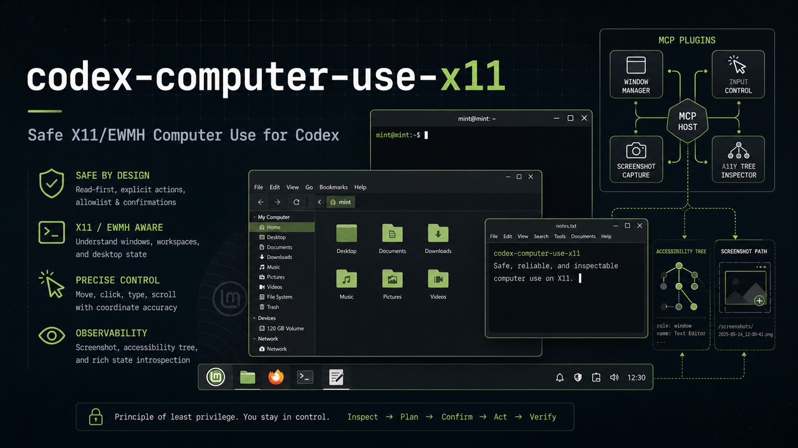
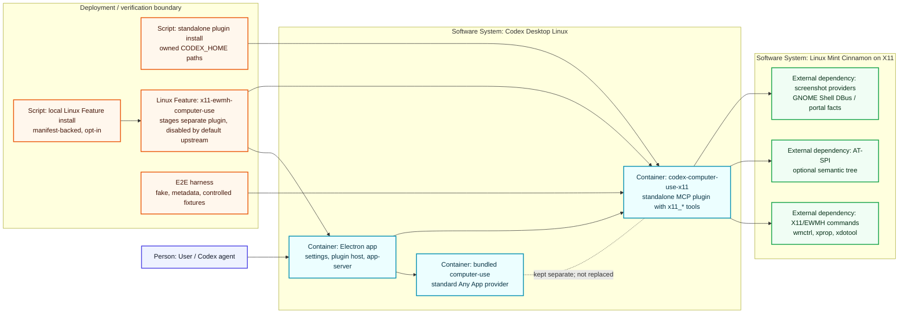

<div align="center">

# codex-computer-use-x11

   

**Cinnamon/X11 Computer Use for Codex:** a standalone Rust CLI/MCP plugin plus a reversible source overlay for proving a safe, generic X11/EWMH backend before upstream integration.



</div>

`codex-computer-use-x11` makes the X11 desktop visible and controllable through explicit, evidence-oriented commands. It focuses on the supported Linux Mint Cinnamon on X11 path, uses the canonical backend id `x11-ewmh`, and keeps every live automation claim tied to JSON diagnostics, controlled fixtures, and rollback-friendly install scripts.


**Release:** `v0.1.3` is the current fresh public baseline: it keeps the standalone plugin, safe installer/uninstaller, source-overlay staging, production-readiness evidence, current OpenSpec specs, rollback-first documentation, a live-verified AT-SPI doctor fix, X11-only doctor readiness with RemoteDesktop/Wayland facts kept debug-only, the optional Codex Desktop Linux Feature installer/uninstaller, and the README hero image.

Prepared adapter contract for optional linux-features/x11-ewmh-computer-use integration in codex-desktop-linux. The same adapter path now has a local verification helper for manual no-release installs. See [`docs/codex-desktop-linux-x11-ewmh-adapter.md`](docs/codex-desktop-linux-x11-ewmh-adapter.md). This is still opt-in/local integration work; it does not claim upstream integration is merged or enabled by default.

| Area | Status |
| --- | --- |
| Runtime shape | standalone user-local Codex MCP plugin with `x11_*` tools |
| Backend identity | generic X11/EWMH via `x11-ewmh` |
| Primary target | Linux Mint Cinnamon on X11 |
| Integration path | reversible source overlay plus opt-in local Linux Feature installer for a Codex Desktop Linux checkout/install |
| Evidence model | fake smoke → live metadata → controlled fixtures only |
| Out-of-scope baseline | Cinnamon Wayland, RemoteDesktop/portal-required runtime paths, unsafe uncontrolled input |

## Architecture



- The C4-style view shows the important boundary: bundled `computer-use` stays separate, while `codex-computer-use-x11` is a standalone MCP plugin with namespaced `x11_*` tools.
- The local Linux Feature installer stages the adapter/plugin into Codex Desktop Linux for manual verification, but the upstream feature remains opt-in and disabled by default.
- The Rust plugin owns target resolution, verified-focus gates, root/global X11 coordinates, path-oriented screenshot evidence, and degraded diagnostics for X11-baseline layers.
- Desktop integrations are thin command/DBus/AT-SPI boundaries with parser tests and controlled fixture evidence; RemoteDesktop/Wayland compatibility facts are debug-only and never block X11 readiness.

## What it provides

- 🪟 **Window discovery and focus** — list, identify, focus, and verify X11/EWMH windows before input.
- ⌨️ **Safe targeted keyboard input** — `type-text` and `press-key` require an exact target and verified focus.
- 🖱️ **Pointer actions** — click, scroll, and drag use the same X11 root/global pixel model as bounds and screenshot crops.
- ♿ **Accessibility correlation** — AT-SPI tree collection with explicit degraded diagnostics when the desktop environment cannot provide a tree.
- 📸 **Path-oriented screenshots** — `get-app-state --json` does not emit inline screenshot blobs by default; screenshot evidence is metadata plus an output path.
- 🎯 **Target-window context** — session-local target groups, colors, stale-target cleanup, and warning-only overlays.
- 🧪 **Production-readiness harness** — deterministic fake checks, controlled live fixtures, capability matrix validation, and release checklist gates.

## Quick start

This repository's v1 handoff is a **standalone user-local Codex MCP plugin**, a **reversible source overlay**, and a **local opt-in Linux Feature install helper** for manual Codex Desktop Linux verification. It is Codex-first, Cinnamon/X11-first, and generic X11/EWMH internally through the canonical `x11-ewmh` backend id.

Start with deterministic checks before touching a real desktop or target checkout:

```bash
make fmt
make check
make test
scripts/validate-final-dod.py
scripts/install-codex-plugin.sh --dry-run
scripts/e2e/codex-plugin-smoke.sh --fake
scripts/e2e/codex-source-overlay-smoke.sh --fake
```

Install the standalone plugin user-locally, without sudo:

```bash
scripts/install-codex-plugin.sh
# restart or refresh Codex, then look for the x11_* MCP tools
```

Rollback for the standalone plugin is owned and local:

```bash
scripts/uninstall-codex-plugin.sh
```

If you installed the broader provider takeover, use the matching manifest-backed rollback so target source files, live settings assets, and plugin state are restored together:

```bash
scripts/uninstall-x11-provider-takeover.sh --target "$CODEX_DESKTOP_LINUX_FULL_PATH" --dry-run
scripts/uninstall-x11-provider-takeover.sh --target "$CODEX_DESKTOP_LINUX_FULL_PATH"
```

For the new optional `codex-desktop-linux` Linux Feature architecture, use the local feature installer when you want to test this plugin as if the adapter had already been wired into Codex Desktop Linux, without publishing a release or changing upstream defaults:

```bash
# Preview only: no writes.
scripts/install-codex-desktop-linux-x11-feature.sh \
  --target "$CODEX_DESKTOP_LINUX_FULL_PATH" \
  --install-dir /opt/codex-desktop \
  --source "$PWD" \
  --patch-mode auto \
  --dry-run \
  --report-json -

# Real local install. Use suitable permissions when /opt/codex-desktop is root-owned.
scripts/install-codex-desktop-linux-x11-feature.sh \
  --target "$CODEX_DESKTOP_LINUX_FULL_PATH" \
  --install-dir /opt/codex-desktop \
  --source "$PWD" \
  --patch-mode auto \
  --report-json /tmp/codex-x11-feature-install.json
```

Rollback is manifest-backed and refuses to overwrite drifted app/update/plugin files:

```bash
scripts/uninstall-codex-desktop-linux-x11-feature.sh \
  --install-dir /opt/codex-desktop \
  --dry-run \
  --report-json -

scripts/uninstall-codex-desktop-linux-x11-feature.sh \
  --install-dir /opt/codex-desktop \
  --report-json /tmp/codex-x11-feature-uninstall.json
```

The feature helper preserves bundled `computer-use`, stages the separate `codex-computer-use-x11` plugin, and writes its rollback manifest under `<install-dir>/.codex-x11-feature/install-manifest.json`.

For v1, **Cinnamon Wayland**, a Cinnamon/Muffin extension, unsafe input against arbitrary user applications, and native `.deb`/`.rpm`/AppImage packaging is out of scope for v1; native `.deb`/`.rpm`/AppImage packaging is out of scope for this repository stage. Native packaging and wrapper-level distribution belong in the Codex Desktop Linux target project after a separate upstreaming decision.

## Command map

All CLI commands emit machine-readable JSON when `--json` is required by the command shape.

| Need | Command |
| --- | --- |
| Diagnose runtime readiness | `cargo run -- doctor --json` |
| List windows | `cargo run -- list-windows --json` |
| Read active window | `cargo run -- focused-window --json` |
| Focus with verification | `cargo run -- focus-window --window-id 0x123456 --json` |
| Type into a verified target | `cargo run -- type-text --window-id 0x123456 --text "hello" --json` |
| Press a key | `cargo run -- press-key --window-id 0x123456 --key Enter --json` |
| Pointer click | `cargo run -- click --window-id 0x123456 --x 100 --y 100 --json` |
| Pointer scroll | `cargo run -- scroll --window-id 0x123456 --x 100 --y 100 --direction down --json` |
| Pointer drag | `cargo run -- drag --window-id 0x123456 --start-x 100 --start-y 100 --end-x 200 --end-y 200 --json` |
| Accessibility tree | `cargo run -- accessibility-tree --window-id 0x123456 --json` |
| X11 window bounds | `cargo run -- window-bounds --window-id 0x123456 --json` |
| Screenshot crop to file | `cargo run -- screenshot-crop --window-id 0x123456 --output /tmp/window-crop.png --json` |
| App state with path-only screenshot metadata | `cargo run -- get-app-state --window-id 0x123456 --screenshot-output /tmp/app-state.png --json` |
| App state without screenshot | `cargo run -- get-app-state --window-id 0x123456 --no-screenshot --json` |
| Save target context | `cargo run -- target-window --window-id 0x123456 --group data-entry --color green --overlay --json` |
| Inspect target context | `cargo run -- target-context --json` |
| Release target context | `cargo run -- release-window --window-id 0x123456 --json` |
| Clear all target context | `cargo run -- release-window --all --json` |
| Start MCP server | `cargo run -- mcp` |

## Safety model

The project intentionally treats desktop automation as unsafe until proven safe by selectors, focus checks, bounds checks, and fixture evidence.

1. **Resolve exactly one target.** Window selectors are explicit: `--window-id`, `--title`, `--wm-class`, or `--pid`.
2. **Verify focus before keyboard input.** `wmctrl`/`xdotool` activation success alone is not enough; the active X11 window must match the requested id.
3. **Use root/global X11 pixels.** ADR 0008 defines one coordinate model for bounds, pointer points, screenshot rectangles, and app-state composition.
4. **Fail closed on ambiguity.** Missing, ambiguous, stale, or unverified targets produce structured JSON errors instead of arbitrary input.
5. **Keep evidence path-oriented.** Screenshots are files plus metadata by default, not large inline JSON blobs.
6. **Use controlled fixtures only for live actions.** Live input, pointer, overlay, screenshot, target-window, and app-state checks must never silently fall back to uncontrolled real user applications.

## App state and screenshot evidence

`get-app-state` composes target-compatible fields for Codex-style desktop state:

```text
window_context, window_error, screenshot, screenshot_error,
accessibility_tree, accessibility_error, diagnostics, message
```

By default, `cargo run -- get-app-state --json` returns screenshot metadata and a file path. It no longer emits inline `data:image/png;base64,...` screenshot blobs unless explicitly requested for unsafe debugging.

```bash
# Preferred: path-oriented screenshot evidence
cargo run -- get-app-state --window-id 0x123456 --screenshot-output /tmp/app-state.png --json

# Skip screenshot entirely
cargo run -- get-app-state --window-id 0x123456 --no-screenshot --json

# Unsafe debug-only opt-in; do not use for normal evidence logs
cargo run -- get-app-state --window-id 0x123456 --inline-screenshot --json
```

## Standalone Codex MCP plugin

`cargo run -- mcp` starts a stdio MCP server. The installed plugin exposes namespaced tools so it does not collide with bundled `computer-use` tools:

| Category | MCP tools |
| --- | --- |
| Readiness | `x11_doctor` |
| Windows | `x11_list_windows`, `x11_focused_window`, `x11_focus_window` |
| Input | `x11_type_text`, `x11_press_key`, `x11_click`, `x11_scroll`, `x11_drag` |
| State | `x11_accessibility_tree`, `x11_get_app_state` |
| Target context | `x11_target_window`, `x11_target_context`, `x11_release_window` |

The installer writes only owned `codex-computer-use-x11` state under `$CODEX_HOME` (default: `~/.codex`): plugin cache, local marketplace metadata, and owned Codex config sections. It does not write `/opt`, `openai-bundled`, or the bundled `computer-use` cache.

## Reversible Codex source overlay

The source overlay is a staging bridge for local Codex Desktop Linux validation. It applies project-owned marker blocks and generated X11/EWMH backend code into a target checkout, runs smoke evidence, then removes its owned changes.

```bash
# Inspect the target checkout state.
scripts/status-codex-source-overlay.sh --target "$CODEX_DESKTOP_LINUX_FULL_PATH"

# Apply owned overlay changes.
scripts/install-codex-source-overlay.sh --target "$CODEX_DESKTOP_LINUX_FULL_PATH"

# Run target-side evidence while applied.
cargo test -p codex-computer-use-linux x11_ewmh --manifest-path "$CODEX_DESKTOP_LINUX_FULL_PATH/Cargo.toml"

# Remove owned overlay changes.
scripts/uninstall-codex-source-overlay.sh --target "$CODEX_DESKTOP_LINUX_FULL_PATH"
```

Overlay status reports `state=clean`, `state=applied`, or `state=drifted`. Drift means target anchors, owned marker blocks, generated files, or metadata no longer match expectations; install refuses to overwrite unowned native X11 backend work.

## Local Codex Desktop Linux Feature installer

`scripts/install-codex-desktop-linux-x11-feature.sh` is the no-release manual verification path for the new optional adapter architecture. It copies the prepared `x11-ewmh-computer-use` scaffold into the selected `codex-desktop-linux` checkout, enables it through local feature config, delegates plugin staging to the scaffold `stage.sh`, and optionally patches app assets when `--patch-mode auto` can use the target patch tooling.

Key properties:

- fully opt-in and disabled by default upstream;
- preserves bundled `computer-use` and adds only `codex-computer-use-x11`;
- supports `--dry-run` and `--report-json` for machine-readable plans/evidence;
- supports `--source`, `--binary`, and `--target`/`--install-dir` paths;
- records non-secret before/after state in `<install-dir>/.codex-x11-feature/install-manifest.json`;
- `scripts/uninstall-codex-desktop-linux-x11-feature.sh` restores only installer-owned changes and blocks on drift.

Patch modes:

| Mode | Use |
| --- | --- |
| `auto` | Real local Codex Desktop app verification when app assets and target patch tooling are available. |
| `skip` | Stage feature/plugin state without touching `resources/app.asar` or `content/webview`. |
| `fake` | Fixture/test-only mode; never use it as live UI patch evidence. |

The overlay reuses stock target surfaces such as `list_windows`, `focused_window`, `activate_window`, `get_app_state`, `type_text`, `press_key`, `click`, `scroll`, and `drag`. It is reversible staging evidence, not a long-lived fork.

## Production readiness evidence

The supported production claim is **yes for the documented Cinnamon/X11 `x11-ewmh` baseline**, with degraded diagnostics only for X11-baseline layers such as optional screenshot or AT-SPI enrichment. Wayland and RemoteDesktop/portal-required runtime paths are outside the current standalone plugin scope; if compatibility facts remain in JSON, they are debug-only and do not affect `doctor` readiness, blockers, degraded reasons, optional enrichments, or recommended next steps.

Capability matrix rows use explicit semantics:

- **PASS means** the capability has concrete evidence for the stated delivery path and fixture mode: public command/tool output, JSON log, screenshot file path, controlled fixture record, or validated matrix entry.
- **DEGRADED means** the row is not a hidden pass. It must include a `reason_category` such as `environment_limitation`, `missing_fixture_setup`, `expected_fake_fixture_limitation`, `unsupported_out_of_scope`, or `not_evaluated`.
- **FAIL means** code behavior, safety, cleanup, or output integrity blocks the production claim until fixed and retested.

Safe retest sequence:

```bash
cargo run -- doctor --json
scripts/e2e/codex-plugin-smoke.sh --fake
scripts/e2e/codex-x11-e2e.py validate-matrix --evidence target/e2e-logs/<run>/evidence.json
scripts/e2e/codex-plugin-smoke.sh --live --industrial --fake-live-fixtures
scripts/e2e/codex-x11-e2e.py validate-matrix --industrial --evidence target/e2e-logs/<run>/evidence.json
```

A real desktop retest may add metadata-only live checks, but fixture-dependent rows remain `missing_fixture_setup` until a unique neutral controlled fixture is started or selected. Input and pointer tests are valid only against controlled fixtures only.

## Development

```bash
make fmt      # cargo fmt -- --check
make check    # cargo check
make test     # cargo test
```

Project rules live in `CONSTITUTION.md`, `ARCHITECTURE.md`, and `adr/`. Substantial behavior changes use the OpenSpec lifecycle under `openspec/`; README-only documentation polish can be validated through the docs tests shown below.

Useful docs-focused check:

```bash
cargo test --test packaging_docs
```

Real credentials are not needed for normal development. Do not read, print, commit, archive, or copy `.secrets.local.env`; tracked files may contain variable names and empty placeholders only.

## Repository map

| Path | Purpose |
| --- | --- |
| `src/` | Rust CLI, MCP server, X11/EWMH adapters, safety gates, app-state composition, and diagnostics. |
| `scripts/` | Installer, uninstaller, source-overlay, release, and verification helpers. |
| `tests/` | CLI, MCP, installer, OpenSpec, documentation, and e2e-harness regression tests. |
| `openspec/specs/` | Canonical behavior specifications for the released baseline. |
| `openspec/changes/archive/` | Historical lifecycle evidence for completed changes. |
| `adr/` | Durable architecture decisions; accepted ADRs are append-only. |
| `docs/` | Installation, troubleshooting, release checklist, upstreaming, and final DoD documentation. |
| `assets/` | README and plugin visual assets. |
| `VERSION` / `CHANGELOG.md` / `INSTALL_CODEX.md` | Release identity, release notes, and short installation path. |

## Documentation

- [`docs/install-uninstall.md`](docs/install-uninstall.md) — standalone plugin install, source overlay install, dry-runs, smoke checks, and rollback.
- [`docs/troubleshooting.md`](docs/troubleshooting.md) — PASS / DEGRADED / FAIL diagnostics, AT-SPI remediation, screenshot evidence safety, plugin issues, and source-overlay drift.
- [`docs/upstreaming.md`](docs/upstreaming.md) — backend-upstream vs wrapper-integration boundaries and fresh target research expectations.
- [`docs/license-attribution.md`](docs/license-attribution.md) — license refresh notes, runtime command dependency policy, and copy-safe/copy-unsafe rules.
- [`docs/release-checklist.md`](docs/release-checklist.md) — validation, E2E, rollback, license, secret-safety, archive, and push checklist.
- [`docs/final-architecture-dod.md`](docs/final-architecture-dod.md) — final Cinnamon/X11 v1 answer, decision ledger, capability matrix, and `scripts/validate-final-dod.py` gate.
- [`docs/e2e-harness.md`](docs/e2e-harness.md) — fake/live smoke harness and evidence paths.
- [`docs/integration-contract.md`](docs/integration-contract.md) — canonical source-overlay and future target integration contract.
- [`docs/codex-desktop-linux-x11-ewmh-adapter.md`](docs/codex-desktop-linux-x11-ewmh-adapter.md) — prepared contract for optional `linux-features/x11-ewmh-computer-use` integration in `codex-desktop-linux`.

## Scope boundaries

- Supported v1 scope is Cinnamon/X11 with X11/EWMH; Cinnamon Wayland is unsupported/out of scope for v1.
- The source overlay is optional and explicit; the standalone plugin path does not modify a target checkout.
- Native distribution packaging belongs outside this repository stage.
- Unsafe targeted input without verified focus or controlled fixture evidence is not a supported claim.
- The current Rust baseline is stable Rust 2021; no formal MSRV is declared yet.

## License

This project is licensed under the [MIT License](LICENSE).
