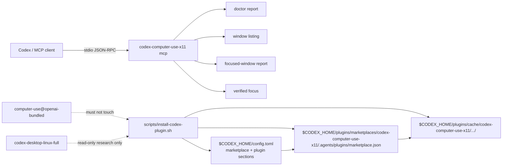

## Context

The project is a standalone Rust 2021 CLI crate with existing one-shot JSON commands:

- `doctor --json` for readiness/capabilities;
- `list-windows --json` for X11/EWMH window listing;
- `focused-window --json` for active-window reporting;
- `focus-window --window-id <id> --json` for verified activation.

The Codex Desktop Linux target checkout already exposes a bundled `computer-use` plugin through `.codex-plugin/plugin.json`, `.mcp.json`, and a local marketplace/cache structure. Current local research shows Codex config enables plugins through `[plugins."plugin@marketplace"]` and local marketplaces through `[marketplaces.<name>]`. The bundled Computer Use plugin uses the `openai-bundled` marketplace and must not be replaced or masked.

Relevant constraints from project context:

- Preserve the canonical backend id `x11-ewmh` and standalone-before-source-overlay delivery posture.
- Keep this stage user-local and reversible: no `/opt` writes, no target checkout mutation, no secrets, no sudo.
- Follow Rust 2021 and root `make fmt`, `make check`, `make test` verification.
- Follow vertical RED/GREEN/REFACTOR slices through public CLI/MCP/scripts.
- Session Claude artifact review is disabled by user request.

A lightweight boundary diagram is useful because this change adds a runtime boundary (MCP stdio) and an install/config boundary (Codex user-local plugin state):



## Goals / Non-Goals

**Goals:**

- Add `codex-computer-use-x11 mcp` with a minimal stdio MCP server supporting initialize, initialized notification, `tools/list`, and `tools/call`.
- Expose deterministic `x11_doctor`, `x11_list_windows`, `x11_focused_window`, and `x11_focus_window` tools.
- Keep MCP tool behavior as a thin wrapper over existing JSON report builders.
- Add user-local install and uninstall scripts with `--dry-run`, temp-`CODEX_HOME` testability, idempotence, and owned namespace cleanup.
- Generate a plugin bundle with `.codex-plugin/plugin.json`, `.mcp.json`, copied executable, local marketplace metadata, `latest` symlink, and Codex config enablement.
- Document direct MCP smoke, install, refresh/restart, and uninstall/rollback commands.

**Non-Goals:**

- No source overlay into `/home/as/Документы/AI_PROJECTS/codex-desktop-linux-full`.
- No changes to bundled `computer-use@openai-bundled` or `/opt/codex-desktop`.
- No new stock `computer-use` tools and no use of unprefixed tool names.
- No keyboard/pointer input beyond the existing verified focus command.
- No external MCP framework dependency unless future evidence shows the minimal server is insufficient.
- No secrets or credential prompts.

## Decisions

### 1. Implement a minimal internal MCP stdio server

Add `src/mcp.rs` and expose it from `src/lib.rs`. Add a CLI arm in `src/cli.rs` for exactly `mcp`, and update usage text.

The server will:

- read newline-delimited JSON-RPC messages from stdin;
- write exactly one JSON-RPC response line to stdout for each request with an id;
- ignore `notifications/initialized` notifications;
- support `initialize`, `tools/list`, and `tools/call`;
- return JSON-RPC errors for parse errors, unsupported methods, invalid params, and internal serialization failures.

Rationale: the standalone crate currently only depends on `serde`/`serde_json`; a minimal protocol surface is enough for Codex smoke testing and avoids introducing a framework before there is evidence it is needed.

Alternative rejected: add a full MCP/RMCP dependency immediately. The target repo already validates full `rmcp` integration for stock Computer Use; this project only needs a standalone feedback loop now.

### 2. Define the MCP registry as a static x11 tool table

Create a small static registry (function or constant) with tools in this order:

1. `x11_doctor`
2. `x11_list_windows`
3. `x11_focused_window`
4. `x11_focus_window`

Each tool has a clear description and JSON schema. The first three tools accept no arguments. `x11_focus_window` requires `window_id` as a string but accepts numeric JSON values defensively by converting them to decimal strings before normalization.

Rationale: deterministic order makes `tools/list` tests stable and keeps tool names visibly separate from stock `computer-use` names.

### 3. Tool results contain existing report JSON as text

Each tool call returns an MCP tool result shaped like:

```json
{
  "content": [
    { "type": "text", "text": "{...one JSON report...}" }
  ],
  "isError": false
}
```

For `x11_focus_window`, `isError` is true for missing/invalid arguments and for a valid focus report whose `success` is false. The content still contains the structured report when one exists, so callers can inspect `WindowNotFound` or `FocusNotVerified`.

Rationale: existing reports are the source of truth; MCP wrapping should not fork behavior or invent an incompatible schema.

### 4. Installer layout uses an owned persistent local marketplace root

Use these owned paths by default:

- cache version: `$CODEX_HOME/plugins/cache/codex-computer-use-x11/codex-computer-use-x11/<version>`;
- cache latest symlink: `$CODEX_HOME/plugins/cache/codex-computer-use-x11/codex-computer-use-x11/latest`;
- marketplace root: `$CODEX_HOME/plugins/marketplaces/codex-computer-use-x11`;
- marketplace file: `$CODEX_HOME/plugins/marketplaces/codex-computer-use-x11/.agents/plugins/marketplace.json`;
- marketplace plugin link: `$CODEX_HOME/plugins/marketplaces/codex-computer-use-x11/plugins/codex-computer-use-x11`.

The plugin version comes from root `Cargo.toml`. The default installer builds `cargo build --release` and copies `target/release/codex-computer-use-x11`; tests can set `CODEX_X11_PLUGIN_BINARY` to the already-built test binary. `--dry-run` does not build or write.

Rationale: this mirrors the observed Codex local marketplace shape without using `openai-bundled` or the launcher's temporary bundled marketplace cache.

### 5. Generate plugin manifests during install

The installed bundle contains:

- `.codex-plugin/plugin.json` with name/version/description/metadata and `mcpServers: "./.mcp.json"`;
- `.mcp.json` with server key `codex-computer-use-x11`, command `./bin/codex-computer-use-x11`, args `["mcp"]`, and cwd `.`;
- `bin/codex-computer-use-x11` copied executable with executable mode.

The marketplace JSON contains exactly one plugin entry:

```json
{
  "name": "codex-computer-use-x11",
  "interface": { "displayName": "codex-computer-use-x11" },
  "plugins": [
    {
      "name": "codex-computer-use-x11",
      "source": { "source": "local", "path": "./plugins/codex-computer-use-x11" },
      "policy": { "installation": "AVAILABLE", "authentication": "ON_INSTALL" },
      "category": "Productivity"
    }
  ]
}
```

Rationale: the generated files are small, deterministic, and can be validated in temp homes without relying on existing local plugin state.

### 6. Update Codex config by owned section replacement

The installer edits `${CODEX_CONFIG_FILE:-$CODEX_HOME/config.toml}`. It preserves unrelated content and rewrites only these owned sections:

```toml
[plugins."codex-computer-use-x11@codex-computer-use-x11"]
enabled = true

[marketplaces.codex-computer-use-x11]
last_updated = "<UTC timestamp>"
source_type = "local"
source = "<marketplace root>"
```

The uninstall script removes only those exact sections. The section editing will be implemented with a small embedded Python routine inside the Bash scripts to avoid fragile `sed` parsing while keeping the public entry points as Bash scripts under `scripts/`.

Rationale: current Codex config uses this section shape. Exact owned section replacement gives idempotence without parsing or rewriting unrelated plugin settings, and avoids exposing secret-containing config lines in logs.

### 7. Rollback is first-class

`install-codex-plugin.sh --dry-run` prints planned owned writes and exits 0 without filesystem changes. `uninstall-codex-plugin.sh --dry-run` prints planned owned removals. Non-dry uninstall removes owned cache/marketplace/config sections and succeeds even when absent.

Rationale: user-local plugin experiments must be safe to reverse, and acceptance requires uninstall tests proving unrelated plugins are preserved.

### 8. Verification strategy prefers direct MCP smoke before live install

Final verification will include:

- direct stdio MCP smoke that initializes the server, lists `x11_*` tools, and calls `x11_doctor` without touching real HOME;
- temp-`CODEX_HOME` installer/uninstaller tests;
- optional live user-local install per user request, followed by filesystem/config inspection and either tool visibility evidence or exact restart/refresh instructions;
- rollback command documented and available.

Rationale: Codex may not dynamically load newly installed plugins into the current process; direct MCP smoke keeps backend progress evidence independent from host UI lifecycle.

## Risks / Trade-offs

- **MCP spec drift:** a minimal internal server may miss future MCP features. Mitigation: support the stable initialize/tools path needed by Codex smoke, keep responses additive, and document direct smoke evidence.
- **Codex plugin format drift:** observed marketplace/config layout may change. Mitigation: generated files are isolated, reversible, and tested against the current local format; direct MCP smoke remains a fallback.
- **Config editing risk:** user config can contain unrelated or secret MCP settings. Mitigation: do not print full config, replace only owned sections, and test unrelated-section preservation.
- **Symlink portability:** plugin cache uses `latest` symlink like the observed local layout. Mitigation: scripts run on Linux target, tests assert the symlink resolves, and uninstall handles missing or non-existent paths safely.
- **Live install mutates real `$CODEX_HOME`:** this is accepted by the user's explicit request, but scripts remain dry-run capable and uninstallable.

## Migration Plan

1. Add MCP tests and minimal `mcp` command through RED/GREEN slices.
2. Add installer script tests with temporary `CODEX_HOME`, then implement install layout/config update.
3. Add idempotence, uninstall, and dry-run tests and implementation.
4. Update README with MCP, install, refresh/restart, and uninstall instructions.
5. Run final checks: `openspec validate`, `make fmt`, `make check`, `make test`, direct MCP smoke, dry-run smoke, and live user-local install/rollback evidence.
6. Archive after verification from clean `main`.

Rollback after live install:

```bash
scripts/uninstall-codex-plugin.sh
```

If manual inspection is needed, only owned paths under `$CODEX_HOME/plugins/cache/codex-computer-use-x11` and `$CODEX_HOME/plugins/marketplaces/codex-computer-use-x11` should be removed.

## Open Questions

None.
