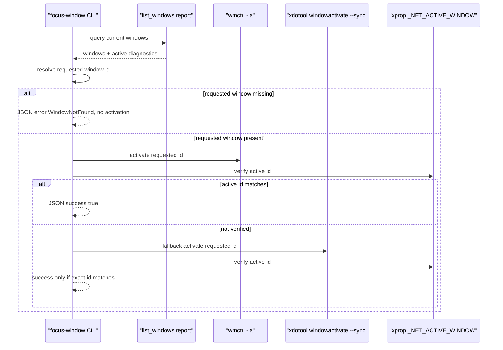

## Context

The project is a standalone Rust 2021 CLI crate with `doctor --json` and `list-windows --json`. `list-windows` already uses `wmctrl -lpGx` for window inventory, `xprop -root _NET_ACTIVE_WINDOW` for focused flags, and the shared `x11_id` normalizer for equivalent X11 id forms. The target Codex Desktop Linux checkout exposes stock `list_windows`, `focused_window`, and `activate_window` tools; its `windowing/target.rs` activates a resolved window and then verifies focus by querying the currently focused window.

Relevant project constraints:

- Preserve the canonical backend id `x11-ewmh` and Codex-first/Cinnamon-X11-first posture.
- Keep this stage standalone and read-only toward `/home/as/Документы/AI_PROJECTS/codex-desktop-linux-full`.
- Follow Rust 2021/root Makefile verification (`make fmt`, `make check`, `make test`) and RED/GREEN/REFACTOR apply discipline.
- Do not use secrets or external credentialed systems.
- Do not treat direct X11 synthetic input or command exit status as a safety boundary for future targeted input.

## Goals / Non-Goals

**Goals:**

- Add `focused-window --json` with a stable JSON object that reports a matched focused `WindowInfo` or structured no-active/no-match degradation.
- Add `focus-window --window-id <id> --json` with shared id normalization, current-listing target resolution, activation attempts, and fresh active-window verification.
- Return machine-readable failures (`WindowNotFound`, `FocusNotVerified`, and invalid-id stderr for unsupported input) without panicking or emitting malformed JSON when a JSON command can be answered.
- Record activation attempt diagnostics in command order, including `wmctrl` first and `xdotool` fallback.
- Keep existing `doctor --json` and `list-windows --json` behavior additive-compatible.

**Non-Goals:**

- No source overlay mutation in the target checkout.
- No Cinnamon/Muffin extension.
- No keyboard, text, pointer, or direct `xdotool --window` targeted input.
- No new long-lived daemon, MCP server, installer, or plugin surface.
- No native X11 crate migration; shelling out to existing commands remains the MVP path.

## Decisions

### 1. Add a focused/focus module that reuses listing primitives

Create `src/focus.rs` and expose it from `src/lib.rs`. The module will reuse `list_windows::report_from_system()`, `WindowInfo`, `WindowListingDiagnostics`, and `x11_id::parse_x11_window_id` instead of duplicating `wmctrl -lpGx` parsing.

Rationale: this keeps `focused-window` and `focus-window` aligned with the already accepted `WindowInfo` shape and avoids a second parser for the same listing format.

Alternative rejected: make `list_windows` return an opaque JSON value and post-process it in CLI code. That would make parser/unit tests harder and blur the reusable Rust API boundary.

### 2. Represent active-window parsing as a typed state

Add a small parser result for `_NET_ACTIVE_WINDOW` that distinguishes:

- active id present;
- explicit no-active value (`0x0`/`0`);
- property missing or unparsable.

`list-windows` can continue to expose `diagnostics.focused_window: Option<u64>`, while `focused-window` and `focus-window` use the richer state for diagnostics and `FocusNotVerified` decisions.

Rationale: the backlog explicitly requires `0x0`/missing/no-active to degrade safely, not collapse into an ambiguous `None`.

### 3. JSON result shapes

`focused-window --json` returns:

```json
{
  "project": "codex-computer-use-x11",
  "version": "0.1.0",
  "backend": "x11-ewmh",
  "focused_window": null,
  "diagnostics": {
    "ok": true,
    "blockers": [],
    "degraded_reasons": [],
    "active_window": null,
    "commands": [],
    "activation_attempts": [],
    "listing": { }
  }
}
```

`focus-window --window-id <id> --json` returns the same identity fields plus:

- `success: bool`;
- `requested_window: Option<WindowInfo>`;
- `focused_window: Option<WindowInfo>`;
- `exact_window_focused: bool`;
- `error_code: Option<String>`;
- `note: String`;
- `diagnostics` with blockers/degraded reasons and ordered activation attempts.

Rationale: top-level fields mirror the target repo's `WindowFocusResult` concepts while keeping standalone command diagnostics explicit.

### 4. Activation algorithm

`focus-window` resolves the requested id against the current listing before attempting activation. If the target is missing, it returns JSON with `WindowNotFound` and does not call `wmctrl -ia` or `xdotool`.

If the target exists:

1. Attempt `wmctrl -ia 0x<lowercase-hex-id>` when `wmctrl` is available.
2. Verify by running `xprop -root _NET_ACTIVE_WINDOW` after the attempt and comparing the parsed id to the requested id.
3. If `wmctrl` fails or verification does not match, attempt `xdotool windowactivate --sync <decimal-id>` when `xdotool` is available.
4. Verify again with `xprop -root _NET_ACTIVE_WINDOW`.
5. Match the verified active id back to the current listing and normalize the returned `focused_window` clone so its `focused` flag reflects the fresh verification result, avoiding stale focus flags from the pre-activation listing.
6. Return success only if exact id matches. Otherwise return `FocusNotVerified` with the last observed focused window when it can be matched to the listing.

The verification helper performs a short bounded retry loop after each activation attempt. The initial implementation will use a small fixed loop (for example, 6 attempts with 50ms sleeps) matching the target repo's verification posture; tests use fake commands and should not depend on real sleeps for successful cases.



### 5. CLI argument handling

Extend `USAGE` and `cli::handle_cli` for exactly:

- `focused-window --json`;
- `focus-window --window-id <id> --json`.

Invalid ids return non-zero with stderr and no activation attempt. Unsupported argument order remains unsupported for now to keep the surface small and testable.

### 6. Tests and live smoke

TDD slices will add tests before production changes:

- Pure parser tests for active-window id, `0x0`, missing property, and invalid text.
- CLI integration tests with fake `wmctrl`, `xprop`, and `xdotool` on `PATH` for focused-window success/no-active/no-match.
- CLI integration tests for focus success, invalid id, `WindowNotFound`, `FocusNotVerified`, and fallback from `wmctrl` failure to `xdotool` success.
- Live smoke after unit/integration GREEN: current-window focus no-op and, if safe in the current desktop, one switch to a listed terminal/browser/file-manager window followed by restoring the original active id. If a real window manager refuses activation, capture the `FocusNotVerified` result as acceptable evidence rather than forcing success.

## Risks / Trade-offs

- **Focus stealing prevention:** Muffin/Mutter may refuse activation; the design favors safe `FocusNotVerified` over retrying aggressively or pretending success.
- **Command availability:** `focus-window` requires at least one activation command plus `xprop` for verification. Missing commands produce structured diagnostics.
- **Timing:** A bounded retry loop handles normal asynchronous focus changes but may still miss slow transitions. Increasing retries would slow automation; keep the MVP bounded and revisit only with evidence.
- **JSON compatibility:** Adding new commands is non-breaking, but result shapes should be stable once archived because later MCP/plugin stages may consume them.
- **Testing real focus:** Live smoke can disrupt the user's desktop focus briefly. Limit live smoke to explicit command invocations, restore original focus when possible, and rely primarily on fake-command tests for deterministic verification.

## Migration Plan

- No data migration.
- Add `src/focus.rs`, update `src/lib.rs`, `src/cli.rs`, `USAGE`, tests, and README command list.
- Keep rollback simple: remove the new module, CLI arms, tests, and README lines if the change must be reverted.
- Do not modify the target checkout; source overlay integration remains a later backlog item.

## Open Questions

None.
