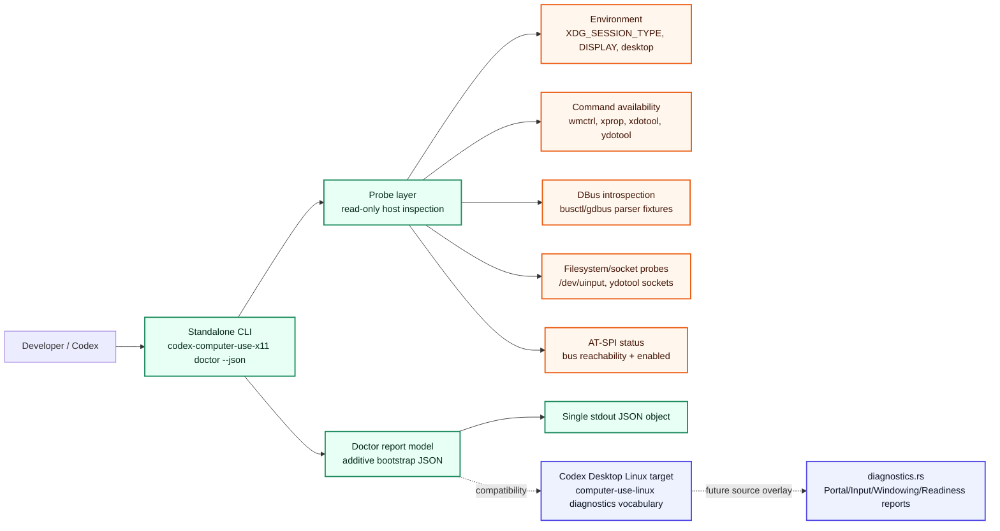
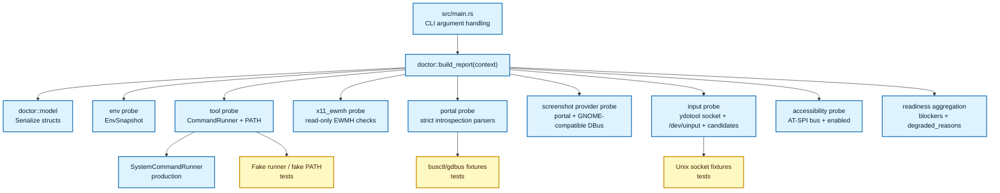

## Context

This design implements the behavior defined by `proposal.md`, `specs/doctor-cli/spec.md`, `specs/x11-integration-contract/spec.md`, and the pre-design `grill.md` for change `add-x11-doctor-capability-detection`.

Relevant project constraints:

- Root package remains the standalone Rust 2021 crate `codex-computer-use-x11`; verification remains `make fmt`, `make check`, and `make test`.
- `.secrets.local.env` is not needed and must not be read. The doctor performs local host inspection only and must not require credentials.
- The local integration target is referenced by `CODEX_DESKTOP_LINUX_FULL_PATH` or the documented local default path, but this design does not patch that checkout. Source-overlay acceptance is captured as a compatibility target for later work.
- `x11-ewmh` remains the canonical backend id. Existing GNOME/COSMIC/KWin/Hyprland/i3 target backends remain out of scope.
- The top-level `adr/README.md` lists in-force ADRs, but the referenced `adr/NNNN-*.md` body files are absent in this checkout. This design uses `ARCHITECTURE.md` and `adr/README.md` as available architecture context and leaves durable ADR confirmation to the later `adr.md` artifact.

The current standalone implementation has a flat bootstrap model in `src/doctor.rs` and a CLI in `src/main.rs`. The target Computer Use Linux checkout already has a richer diagnostics model with `PlatformReport`, `PortalReport`, `AccessibilityReport`, `WindowingReport`, `InputReport`, `ReadinessReport`, and `CapabilityMap`; the standalone report should align semantically without becoming a strict subset of the target JSON.

### Boundary diagram

Using lightweight C4-inspired Mermaid because this change has non-trivial standalone/source-overlay boundaries and multiple local desktop probe integrations.



### Component diagram



## Goals / Non-Goals

**Goals:**

- Preserve the bootstrap JSON contract while adding structured capability detection facts.
- Provide deterministic, testable probe behavior for environment, tool availability, AT-SPI, X11/EWMH prerequisites, strict portals, screenshot providers, ydotool sockets, `/dev/uinput`, and input candidates.
- Align readiness names and semantics with the target Computer Use Linux diagnostics vocabulary without requiring a strict target JSON shape.
- Keep `doctor --json` non-invasive: no credential reads, no target checkout writes, no focus/input side effects, and no filesystem writes beyond ordinary process execution side effects outside project code.
- Make no-display/headless runs successful when a structured report can be emitted.
- Provide fixture-backed parser coverage before relying on live Cinnamon/X11 smoke evidence.

**Non-Goals:**

- Implement window listing, focused window detection, focus activation, or verified targeted input.
- Add a top-level or upstream-required `can_send_targeted_input` field.
- Patch `/home/as/Документы/AI_PROJECTS/codex-desktop-linux-full` in this change.
- Add a Cinnamon/Muffin extension, Cinnamon Wayland support, or replace existing target backends.
- Copy external project code, including `joe223/sootie`, without a later explicit license/attribution decision.

## Decisions

### 1. Report model remains additive over bootstrap JSON

Keep the existing top-level `DoctorReport` fields and add richer sections rather than replacing the report:

```rust
DoctorReport {
    project: String,
    version: String,
    backend: String,              // always "x11-ewmh"
    readiness: Readiness,
    capabilities: Capabilities,   // preserves implemented/planned
    checks: Vec<Check>,           // preserves name/ok/detail
    environment: EnvironmentReport,
    tools: ToolReport,
    accessibility: AccessibilityReport,
    x11_ewmh: X11EwmhReport,
    portals: PortalFacts,
    screenshots: ScreenshotFacts,
    input: InputFacts,
    source_overlay: SourceOverlayFacts,
}
```

Rationale:

- Existing tests and consumers keep their JSON paths and types.
- New machine-readable details do not overload `checks[*].detail` prose.
- Source-overlay compatibility can be represented without mimicking the target JSON exactly.

`capabilities.implemented` should become `[`doctor-json`, `doctor-capability-detection`]` once the expanded report is implemented. `capabilities.planned` should keep `x11-ewmh-windowing` until a later listing/focus change implements it or moves it into a named capability fact. Design/tasks must not silently empty `capabilities.planned` for unrelated reasons.

### 2. Use a probe context and seams in standalone code

Replace the current `bootstrap_report()` entry point with `build_report(context: &ProbeContext) -> DoctorReport`, while keeping a production wrapper such as `doctor::report_from_system()` for `src/main.rs`.

`ProbeContext` should provide:

- `EnvSnapshot` from current env or a test map.
- `CommandRunner` for command execution and fake command outputs.
- `FileSystemProbe` or small functions for path existence/read-write checks.
- `SocketConnector` or small functions for Unix stream/datagram connect tests.

Rationale:

- Standalone specs require command-runner/fake PATH or fixtures.
- Tests should not depend on live X11, live portals, or current `/dev/uinput` permissions.
- This does not imply adding dependency injection to the target repo; source-overlay work remains thin wrappers + pure parser tests per `x11-integration-contract`.

### 3. Keep probes read-only and side-effect-safe

Allowed production probes:

- Read environment variables.
- Check command availability using `command -v` or equivalent direct PATH lookup.
- Run read-only/status commands such as `busctl --user introspect`, `busctl --user call/get-property`, `gdbus introspect`, `pgrep`, and read-only X11/EWMH checks.
- Check `/dev/uinput` read/write open capability.
- Attempt Unix socket connect to ydotool socket candidates.

Disallowed in this change:

- Running `xdotool windowactivate`, key/mouse injection, focus mutation, or any command that changes desktop state.
- Writing to the integration target checkout.
- Reading `.secrets.local.env`.

### 4. Readiness is blocker-based; degradation is separate

`Readiness` should preserve existing fields and add upstream-shaped booleans:

```rust
Readiness {
    ok: bool,
    blockers: Vec<String>,
    degraded_reasons: Vec<String>,
    can_query_windows: bool,
    can_focus_apps: bool,
    can_focus_windows: bool,
    can_send_development_input: bool,
    recommended_next_step: String,
}
```

Aggregation rules:

- `ok == false` whenever `blockers` is non-empty.
- Successful JSON emission does not imply `ok == true`.
- `degraded_reasons` is present even when empty and records optional unavailable capabilities or fallback use.
- `blockers` records failures that block the current supported readiness target.
- `can_send_development_input` is true when at least one supported development-input backend is verified:
  - `/dev/uinput` is read/write accessible and the `abs_pointer` capability fact is ok;
  - `ydotool` is available and at least one ydotool socket candidate is connectable;
  - XDG Portal RemoteDesktop introspection contains the required concrete session/device/input methods or properties.
  It is false when none of those backends is verified. `xdotool` remains a separate X11-native candidate fact and does not satisfy this upstream-shaped boolean by itself.
- `recommended_next_step` is deterministic:
  1. If `blockers` is non-empty, derive the recommendation from the first most-actionable blocker in this priority order: AT-SPI/tree readiness, no X11/EWMH window query, no verified focus capability, no verified development-input backend.
  2. If there are no blockers but `degraded_reasons` is non-empty and no development-input backend is verified, recommend the most local remediation: start/expose `ydotoold` when ydotool is installed but no socket is connectable; otherwise enable `/dev/uinput` access or a strict RemoteDesktop portal backend when those are the available candidates.
  3. If no blockers or degradations remain, emit a generic readiness confirmation.
  No-display/headless recommendations should mention `DISPLAY`/X11 session setup rather than suggesting input tooling first.

For this change, `can_query_windows` may be true only when X11/EWMH prerequisites are verified by read-only probes. `can_focus_apps` and `can_focus_windows` should remain false unless the design implements a non-mutating verified focus capability, which it does not. Focus candidates can be reported separately, but targeted input readiness must remain degraded until a later focus-verification change.

### 5. Use explicit fact sections for probes

Recommended fact sections:

- `environment`: session type, current desktop, desktop session, display presence/value where non-secret, Wayland display presence, runtime-dir presence, and derived `is_cinnamon_x11`.
- `tools`: per-command availability for `wmctrl`, `xprop`, `xdotool`, `ydotool`, `busctl`, `gdbus`, and optional `pgrep`.
- `accessibility`: `at_spi_bus_reachable`, `at_spi_enabled`, `toolkit_accessibility_enabled`, and `can_build_accessibility_tree`.
- `x11_ewmh`: display availability, required command availability, read-only EWMH/root probe status, and candidate list/focus facts.
- `portals`: desktop portal presence, strict `remote_desktop`, `screenshot`, `screencast`, and `input_capture` facts.
- `screenshots`: provider facts for `gnome_shell_dbus` and `xdg_portal`; do not require `gnome-shell --version` for Cinnamon-owned `org.gnome.Shell.Screenshot`.
- `input`: `abs_pointer` capability fact, `/dev/uinput` device fact, ydotool command/process/socket facts, portal RemoteDesktop input fact, and xdotool candidate fact.
- `source_overlay`: report-only notes indicating how standalone facts map to target `PortalReport`/`InputReport`/`WindowingReport`/`ReadinessReport` semantics.

Avoid storing potentially sensitive env values such as full DBus session bus addresses in the standalone JSON unless a later design explicitly justifies them. Presence booleans are enough for this change.

`SourceOverlayFacts` should be stable enough for tests while remaining report-only:

```rust
SourceOverlayFacts {
    target_vocabulary: Vec<String>,       // e.g. PortalReport, InputReport, WindowingReport, ReadinessReport
    strict_portal_required: bool,
    screenshot_provider_mapping: Vec<String>,
    target_checkout_modified: bool,       // false in this change
    notes: Vec<String>,
}
```

Tests should assert `target_checkout_modified == false`, `strict_portal_required == true`, and the presence of target vocabulary names rather than depending on prose-only notes.

### 6. Tool and environment probes

Environment probe:

- `is_x11 = XDG_SESSION_TYPE == "x11" || DISPLAY is present`.
- `is_cinnamon = XDG_CURRENT_DESKTOP` or `DESKTOP_SESSION` contains Cinnamon case-insensitively.
- `is_cinnamon_x11 = is_x11 && is_cinnamon`.
- Headless/no-display path sets X11/EWMH facts unavailable but does not make CLI exit non-zero.

Tool probe:

- Use a fakeable `CommandRunner` or direct PATH lookup seam.
- Report missing `wmctrl`, `xprop`, `xdotool`, or `ydotool` as degraded/check facts, not panics.
- For tests, use fake PATH fixtures or fake command output, not live desktop commands.

### 7. Ydotool socket probing

Candidate order:

1. `YDOTOOL_SOCKET` when set and non-empty.
2. `$XDG_RUNTIME_DIR/.ydotool_socket` when runtime dir exists.
3. `/tmp/.ydotool_socket`.

For each candidate:

- Record candidate path label/source, whether it existed, and stream/datagram connect result.
- Continue after stale/missing candidates.
- Select the first connectable candidate as `selected_socket`.
- Mark ydotool socket ok if any candidate is connectable.

Ydotool contributes to `readiness.can_send_development_input` only when the ydotool command is available, ydotoold/process hint is ok or not contradicted by socket evidence, and a socket candidate is connectable. A connectable socket is stronger than `pgrep ydotoold`; stale process information should not override socket failure. The unified readiness boolean is still the OR of all supported development-input backends from decision 4, not ydotool alone.

### 8. Portal and screenshot parsing is strict and fixture-backed

Implement pure parsers over introspection text before wiring commands:

- `portal_screenshot_available(output)` is true when method `Screenshot` is present. Version 2 is sufficient for basic availability.
- `portal_remote_desktop_available(output)` is false for empty header-only tables. It requires concrete RemoteDesktop members such as `CreateSession`, `SelectDevices`, `Start`, and at least one input notification method/property family (`NotifyPointer*`, `NotifyKeyboard*`, or documented equivalent discovered during implementation).
- `gnome_shell_screenshot_available(output)` is true when `org.gnome.Shell.Screenshot` exposes `Screenshot`, `ScreenshotArea`, or `ScreenshotWindow` methods.

Production command wrappers should be thin:

- `busctl --user introspect org.freedesktop.portal.Desktop /org/freedesktop/portal/desktop org.freedesktop.portal.Screenshot`
- same path for `org.freedesktop.portal.RemoteDesktop`, `ScreenCast`, and `InputCapture`
- `gdbus introspect --session --dest org.gnome.Shell.Screenshot --object-path /org/gnome/Shell/Screenshot`

Tests must include fixtures for:

- empty successful RemoteDesktop table;
- Screenshot portal version 2 table with `Screenshot`;
- Cinnamon-owned GNOME Shell-compatible screenshot method table;
- absent/failed command outputs.

### 9. X11/EWMH readiness is detected, not activated

This stage should not focus or activate windows. X11/EWMH facts should be limited to read-only capability detection:

- X11 display present.
- `wmctrl` and `xprop` available.
- Optional read-only commands such as `wmctrl -m` or `xprop -root _NET_SUPPORTING_WM_CHECK _NET_ACTIVE_WINDOW` succeed when run through the command runner.
- `xdotool` availability is a candidate fact for later X11-native input/focus work, not an upstream-shaped development input backend by itself.

`readiness.can_query_windows` is true exactly when an X11 display is present, `wmctrl` and `xprop` are available, and the selected read-only EWMH/root probe succeeds. It is false otherwise. `can_focus_apps` and `can_focus_windows` should remain false unless a later design implements verified focus behavior. This prevents over-promising targeted input readiness.

The design-review and test-plan artifacts should consume this deterministic rule directly instead of treating X11 query readiness as discretionary.

### 10. CLI exit behavior

Keep `src/main.rs` behavior categories:

- `doctor --json` returns exit 0 when a valid JSON report is emitted, even when readiness is degraded or blocked.
- Unsupported commands/flags return non-zero and write human-readable usage/error text to stderr.
- Internal failures that prevent JSON report production return non-zero and must not print partial successful JSON.

No-display/headless is a report condition, not an unsupported invocation.

### 11. Source-overlay compatibility plan

This change should not patch the target checkout, but design the standalone probes so later source-overlay work can make these target-side changes with minimal reinterpretation:

- Replace target `portal_interface_check(interface)` success-by-exit-code behavior with strict method/property checks for each portal interface.
- Make target screenshot capability derive from actual provider methods (`org.gnome.Shell.Screenshot` or XDG Portal Screenshot), not `gnome-shell --version` alone.
- Preserve `PortalReport`, `InputReport`, `WindowingReport`, `ReadinessReport`, and `CapabilityMap` semantics.
- Preserve existing desktop-specific backend order; `x11-ewmh` remains a later/future fallback if added.

The later `tasks.md` artifact must include a concrete named task or archive note for canonical spec `Purpose` cleanup and must enumerate planned capabilities before allowing `capabilities.planned` to become empty.

## Risks / Trade-offs

- **Report shape growth:** Adding many top-level fact sections increases JSON size, but keeps compatibility clearer than overloading strings or forcing a target JSON subset.
- **Readiness strictness:** Keeping focus readiness false until verified may make `readiness.ok` false on machines where manual focus would work, but avoids unsafe over-promising before focus verification exists.
- **Command output variability:** `busctl`, `gdbus`, `wmctrl`, and `xprop` output can differ by distro/version. Fixture-backed parsers reduce risk, and live smoke remains a later verification layer.
- **Socket probing side effects:** Unix socket connect attempts are local and non-mutating, but can fail for permissions/protocol reasons. Reporting both stream/datagram details keeps diagnostics explainable.
- **AT-SPI ambiguity:** AT-SPI bus reachability and accessibility enabled state can differ; the report must keep these separate so design does not collapse a reachable bus into tree-readiness.
- **Missing durable ADR bodies:** The design cannot verify the full text of referenced in-force ADRs because only `adr/README.md` exists. This should be noted in `adr.md`; it does not block this scoped design because `ARCHITECTURE.md` and `adr/README.md` provide the relevant constraints used here.

## Migration Plan

Implementation should proceed in small TDD slices, but this design does not implement code yet.

Suggested implementation order for later `test-plan.md` / `tasks.md`:

1. Introduce additive report structs while preserving existing `doctor --json` tests.
2. Add `EnvSnapshot` and environment classifier tests, including Cinnamon/X11 and no-display cases.
3. Add command availability seam and fake PATH/fake runner tests.
4. Add ydotool socket candidate model and socket fixture tests.
5. Add pure portal/screenshot introspection parsers and fixtures.
6. Add AT-SPI and `/dev/uinput` probe seams with fake outputs/access checks.
7. Add readiness aggregation and degraded-reasons tests.
8. Add CLI JSON contract integration tests for success, no-display, unsupported usage, and serialization/runtime failure seam if practical.
9. Add live Cinnamon/X11 smoke evidence only after unit/fixture tests pass.
10. Record source-overlay acceptance and canonical Purpose cleanup follow-ups in `tasks.md`.

Rollback:

- Revert the implementation commit(s) for standalone code. Because the schema expansion is additive and no target checkout is patched, rollback is local to this repository.
- If a future source-overlay patch is created separately, rollback that target patch independently and keep this design as the standalone compatibility source.

## Open Questions

None.

The later `adr.md` artifact should still evaluate whether any durable ADR is needed. Based on this design, no new durable ADR appears necessary unless design-review identifies that the source-overlay compatibility plan changes project architecture rather than scoped diagnostics behavior.
