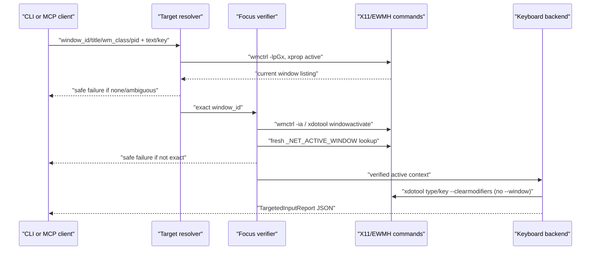

## Context

The standalone crate already provides:

- `list-windows --json` and `focused-window --json` backed by `wmctrl -lpGx` plus `xprop -root _NET_ACTIVE_WINDOW`.
- `focus-window --window-id <id> --json` that resolves a listed window, attempts `wmctrl -ia` then `xdotool windowactivate --sync`, and succeeds only when a fresh active-window lookup equals the requested id.
- A standalone MCP server exposing `x11_doctor`, `x11_list_windows`, `x11_focused_window`, and `x11_focus_window`.

Relevant project constraints:

- `CONSTITUTION.md`: Rust 2021/Cargo root crate, `make fmt`, `make check`, `make test`, OpenSpec validation, no secrets, no target checkout writes unless explicitly planned.
- `ARCHITECTURE.md` / in-force ADRs: OpenSpec lifecycle with mandatory grill/TDD gates, automatic safe checkpoints, optional Claude review (disabled for this session), canonical backend id `x11-ewmh`.
- `backlog/00`: source overlay is deferred; standalone plugin is the fast feedback loop; global injectors require verify-before-inject for targeted tasks.
- Target checkout research: stock Computer Use Linux `server.rs` already gates `type_text` and `press_key` through `focus_target_for_input()`. This change mirrors that safety in the standalone path rather than patching the target repo.

Lightweight C4-inspired dynamic view:

## Goals / Non-Goals

**Goals:**

- Add safe standalone `type-text` and `press-key` CLI JSON commands.
- Add MCP `x11_type_text` and `x11_press_key` tools that wrap the same behavior.
- Resolve exactly one current target by `window_id`, title substring, `wm_class`, or pid.
- Reuse the focus verification boundary from `focus.rs` before calling any keyboard backend.
- Use active-context `xdotool type/key --clearmodifiers` after verified focus; never treat `xdotool --window` direct events as the safety boundary.
- Return structured JSON for success and safe refusals, including `success`, `input_sent`, `error_code`, `target`, `focus`, `keyboard`, and diagnostics/candidates.
- Cover behavior with fake `PATH` CLI/MCP tests before live smoke.

**Non-Goals:**

- No source overlay writes into `/home/as/Документы/AI_PROJECTS/codex-desktop-linux-full`.
- No new upstream stock tools and no bundled Computer Use plugin mutation.
- No pointer click/scroll/drag changes; those belong to backlog/07b.
- No AT-SPI correlation, screenshot/coordinate integration, `get_app_state`, target groups, or overlay borders.
- No promise of complete Unicode/layout fidelity until evidence proves it; record limitations as degraded behavior.
- No global/unverified input mode in the safe targeted commands.

## Decisions

1. **Standalone first, target checkout read-only.**
   - Rationale: backlog/00 defers source overlay until core behavior stabilizes; target repo already has a similar `focus_target_for_input()` safety pattern.
   - Consequence: this change validates behavior in the standalone MCP plugin and prepares semantics for later overlay work.

2. **Window target model is intentionally small.**
   - Add a standalone `WindowTarget` with `window_id`, `title`, `wm_class`, and `pid` selectors because those are observable in the current `WindowInfo` listing.
   - `window_id` is exact and uses existing `parse_x11_window_id()`.
   - `title` is case-insensitive substring, `wm_class` is case-insensitive exact, `pid` is exact.
   - Ambiguous matches return `AmbiguousTarget` with candidate ids/titles and no activation attempt.

3. **Focus verification remains a separate prerequisite.**
   - Targeted input calls `focus_window_report_from_listing()` after resolving the target and passes only if `success == true` and `exact_window_focused == true`.
   - The command records the full focus report inside the targeted input report for auditability.
   - Failure paths set `input_sent: false` and skip keyboard command execution.

4. **Keyboard backend is active-context `xdotool`.**
   - `type-text`: `xdotool type --clearmodifiers <text>`.
   - `press-key`: `xdotool key --clearmodifiers <key>`.
   - Do not pass `--window`; `xdotool` direct-window events use XSendEvent and are not the safety boundary.
   - Diagnostics state that the backend is global/active-context and safe only because focus was verified immediately before injection.

5. **Report shape favors automation and MCP wrapping.**
   - Add `TargetedInputReport` with stable top-level fields: `project`, `version`, `backend`, `action`, `success`, `input_sent`, `target`, `focus`, `keyboard`, `error_code`, `note`, `diagnostics`.
   - `TargetedInputDiagnostics` includes target resolution candidates, listing diagnostics, and warnings/degraded reasons.
   - `KeyboardAttempt` records command/args/ok/detail; text values may be present as command arguments in fake tests and user-invoked command reports, but no secrets are involved and the command accepts user-provided text explicitly.

6. **MCP calls reuse report builders.**
   - `x11_type_text` requires `text` plus at least one target selector.
   - `x11_press_key` requires `key` plus at least one target selector.
   - MCP `isError` is `true` whenever `TargetedInputReport.success` is false.

## Risks / Trade-offs

- **`xdotool` Unicode/layout fidelity:** local docs warn unusual symbols under non-US keybindings can be wrong. Mitigation: tests prove argument preservation and live smoke records actual behavior/degraded limitation.
- **Race between focus verification and injection:** another window can steal focus after verification. Mitigation: verification happens immediately before injection, report states it is an active-context safety check, and later overlay stages may add stronger target locking if available.
- **Title substring ambiguity:** user-friendly selectors can match multiple windows. Mitigation: ambiguous title is a hard safe refusal with candidates.
- **Global injector semantics:** active-context `xdotool` still injects globally. Mitigation: no global mode in this safe command; refusal on missing/unverified target.
- **MCP text arguments may contain sensitive user input:** project has no external secrets for this stage, but outputs should avoid unrelated environment/log data. User-provided text is inherently part of the requested command; no local secret files are read.

## Migration Plan

1. Add tests that fail for missing CLI/MCP tools and safe refusal behavior.
2. Add `src/input.rs` with target resolution, report builders, and keyboard backend command wrappers.
3. Wire CLI parsing in `src/cli.rs` and public module export in `src/lib.rs`.
4. Wire MCP tool definitions/schemas and tool calls in `src/mcp.rs`.
5. Rebuild/reinstall standalone plugin if live Codex plugin smoke is needed; existing installer already copies the built binary.
6. Rollback is deleting the new source/test code or reinstalling the previous committed binary; no target checkout or user Codex config migration is required for source code rollback.

## Open Questions

None
