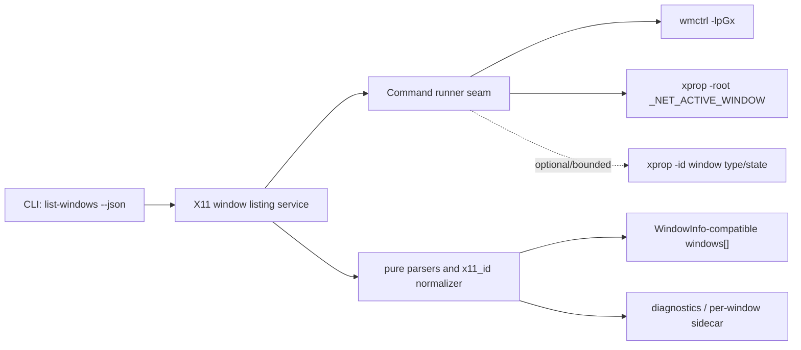

## Context

The repository is a standalone Rust 2021 crate with a small CLI, `doctor --json`, shared `x11_id` normalization, and root Makefile verification. The project constitution requires Rust/Cargo, `make fmt`, `make check`, and `make test`; it also requires no secret access and no writes to the machine-local Codex Desktop Linux target checkout unless a later task explicitly targets source-overlay changes.

The relevant architecture snapshot keeps the project Codex-first, Cinnamon/X11-first, and generic X11/EWMH-oriented with canonical backend id `x11-ewmh`. The current canonical integration contract requires upstream `WindowInfo` to be the primary model and X11-only provenance/reliability details to remain sidecar/report metadata by default. The target repo confirms this shape in `computer-use-linux/src/windowing/types.rs`:

- `WindowInfo.window_id: u64`
- nullable `title`, `app_id`, `wm_class`, `pid`, `bounds`, `workspace`, `client_type`
- boolean `focused`, `hidden`
- string `backend`
- `WindowBounds { x: Option<i32>, y: Option<i32>, width: u32, height: u32 }`

Fresh research and local safe probes support the backlog assumption that `wmctrl -lpGx` is a suitable MVP source on the current Cinnamon/X11 machine. A native X11 dependency such as `x11rb` remains a later option, not an MVP requirement.



## Goals / Non-Goals

**Goals:**

- Add `codex-computer-use-x11 list-windows --json` as a public JSON command.
- Parse `wmctrl -lpGx` deterministically and preserve titles with whitespace, Unicode, and multibyte characters.
- Reuse the existing canonical X11 window-id parser so padded/unpadded hex ids normalize to the same `u64`.
- Emit primary windows compatible with target repo `WindowInfo` fields.
- Emit sidecar diagnostics for raw class/id/provenance, parse failures, PID reliability, missing tools, no display, active-window lookup failure, and optional enrichment uncertainty.
- Mark `focused` from `_NET_ACTIVE_WINDOW` when it can be read.
- Avoid unconditional unbounded per-window `xprop -id` enrichment in the MVP.
- Keep testing independent from live X11 by using pure parser fixtures and fake command/PATH behavior before live smoke.

**Non-Goals:**

- No source-overlay patch to `/home/as/Документы/AI_PROJECTS/codex-desktop-linux-full` in this change.
- No native `x11rb` backend in this change.
- No Cinnamon/Muffin extension.
- No new MCP server/tool surface beyond the standalone CLI command.
- No change to target repo stock input tools and no requirement for a stock `mousemove` MCP tool.
- No strict promise that every `wmctrl` row is a safe application target; uncertain/non-application targets must be filtered or diagnosed.

## Decisions

### 1. Add a dedicated listing module and keep CLI dispatch explicit

Add a new module, tentatively `src/list_windows.rs`, containing:

- `WindowListReport`
- `WindowInfoReport` or equivalent primary window struct matching the target `WindowInfo` shape used by this standalone crate
- `WindowBoundsReport`
- `WindowListingDiagnostics`
- `WindowDiagnostic` / sidecar metadata keyed by `window_id` or raw id
- parser functions for `wmctrl -lpGx`, active-window output, and optional xprop window type/state output
- a system probe function, e.g. `window_list_from_system()`

Update CLI dispatch so `main.rs` no longer delegates only to `doctor::handle_cli`. The least disruptive implementation path is a small shared CLI dispatcher in `src/lib.rs` or `src/cli.rs` that supports:

- `doctor --json`
- `list-windows --json`
- `--help` / `-h`
- unsupported usage errors

`doctor::handle_cli` can either remain for existing tests or be replaced by a wrapper that preserves behavior.

### 2. Use `wmctrl -lpGx` as the MVP listing source

The command runner should execute `wmctrl -lpGx` only after confirming a display is present and `wmctrl` is discoverable. A missing display or missing `wmctrl` should produce a valid degraded report with `windows: []` rather than a panic.

Expected `wmctrl -lpGx` columns are parsed as fixed leading fields plus title remainder:

```text
<id> <desktop> <pid> <x> <y> <width> <height> <wm_class> <host> <title...>
```

The parser should split into at most ten fields so the title remainder can contain spaces, Cyrillic, emoji, and other multibyte characters. Rows with too few fixed fields, invalid ids, invalid numbers, or non-positive dimensions should be skipped or marked degraded according to report diagnostics.

### 3. Map `WM_CLASS` conservatively

The `wmctrl -x` class column commonly appears as `instance.Class`. Map it as follows:

- store the raw class column in sidecar diagnostics;
- if the column contains a dot, map the part after the final dot to primary `wm_class` and the part before it to primary `app_id`;
- if the column has no dot, map the non-empty value to `wm_class`, map `app_id` to the same value only when no better instance/app identifier is available, and record that fallback in diagnostics;
- trim empty strings to `None`.

This gives target selectors useful `wm_class` and `app_id` values while preserving raw X11 data outside the primary shape.

### 4. Treat PID as useful but not verified identity by default

Map PID to primary `pid: Some(u32)` only when the parsed PID is greater than `2` and the host/client-machine column is local or unknown. Mark PID reliability in sidecar diagnostics:

- `reliable` for local host and PID > 2;
- `unreliable` for PID `0`, PID `2`, or non-local host;
- `unknown` when host comparison cannot be made.

Local hostname can be obtained with a small safe helper, preferring `/proc/sys/kernel/hostname` or `HOSTNAME` rather than introducing a new dependency.

### 5. Mark focus from `_NET_ACTIVE_WINDOW`

Use `xprop -root _NET_ACTIVE_WINDOW` through the same command runner seam when `xprop` is available. Parse a hexadecimal id from the output and normalize it with `parse_x11_window_id`. If the active id matches a listed window, set only that window's `focused` to true. If the active id lookup fails, leave all windows `focused: false` and add diagnostics.

### 6. Keep window type and hidden-state enrichment bounded/optional

The MVP should not spawn `xprop -id` unconditionally for every row. Acceptable implementation strategies are:

- no per-window enrichment in the first implementation, with `client_type: None`, `hidden: false`, and explicit diagnostics that type/state are unknown; or
- bounded enrichment for a limited number of rows or a specific option/internal helper, with tests proving the bound.

The first implementation should prefer the no-enrichment path unless a TDD slice introduces a bounded parser-only helper. This preserves command responsiveness and leaves a clean path to native X11 or cached enrichment later.

### 7. JSON report shape

Use a standalone report shape similar to:

```json
{
  "project": "codex-computer-use-x11",
  "version": "0.1.0",
  "backend": "x11-ewmh",
  "windows": [],
  "diagnostics": {
    "ok": true,
    "blockers": [],
    "degraded_reasons": [],
    "commands": [],
    "parse_errors": [],
    "window_metadata": []
  }
}
```

The exact field names may be refined during implementation, but they must satisfy the spec: `project`, `version`, `backend`, `windows`, and `diagnostics` are required; primary windows must stay `WindowInfo`-compatible; sidecar metadata must not be embedded as extra primary fields.

### 8. Test seams and TDD-friendly structure

Use pure parser functions for:

- `wmctrl -lpGx` rows;
- active-window `xprop -root _NET_ACTIVE_WINDOW` output;
- optional `_NET_WM_WINDOW_TYPE` / `_NET_WM_STATE` fixtures if implemented.

Use a small command seam for CLI/system tests. The standalone crate may use either:

- a trait such as `CommandRunner`; or
- fake `PATH` fixture scripts invoked through `std::process::Command`.

Because this repository is standalone, a trait seam is acceptable here. The design does not imply adding a dependency-injection runner to the target repo; the source-overlay contract still prefers thin `Command::new(...)` wrappers plus pure parser tests unless a later design/ADR accepts an exception.

## Risks / Trade-offs

- **Shell-out fragility:** `wmctrl` output is text and can vary. Mitigation: strict parser fixtures, degraded diagnostics, no panic on malformed rows.
- **Performance:** per-window `xprop` enrichment can become N+1. Mitigation: no unbounded enrichment in MVP; document unknown state.
- **PID reliability:** X11 PID fields can be missing, service-like, remote, or misleading. Mitigation: sidecar reliability and conservative primary `pid` mapping.
- **Non-application windows:** desktops/panels can appear in listings. Mitigation: bounded type/class-based filtering or diagnostic marking; do not silently claim they are safe normal targets.
- **Privacy:** live window titles may include sensitive local information. Mitigation: do not record live titles in OpenSpec artifacts or diagnostics beyond actual command output requested by the user; tests use synthetic fixtures.
- **Future source overlay:** standalone command seams should not force target repo architecture. Mitigation: keep source-overlay decisions out of implementation and document compatibility only.

## Migration Plan

- Add code and tests in the standalone crate only.
- Preserve `doctor --json` behavior and existing field compatibility.
- Add `list-windows --json` to help/usage text and CLI dispatch.
- Run `make fmt`, `make check`, and `make test` before marking tasks complete.
- Run a live smoke command on the local Cinnamon/X11 desktop after unit/CLI tests pass, but do not paste sensitive window titles into artifacts or chat.
- Rollback is a normal git revert of the standalone code/tests/spec artifacts; no external state or target checkout migration is required.

## Open Questions

None.
