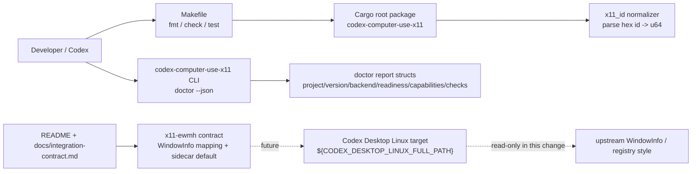

## Context

This change bootstraps `codex-computer-use-x11` as a standalone Rust project before any real X11/EWMH backend code exists. The design follows:

- `CONSTITUTION.md`: Rust/Cargo is the default stack; the initial package lives at the repository root; verification uses root `Makefile` targets; the target Codex Desktop Linux checkout is referenced by `CODEX_DESKTOP_LINUX_FULL_PATH`; secrets are not needed.
- `CONTEXT.md`: `x11-ewmh` is the canonical generic X11/EWMH backend label; Standalone plugin and Source overlay are delivery paths.
- `ARCHITECTURE.md` / `adr/README.md`: OpenSpec artifacts are the source of truth; apply must use TDD slices; durable ADRs are append-only if design later changes project architecture.
- `grill.md`: the bootstrap `doctor --json` report is a standalone smoke-test surface, not a strict subset of upstream target `doctor_report()`; sidecar diagnostics shape and source-overlay details are design-owned unless implemented in this stage.

### Boundary diagram



The only runnable unit introduced by this change is the root Cargo package/CLI. The target checkout is read-only context for documentation and future overlay compatibility.

## Goals / Non-Goals

**Goals:**

- Create a root Rust 2021 package named `codex-computer-use-x11` with binary `codex-computer-use-x11`.
- Provide `codex-computer-use-x11 doctor --json` with a stable bootstrap JSON shape.
- Provide a pure X11 window-id normalizer with tests for equivalent hex strings such as `0x5624b36` and `0x05624b36`.
- Provide `make fmt`, `make check`, and `make test` wrappers over Cargo.
- Document the public bootstrap posture and integration contract in README/project docs.
- Keep implementation independent from `${CODEX_DESKTOP_LINUX_FULL_PATH}` and avoid secrets.

**Non-Goals:**

- No real `wmctrl`, `xprop`, `xdotool`, `ydotool`, AT-SPI, portal, screenshot, or live X11 probing.
- No patching of the path referenced by `CODEX_DESKTOP_LINUX_FULL_PATH` (currently `/home/as/Документы/AI_PROJECTS/codex-desktop-linux-full` on the development machine) or any target checkout path.
- No Cinnamon/Muffin extension.
- No standalone MCP server implementation yet; only document it as a future delivery path.
- No expansion of upstream `WindowInfo`.

## Decisions

### 1. Root package layout

Use a root package layout:

```text
Cargo.toml
Makefile
README.md
src/
  lib.rs
  main.rs
  doctor.rs
  x11_id.rs
tests/
  doctor_cli.rs
docs/
  integration-contract.md
```

`Cargo.toml` declares:

- `[package] name = "codex-computer-use-x11"`
- `version = "0.1.0"`
- `edition = "2021"`
- no mandatory `[workspace]` table in this stage.

Rationale: the bootstrap has one binary and one library surface. `src/lib.rs` exposes the tested modules as the public crate surface for integration tests:

```rust
pub mod doctor;
pub mod x11_id;
```

A workspace table or subcrates would add structure before there is a second package to justify it.

### 2. Rust dependencies and MSRV posture

Use only minimal dependencies:

- `serde` with `derive` for report structs;
- `serde_json` for JSON output.

Do not introduce `clap`, `anyhow`, `thiserror`, `rmcp`, `tokio`, `x11rb`, or command execution dependencies in this stage. CLI parsing can use `std::env::args()` because only `doctor --json`, `--help`, and error handling are needed.

MSRV is not pinned in `Cargo.toml` for stage 01. The project requires Rust 2021 and validates with the local stable toolchain available to the development environment. The README should state that no formal MSRV is promised yet; the only practical assumption is a stable Rust toolchain that supports Rust 2021. A future packaging/CI change should decide whether to add `rust-version` and CI matrix coverage.

### 3. CLI behavior

`src/main.rs` is a thin adapter:

- `doctor --json` deliberately writes compact machine-readable JSON (`serde_json::to_string`) followed by one newline to stdout and exits `0`; tests should parse JSON and may ignore trailing whitespace instead of treating the newline as a semantic contract, and manual inspection can use external pretty-printers if needed.
- Success path writes nothing to stderr.
- `--help` / `-h` prints usage and exits `0`.
- Unknown commands or `doctor` without `--json` exit non-zero and write a short error to stderr.

The OpenSpec requirement only gates success-path behavior; the error path is designed here to keep CLI behavior predictable without creating a broad error taxonomy.

### 4. Bootstrap doctor report shape

`src/doctor.rs` defines typed structs:

```rust
#[derive(serde::Serialize, serde::Deserialize)]
pub struct DoctorReport {
    pub project: String,
    pub version: String,
    pub backend: String,
    pub readiness: Readiness,
    pub capabilities: Capabilities,
    pub checks: Vec<Check>,
}

#[derive(serde::Serialize, serde::Deserialize)]
pub struct Readiness {
    pub ok: bool,
    pub blockers: Vec<String>,
}

#[derive(serde::Serialize, serde::Deserialize)]
pub struct Capabilities {
    pub implemented: Vec<String>,
    pub planned: Vec<String>,
}

#[derive(serde::Serialize, serde::Deserialize)]
pub struct Check {
    pub name: String,
    pub ok: bool,
    pub detail: String,
}
```

Initial values:

- `project = "codex-computer-use-x11"`
- `version = env!("CARGO_PKG_VERSION")`
- `backend = "x11-ewmh"`
- `readiness.ok = true` for bootstrap smoke-test readiness, not for future live X11 backend readiness
- `readiness.blockers = []`; future live-probe work owns flipping readiness or adding blockers when real backend checks are introduced
- `capabilities.implemented = ["doctor-json"]`
- `capabilities.planned = ["x11-ewmh-windowing"]`
- `checks` includes at least:
  - `bootstrap-project` — package identity/version is available;
  - `backend-identity` — backend label is `x11-ewmh`;
  - `no-live-x11-probes` — a declarative sentinel with `ok = true` and detail such as `stage 01 performs no live X11 probes or external command execution`; it documents that stage 01 has no live X11 probe code and the doctor path performs no external command execution. Tests should assert the check is present and true, while future live-probe work must update or replace this sentinel deliberately. The three names above are stable stage-01 apply identifiers, not placeholders.

This report is a standalone smoke-test contract. It intentionally does not mirror every field of the target repo `DoctorReport`, but uses familiar readiness/capability/check concepts so future design can align or map if useful. The identity fields use owned `String` values rather than borrowed constants so integration tests and future MCP plumbing can deserialize the emitted JSON without lifetime workarounds.

### 5. X11 id normalizer

`src/x11_id.rs` exposes a pure parser:

```rust
pub fn parse_x11_window_id(input: &str) -> Result<u64, ParseX11WindowIdError>
```

Behavior:

- trim leading/trailing whitespace;
- accept `0x` or `0X` prefixes;
- accept uppercase or lowercase hex digits;
- preserve canonical value as `u64`;
- reject empty strings and invalid hex with a small error enum such as `ParseX11WindowIdError::{Empty, InvalidHex}`;
- do not format strings for `wmctrl`, `xprop`, or `xdotool`.

Tests assert `0x5624b36` and `0x05624b36` produce the same `u64`. Formatting for future command calls remains separate from the parser.

### 6. Test strategy for apply

The apply stage should use vertical TDD slices:

1. RED: inline unit test in `src/x11_id.rs` (`#[cfg(test)]`) for `parse_x11_window_id("0x5624b36") == parse_x11_window_id("0x05624b36")`; GREEN: `src/x11_id.rs` parser.
2. RED: integration tests invoking `codex-computer-use-x11` via Cargo's standard `env!("CARGO_BIN_EXE_codex-computer-use-x11")` binary path: success path asserts `doctor --json` exits `0`, writes empty stderr, emits valid compact JSON, includes project/version/backend, `doctor-json`, non-empty planned capabilities, and a `no-live-x11-probes` check with `ok = true`; error-path tests assert unknown commands and `doctor` without `--json` exit non-zero with a short stderr message because Decision 3 commits to those CLI semantics. GREEN: `src/doctor.rs` and `src/main.rs`.
3. RED: run `make fmt`, `make check`, and `make test` before the Makefile targets exist and observe failure; GREEN: add root `Makefile` wrappers that delegate to `cargo fmt -- --check`, `cargo check`, and bare `cargo test` with no default `-- --nocapture`; verify primarily with actual `make fmt`, `make check`, and `make test` command runs, with `make -n` only as an optional target-wiring smoke check.
4. REFACTOR: tidy structs/docs while all checks remain green.

No production code for external command execution is needed in these slices. If a future slice introduces command execution, standalone tests must use a command-runner seam or fake `PATH` fixture.

### 7. Documentation contract

Add root `README.md` and `docs/integration-contract.md`:

- `README.md` summarizes the bootstrap posture for contributors: Codex-first integration, Cinnamon/X11-first validation, generic X11/EWMH strategy, root commands, no live backend in stage 01, a link to the integration contract, and no formal MSRV yet beyond stable Rust 2021 support.
- `docs/integration-contract.md` is the normative project document for future integration details; `README.md` should link to it rather than duplicate it. It records:
  - `x11-ewmh` backend id;
  - upstream `WindowInfo` as primary model;
  - sidecar/report default for X11-only diagnostics, including or referencing the non-implemented `WindowObservationMeta` sketch below so the future boundary remains discoverable after this design artifact is archived;
  - future source-overlay insertion after existing desktop-specific backends;
  - `CODEX_DESKTOP_LINUX_FULL_PATH` as the durable target path variable;
  - license/reuse policy: reference-first, no copy from GPL/AGPL/unlicensed projects without an explicit decision.

### 8. Source-overlay boundary

This stage does not create source-overlay code. Design records future rules only:

- default future source-overlay style follows target repo thin `Command::new(...)` wrappers plus pure parser/normalizer fixture tests;
- adding a dependency-injection runner inside the target repo requires accepted design/ADR rationale;
- future `x11-ewmh` registry insertion point is after GNOME extension, GNOME introspect, COSMIC, KWin, Hyprland, and i3 unless a later ADR changes strategy;
- future X11-only provenance/reliability fields remain sidecar/report data unless a later ADR expands upstream `WindowInfo`.

A future sidecar sketch for design-review and later backend work is:

```rust
pub struct WindowObservationMeta {
    pub window_id: u64,
    pub raw_id: Option<String>,
    pub source: String,
    pub pid_reliable: Option<bool>,
    pub warnings: Vec<String>,
    pub degraded: Vec<String>,
}
```

This struct is not implemented in stage 01; it documents the intended boundary so later design/review can evaluate whether sidecar diagnostics are workable before any proposal to expand upstream `WindowInfo`.

## Risks / Trade-offs

- **Minimal CLI parser vs `clap`:** `std::env::args()` is enough for stage 01 and avoids dependency churn, but future CLI expansion may need `clap` or another parser.
- **No MSRV:** keeps bootstrap flexible but leaves CI/toolchain policy to a future packaging decision.
- **Standalone doctor shape:** avoids premature coupling to target internals, but future source-overlay design must decide whether to map/merge with upstream `doctor_report()`.
- **Sidecar shape deferred:** avoids over-designing diagnostics before backend work, but design-review/ADR should revisit if stage 01 docs are too vague for next changes.
- **Root package now, possible workspace later:** simplest bootstrap now; future subcrates can be introduced without changing the binary name if needed.
- **Forward-looking source-overlay requirements:** they constrain future design enough to avoid accidental target repo architectural drift, but do not produce executable code in this stage.

## Migration Plan

1. Apply creates root Rust package and docs in this repository only.
2. No data migration, deployment migration, or target repo patch is required.
3. Rollback is a normal Git revert of the bootstrap files and docs.
4. `CODEX_DESKTOP_LINUX_FULL_PATH` is not required for stage 01 apply checks, except when documentation or future scripts need to point at the local target.
5. Required verification before marking tasks done:
   - `cargo test`
   - `make fmt`
   - `make check`
   - `make test`
   - `codex-computer-use-x11 doctor --json` parses as JSON and satisfies the spec
   - `README.md` states the bootstrap MSRV posture: no formal MSRV yet beyond stable Rust 2021 support
   - `docs/integration-contract.md` includes or links the non-implemented `WindowObservationMeta` sketch and records the sidecar/report default; this is a required manual verification item with the same gate weight as the cargo/make commands and must be carried into test-plan/tasks
   - `openspec validate bootstrap-codex-computer-use-x11 --type change --json`

## Open Questions

None. The design intentionally defers these non-blocking future decisions to later artifacts or changes:

- whether to pin an MSRV;
- whether to use `clap` when CLI surface grows;
- exact future sidecar/report struct for real X11 diagnostics;
- exact future standalone MCP server shape;
- whether future source-overlay design needs a durable ADR for divergent architecture.
