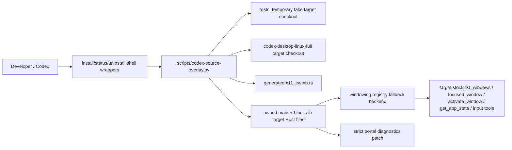

## Overview

This change adds a repository-owned source overlay engine for applying the standalone `codex-computer-use-x11` work into the local Codex Desktop Linux target checkout in a reversible way. The overlay is deliberately a script/template layer, not a fork: it owns one generated target backend file and marker-block patches in existing target Rust files, and verification must uninstall it after real-target smoke.

## Goals

- Provide `scripts/install-codex-source-overlay.sh`, `scripts/uninstall-codex-source-overlay.sh`, and `scripts/status-codex-source-overlay.sh` as stable public commands for this project.
- Apply an `x11-ewmh` target backend that compiles inside `computer-use-linux`, maps to the existing target `WindowInfo`, and registers after desktop-specific backends.
- Keep target changes reversible and marker-owned, with status reporting for `clean`, `applied`, and `drifted` states.
- Patch strict portal diagnostics where the overlay touches target readiness, so successful empty `RemoteDesktop` introspection does not imply portal input support.
- Test the overlay engine against fake target repos before touching the real target checkout.

## Non-Goals

- No long-lived mutation of `/home/as/Документы/AI_PROJECTS/codex-desktop-linux-full` after verification.
- No public stock `focus_window` or `mousemove` tool added to the target.
- No Cinnamon/Muffin extension, Wayland compositor backend, or native `x11rb` backend in this change.
- No vendoring GPL/AGPL/no-license external source code.
- No upstream PR or package-manager integration; that belongs to later packaging/upstreaming backlog.

## Architecture

### Components

1. **Shell wrappers**
   - Thin executable scripts:
     - `/home/as/ai-projects/codex-computer-use-x11/scripts/install-codex-source-overlay.sh`
     - `/home/as/ai-projects/codex-computer-use-x11/scripts/uninstall-codex-source-overlay.sh`
     - `/home/as/ai-projects/codex-computer-use-x11/scripts/status-codex-source-overlay.sh`
   - Each wrapper calls `python3 scripts/codex-source-overlay.py <install|uninstall|status> "$@"` from the repository root.
   - Public arguments: `--target <path>`; if omitted, target resolution uses `CODEX_DESKTOP_LINUX_FULL_PATH`, then `/home/as/Документы/AI_PROJECTS/codex-desktop-linux-full`.

2. **Overlay engine**
   - Python is used because marker-block patching, idempotence checks, and fake target fixture setup are easier and safer than long Bash string manipulation.
   - `preflight()` validates required target files and anchors before mutation.
   - `install()` writes the generated backend file and replaces/inserts marker blocks.
   - `uninstall()` removes owned marker blocks and removes the generated backend only when it still contains the owned generated header.
   - `status()` checks required files, marker counts, generated backend hash/content, target git commit, and unowned native X11 conflicts.
   - Output is line-oriented for script-friendly checks, for example `state=clean`, `state=applied`, `state=drifted`, `target=...`, `target_commit=...`, and diagnostic `detail=...` lines.

3. **Generated backend**
   - Target path: `computer-use-linux/src/windowing/backends/x11_ewmh.rs`.
   - Owned header includes `// Generated by codex-computer-use-x11 source overlay.` and the marker name.
   - Public pieces used by registry:
     - `pub const X11_EWMH_BACKEND: &str = "x11-ewmh";`
     - `pub fn probe() -> BackendProbe`
     - `pub fn list_windows() -> Result<Vec<WindowInfo>>`
     - `pub fn activate_window(window_id: u64) -> Result<()>`
   - Parser tests live in the generated module so target `cargo test -p codex-computer-use-linux x11_ewmh` can validate core backend behavior.
   - Runtime commands are `wmctrl -lpGx`, `xprop -root _NET_ACTIVE_WINDOW`, and `wmctrl -ia <hex-id>`.

4. **Target patches**
   - `windowing/backends/mod.rs`: marker block adds `pub mod x11_ewmh;`.
   - `windowing/registry.rs`: marker blocks add the `x11_ewmh` import, public constant export, backend kind, order entry after i3, descriptor, list dispatch, activation dispatch, probe entry, and backend id mapping.
   - `windowing/mod.rs`: marker blocks export `X11_EWMH_BACKEND` and update the registry-order test expectation/import so target tests remain truthful.
   - `diagnostics.rs`: marker block changes `portal_interface_check()` to require meaningful methods for `RemoteDesktop` and `Screenshot` when introspection succeeds. This avoids treating an empty table as an available portal input backend.

## Data / State Model

The overlay does not maintain a long-lived state database. It derives state from the target filesystem:

- **clean**: target structure is valid, no owned marker blocks are present, no owned generated backend file is present.
- **applied**: all expected marker blocks are present exactly once, generated backend content matches the overlay template, and no unowned X11 conflict is detected.
- **drifted**: target structure is invalid, expected markers are missing/duplicated, generated backend content differs, generated backend is missing while markers remain, marker blocks remain while backend is absent, or unowned native X11 content conflicts with the project-owned overlay.

Status also prints the current target git commit when available. The commit is evidence, not a lock: a changed commit can be reported as context or drift depending on marker/template consistency.

## Key Decisions

### Decision: Use marker blocks plus one owned backend file

Alternatives considered: patch target files in-place without markers, maintain a long-lived target branch, or copy the whole target module tree into this repo. Markers plus one generated file are the smallest reversible boundary and make uninstall safe.

### Decision: Late fallback registration

`x11-ewmh` registers after GNOME extension, GNOME introspect, COSMIC, KWin, Hyprland, and i3. This respects target-specific backends and uses generic X11/EWMH only when more specific backends are unavailable or empty.

### Decision: Existing target tool surface only

The backend feeds `list_windows`, `focused_window`, and `activate_window`. Pointer/keyboard actions remain the existing target `click`, `scroll`, `drag`, `press_key`, and `type_text` tools. The overlay does not add `focus_window`, duplicate `x11_*` stock tools, or public `mousemove`.

### Decision: Diagnostics patch is strict but narrow

The overlay patches `portal_interface_check()` rather than redesigning the target diagnostics schema. It checks method names in `busctl introspect` output for portal interfaces so empty tables are unavailable, while preserving existing `PortalReport`, `CapabilityMap`, and `ReadinessReport` shapes.

## Failure Handling

- Missing target files or anchors: fail before mutation with a clear error.
- Native/unowned X11 backend conflict: refuse or report compatibility/adaptor mode; do not overwrite.
- Partial marker drift: `status` reports `state=drifted`; `install` refuses to proceed from drift so it does not accidentally overwrite a moving target; `uninstall` removes only owned blocks and refuses to remove an unowned `x11_ewmh.rs`.
- Real target cargo test failure: record exact command/output in `test-plan.md`, uninstall the overlay, and stop if the failure is not fixable in this repo.

## Test Strategy

- Integration tests in `tests/source_overlay_scripts.rs` create temporary fake target checkouts with minimal target Rust files and run the public scripts through `Command`.
- Tests cover missing structure, clean/applied/drift status, install marker/backend creation, repeated install idempotence, uninstall preservation of unrelated content, and unowned native X11 conflict refusal.
- Generated target parser tests are validated indirectly by fake target content checks and directly during real target smoke via `cargo test -p codex-computer-use-linux x11_ewmh` after install.
- Existing project checks remain mandatory: `make fmt`, `make check`, `make test`, and OpenSpec strict validation.

## Verification Plan

1. Run fake-target RED/GREEN TDD slices from `test-plan.md`.
2. Run full project checks.
3. Run real target status/apply/test/uninstall smoke:
   - `scripts/status-codex-source-overlay.sh --target /home/as/Документы/AI_PROJECTS/codex-desktop-linux-full`
   - `scripts/install-codex-source-overlay.sh --target ...`
   - `cargo test -p codex-computer-use-linux x11_ewmh --manifest-path <target>/Cargo.toml`
   - `cargo test -p codex-computer-use-linux registry_keeps_stable_backend_order --manifest-path <target>/Cargo.toml`
   - optional diagnostics-focused target test/filter when the patch is active
   - `scripts/uninstall-codex-source-overlay.sh --target ...`
   - final `git -C <target> status --short` must be clean.

## Open Questions

None.
