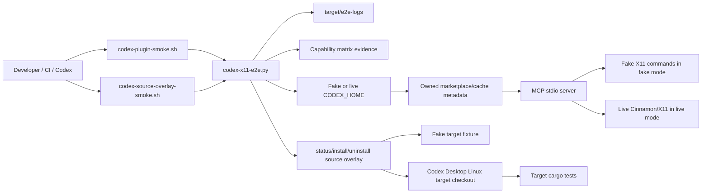

## Context

Backlog 11 needs repeatable e2e evidence for two delivery paths that now exist in the repository:

1. **Standalone plugin path** — `scripts/install-codex-plugin.sh` writes owned Codex plugin marketplace/cache metadata and an MCP server binary exposing namespaced `x11_*` tools.
2. **Source-overlay path** — `scripts/status/install/uninstall-codex-source-overlay.sh` can temporarily patch the local Codex Desktop Linux target checkout with `x11-ewmh` marker-owned code and then return it to clean state.

Relevant project constraints:

- `CONSTITUTION.md`: Rust 2021/Cargo, root `Makefile` checks, no secrets in tracked files, local target path via `CODEX_DESKTOP_LINUX_FULL_PATH`, no direct `/opt/codex-desktop` mutation, and verification must run OpenSpec validation plus Rust checks.
- `CONTEXT.md`: `E2E harness`, `Capability matrix evidence`, `x11-ewmh`, `Source overlay`, `App state`, `Layer-degraded app state`, `X11 root coordinates`, and `Overlay drift` vocabulary.
- `ARCHITECTURE.md`: OpenSpec artifacts remain source of truth; safe checkpoints are local; source-overlay work must preserve stock target tool surfaces and local-secret boundaries.
- `adr/0008-adopt-x11-root-coordinate-model.md`: pointer points, bounds, and screenshot crop rectangles use X11 root/global pixel coordinates; future source overlay should reuse target screenshot providers instead of making the X11 backend own screenshot capture.
- Grill findings: automated e2e should use installed plugin metadata plus MCP stdio as its primary deterministic boundary; fake mode may accept explicit degraded screenshot/AT-SPI evidence; source-overlay smoke must use stock `activate_window` and not fail solely for absent stock `focus_window`/`mousemove`; live source-overlay mutation is allowed only during reversible install/test/uninstall.

## Goals / Non-Goals

**Goals:**

- Provide public smoke entrypoints:
  - `scripts/e2e/codex-plugin-smoke.sh`
  - `scripts/e2e/codex-source-overlay-smoke.sh`
- Implement a shared stdlib-only Python runner under `scripts/e2e/` so shell wrappers stay thin and testable.
- Support `--fake` no-GUI mode for deterministic CI and `--live` mode for current Cinnamon/X11 evidence.
- Validate standalone plugin marketplace/cache metadata, installed `.mcp.json`, MCP startup, tool discovery, safe fake tool calls, and no unnamespaced stock tool leakage.
- Validate source-overlay status/install/uninstall against a fake fixture and live target cleanliness when requested.
- Produce run logs and JSON evidence under `target/e2e-logs/` or `--log-dir` on both success and failure.
- Validate capability-matrix coverage for doctor/capabilities, window listing/focus, `get_app_state`, keyboard input, pointer input, screenshot, AT-SPI, and install/rollback.

**Non-Goals:**

- Do not automate the Codex Desktop UI as the primary archive gate.
- Do not change existing standalone CLI/MCP tool names or target stock tool names.
- Do not modify `/opt/codex-desktop`, require sudo, or read `.secrets.local.env`.
- Do not permanently patch the real target checkout.
- Do not copy or vendor external project code.
- Do not require real screenshot/AT-SPI availability in fake mode; explicit degraded evidence is acceptable.

## Decisions

### 1. Shared runner with two shell wrappers

Implement:

```text
scripts/e2e/
  codex-plugin-smoke.sh          # thin wrapper
  codex-source-overlay-smoke.sh  # thin wrapper
  codex-x11-e2e.py               # shared runner, stdlib only
```

Both wrappers resolve the repository root and execute:

```bash
python3 scripts/e2e/codex-x11-e2e.py plugin "$@"
python3 scripts/e2e/codex-x11-e2e.py source-overlay "$@"
```

The Python runner owns argument parsing, temp fixtures, MCP JSON-RPC, log/evidence writing, and capability-matrix validation. Keeping the logic in one stdlib Python file avoids adding dependencies and makes failure-path logging easier than in pure Bash.

Alternative rejected: duplicate Bash logic in both wrappers. It would make JSON parsing, JSON-RPC stdio, and failure-safe evidence writes more fragile.

### 2. Fake mode creates isolated fixtures by default

Common options:

```text
--fake | --live              # default: --fake
--log-dir <dir>              # default: target/e2e-logs
--evidence-out <file>        # optional exact JSON evidence path
--keep-temp                  # keep generated fixtures for debugging
```

Plugin-specific options:

```text
--codex-home <dir>           # validate an existing fixture/live CODEX_HOME
--no-auto-install            # fake mode only: do not install into temp CODEX_HOME
--binary <path>              # plugin binary for fake auto-install; defaults to CODEX_X11_PLUGIN_BINARY or cargo build via installer
```

Source-overlay-specific options:

```text
--target <dir>               # validate an existing target/live target
--skip-target-cargo-tests    # live mode escape hatch for environment-only reporting, recorded as degraded
```

Behavior:

- Plugin fake mode with no `--codex-home` creates a temp `CODEX_HOME`, invokes `scripts/install-codex-plugin.sh` with `CODEX_HOME` and `CODEX_CONFIG_FILE`, and uses `CODEX_X11_PLUGIN_BINARY`/`--binary` when supplied to avoid release rebuilds in tests.
- Plugin fake mode with `--codex-home` does not auto-install by default; this enables the required missing-plugin failure scenario.
- Source-overlay fake mode with no `--target` creates a temp fixture target matching the anchors needed by the existing source-overlay scripts.
- Live mode never auto-creates a fake environment; it resolves real `CODEX_HOME` or target path and reports missing setup as failure/degraded evidence as appropriate.

### 3. Plugin smoke validates installed metadata before MCP calls

Metadata checks:

1. Marketplace file exists:
   `plugins/marketplaces/codex-computer-use-x11/.agents/plugins/marketplace.json`.
2. Marketplace plugin entry named `codex-computer-use-x11` exists and points to `./plugins/codex-computer-use-x11`.
3. Marketplace plugin path resolves to the owned cache namespace:
   `plugins/cache/codex-computer-use-x11/codex-computer-use-x11/latest`.
4. Installed `.codex-plugin/plugin.json` name/version and `.mcp.json` server command/args are valid.
5. The resolved MCP command is executable from the plugin directory.

Only after these pass does the smoke start MCP. This keeps installation failures distinct from server/tool failures.

### 4. MCP stdio runner is the deterministic Codex-facing tool boundary

The runner implements a minimal JSON-RPC client:

1. Spawn installed command from `.mcp.json` with cwd set to the plugin directory.
2. Send `initialize` with protocol `2025-06-18`.
3. Send `notifications/initialized`.
4. Send `tools/list` and assert deterministic standalone tool names.
5. Send `tools/call` for safe fake/live checks.

Fake plugin mode injects a temporary fake command directory at the front of `PATH`:

- `wmctrl` returns one stable window for `-lpGx` and succeeds for `-ia`.
- `xprop` returns a stable `_NET_ACTIVE_WINDOW` and `_NET_SUPPORTING_WM_CHECK`.
- `xdotool` appends invoked arguments to `target/e2e-logs/.../fake-xdotool.log` and exits 0.
- `busctl` returns status 0 with a RemoteDesktop header/no methods fixture, proving strict portal method detection.
- optional `gdbus` returns a controlled failure so screenshot/AT-SPI can degrade without crashing the whole smoke.

Fake MCP calls:

- `x11_doctor` — validates `backend=x11-ewmh`, strict RemoteDesktop unavailable when methods absent, and input route facts.
- `x11_list_windows`, `x11_focused_window`, `x11_focus_window` — validates listing/focus through fake X11 commands.
- `x11_get_app_state` — validates layered app-state JSON, allowing screenshot/AT-SPI degraded reasons.
- `x11_type_text`, `x11_press_key` — validates targeted keyboard routing through fake focus + fake `xdotool`.
- `x11_click`, `x11_scroll`, `x11_drag` — validates root-coordinate pointer routes inside fake window bounds through fake `xdotool`.
- `x11_accessibility_tree` — records pass or degraded AT-SPI evidence.

Live plugin mode uses the same MCP flow but avoids unsafe input unless a safe live target is provided in a later change. For this change, live mode can record keyboard/pointer as degraded with a clear safety reason if no explicit safe target is configured.

### 5. Source-overlay smoke remains reversible

Fake source-overlay mode:

1. Create a temp target fixture with the minimal `computer-use-linux` files and anchors already used by `tests/source_overlay_scripts.rs`.
2. Run `scripts/status-codex-source-overlay.sh --target <fixture>` and expect `state=clean`.
3. Run `scripts/install-codex-source-overlay.sh --target <fixture>`.
4. Validate generated `x11_ewmh.rs` and marker blocks through existing status output.
5. Run `scripts/uninstall-codex-source-overlay.sh --target <fixture>`.
6. Run final status and expect `state=clean`.
7. Record stock target tool vocabulary as degraded when the fake fixture does not model full target `server.rs`.

Live source-overlay mode:

1. Resolve target from `--target`, `CODEX_DESKTOP_LINUX_FULL_PATH`, or the documented local default.
2. Require initial `git status --short` clean.
3. Inspect current `computer-use-linux/src/server.rs` for stock tool names; map focus to `activate_window`; record absent `focus_window`/`mousemove` as non-blocking facts.
4. Run source-overlay status/install.
5. Run focused target tests when not skipped:
   - `cargo test -p codex-computer-use-linux x11_ewmh --manifest-path <target>/Cargo.toml`
   - `cargo test -p codex-computer-use-linux registry_keeps_stable_backend_order --manifest-path <target>/Cargo.toml`
   - `cargo test -p codex-computer-use-linux portal --manifest-path <target>/Cargo.toml`
6. Always attempt uninstall in `finally` if install reached mutation.
7. Require final source-overlay status `state=clean` and target `git status --short` clean.

### 6. Capability matrix evidence and validator

Evidence shape:

```json
{
  "schema_version": 1,
  "run_id": "20260531T...",
  "mode": "fake",
  "delivery_path": "standalone_plugin",
  "log_dir": "target/e2e-logs/...",
  "checks": [
    {"name": "marketplace_metadata", "status": "pass", "detail": "..."}
  ],
  "capability_matrix": {
    "doctor/capabilities": {
      "standalone_plugin": {"status": "pass", "evidence": ["x11_doctor"]},
      "source_overlay": {"status": "degraded", "reason": "not evaluated by plugin smoke"}
    }
  }
}
```

Fixed groups:

- `doctor/capabilities`
- `window listing/focus`
- `get_app_state`
- `keyboard input`
- `pointer input`
- `screenshot`
- `AT-SPI`
- `install/rollback`

Fixed paths:

- `standalone_plugin`
- `source_overlay`

Validator rules:

- Every group/path entry must exist.
- Status must be `pass` or `degraded` for matrix entries. Failed checks are reported in `checks` and make process exit non-zero.
- `degraded` entries must include a non-empty reason.
- Missing entries cause `missing evidence` failure.

The runner will also expose `validate-matrix --evidence <file>` for focused tests of the missing-evidence behavior.

### 7. Logs and failure safety

Each run creates a run directory:

```text
target/e2e-logs/<delivery-path>-<mode>-<timestamp>-<pid>/
  run.log
  evidence.json
  fake-xdotool.log       # fake plugin mode only
  child-stderr.log       # MCP child stderr when available
```

Implementation uses `try/finally` so evidence is written even when a check raises. The runner prints only sanitized paths and diagnostics; it never reads `.secrets.local.env` and does not print local config file contents beyond owned file paths and JSON keys.

### Boundary diagram



## Risks / Trade-offs

- **Fake mode can overfit to fixtures.** Mitigation: live modes remain available and source-overlay live mode runs target cargo tests against the real checkout.
- **MCP stdio is not the full Desktop UI path.** Mitigation: it is the stable machine-checkable boundary for plugin correctness; docs record manual Desktop steps until a stock runner exists.
- **Live input can be unsafe without a controlled target.** Mitigation: this change records live keyboard/pointer as degraded unless a later explicit safe target is configured; fake mode proves routing without real input.
- **Target checkout may drift.** Mitigation: live source-overlay smoke requires clean start/final status and always attempts uninstall.
- **Logs might accidentally include environment values.** Mitigation: log only selected command paths, statuses, owned JSON key names, and sanitized stderr snippets; never read secrets.

## Migration Plan

1. Add the scripts and tests without changing existing CLI/MCP behavior.
2. Make scripts executable.
3. Add docs explaining fake and live usage, evidence files, capability matrix, and manual Desktop fallback steps.
4. Run fake script tests through `make test`.
5. Run fake plugin/source-overlay smoke directly.
6. Run live/degraded smoke where safe:
   - plugin live metadata/MCP startup if user-local install is present or install into isolated temp `CODEX_HOME`;
   - source-overlay live status/install/target cargo tests/uninstall/final clean against the configured target checkout.
7. Archive only after OpenSpec strict validation, `make fmt`, `make check`, `make test`, fake e2e scripts, and any available live smoke complete or record exact environmental degraded reasons.

Rollback is simple: remove `scripts/e2e/`, e2e docs/tests, and generated logs under `target/e2e-logs/` if this change is reverted. Live source-overlay smoke already uninstalls its own target mutations.

## Open Questions

None.
