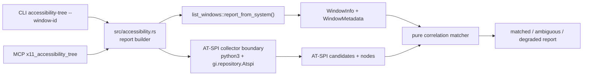

## Context

The standalone crate already provides X11/EWMH window listing, focused-window lookup, focus verification, safe targeted keyboard input, safe targeted pointer input, and a user-local MCP plugin surface. Window listing uses `wmctrl -lpGx` plus per-window/active `xprop` data and records sidecar `WindowMetadata.pid_reliability` separately from `WindowInfo.pid`.

The target Codex Desktop Linux checkout already has a richer `computer-use-linux/src/atspi_tree.rs` that uses Rust `atspi`/`zbus` to list accessibility apps, read nodes, bounds, states, actions, text, values, and editable text. This change does not patch that target; it designs the standalone feedback loop so later source-overlay work can port the proven confidence model into the target.

Constitution and architecture constraints preserved:

- Rust 2021/Cargo root crate remains the implementation stack.
- `x11-ewmh` remains the backend id and canonical generic X11/EWMH term.
- `.secrets.local.env` is not needed or read; no external secret values are involved.
- The source checkout is read-only research context for this change.
- Verification requires OpenSpec validation plus `make fmt`, `make check`, and `make test`.
- TDD apply must use public CLI/MCP behavior slices.
- Claude review remains disabled in session state per user request; no global Claude config changes.

Boundary diagram:

## Goals / Non-Goals

**Goals:**

- Add `codex-computer-use-x11 accessibility-tree --window-id <id> --json`.
- Add MCP tool `x11_accessibility_tree` after pointer tools.
- Build a stable JSON report with `success`, `window`, `correlation`, `tree`, `error_code`, `note`, and `diagnostics`.
- Implement a pure, testable correlation matcher that scores candidates from reliable PID, title/name, app/class text, bounds overlap, and focused state.
- Return no subtree on ambiguity, missing window, unavailable AT-SPI, or below-threshold confidence.
- Use public CLI/MCP tests with fake command boundaries before live smoke.
- Keep live AT-SPI collection bounded by node/depth limits and able to fail as `AtspiUnavailable`.

**Non-Goals:**

- No source overlay or mutation of `/home/as/Документы/AI_PROJECTS/codex-desktop-linux-full`.
- No durable architecture change to `ARCHITECTURE.md`.
- No CDP/browser-specific semantic tree integration.
- No Cinnamon/Muffin extension.
- No AT-SPI action invocation or value setting in the standalone plugin; this stage only returns a correlated tree.
- No claim that an accessibility tree proves input safety; focus verification remains the input safety boundary.

## Decisions

1. **Create `src/accessibility.rs` as the standalone correlation module.**
   - Public report entrypoint: `accessibility_tree_report_from_system(window_id: u64)`.
   - Internal testable entrypoint: `report_from_listing_and_collection(window_id, listing, collection_result)`.
   - Report fields:
     - `project`, `version`, `backend`.
     - `success` boolean.
     - `window: Option<WindowInfo>`.
     - `correlation: CorrelationResult` with `status`, `confidence`, `score`, `matched_object_ref`, `reasons`, and optional `candidates` summary.
     - `tree: Vec<AccessibilityNode>`.
     - `error_code: Option<String>`.
     - `note` and `diagnostics`.
   - Status values: `matched`, `ambiguous`, `no_match`, `degraded`.

2. **Carry X11 PID reliability from listing diagnostics into the matcher.**
   - Add a helper that maps `WindowListReport.diagnostics.window_metadata` by `window_id`.
   - `PidReliability::Reliable` permits PID score when `WindowInfo.pid == candidate.pid`.
   - `PidReliability::Unreliable` or `Unknown` records a reason and does not award PID score.
   - If `WindowInfo.pid` is `None`, the matcher must rely on non-PID signals.

3. **Use deterministic scoring and conservative thresholds.**
   - Reliable PID match: +45.
   - Title/name similarity: +25 for exact/contains token-normalized match, +15 for meaningful token overlap.
   - WM class/app name similarity: +20 for exact/contains normalized app/class match, +10 for token overlap.
   - Bounds overlap: up to +20 when candidate and window bounds overlap materially.
   - Focus state: +10 when the window is focused and the candidate reports focused/active state.
   - Confidence:
     - `high` at score >= 70 with either reliable PID or at least two non-PID corroborating signals.
     - `medium` at score >= 45 with at least two non-PID corroborating signals.
     - below threshold is `no_match`.
   - Ambiguity: if multiple candidates meet threshold and top scores are within 10 points, return `AmbiguousAccessibilityMatch` with candidate summaries and an empty tree.

4. **Represent AT-SPI collection as a bounded external boundary.**
   - Use `python3` with `gi.repository.Atspi` for the standalone live collector because this crate currently stays lightweight and command-testable.
   - The collector writes a JSON object to stdout with `ok`, `candidates`, and diagnostics. Stderr warnings from AT-SPI are captured as diagnostics and not mixed into CLI stdout.
   - If `python3` or GI/AT-SPI is unavailable, if the command exits non-zero, or if JSON cannot be parsed, return `AtspiUnavailable` / `degraded`.
   - This boundary is intentionally replaceable by Rust `atspi` during future source-overlay work; the matcher/report contract remains the portable part.

5. **AT-SPI candidate and node model.**
   - Candidate fields: `object_ref`, `name`, `role`, `pid`, `bounds`, `states`, `focused`, `nodes`.
   - Node fields: `index`, `parent_index`, `depth`, `object_ref`, `role`, `name`, `description`, `child_count`, `bounds`, `states`, `actions`, `value`, `supports_editable_text`.
   - Bounds use screen coordinates to align with X11 `wmctrl` bounds.
   - The collector traverses breadth-first with constants such as `MAX_CANDIDATES=200`, `MAX_NODES=500`, and `MAX_DEPTH=8`, and records truncation.

6. **CLI parsing remains explicit.**
   - Add usage line: `codex-computer-use-x11 accessibility-tree --window-id <id> --json`.
   - Missing `--json`, invalid flags, or invalid window id return stderr/non-zero before collection.
   - Missing listed window returns a JSON `WindowNotFound` report and must not invoke the collector.

7. **MCP wrapper delegates to the report builder.**
   - Add `x11_accessibility_tree` with input schema `{ window_id: string }`.
   - Normalize decimal/hex ids through `parse_x11_window_id`.
   - Return `isError=true` whenever the report has `success=false` or argument parsing fails.
   - Do not expose an unprefixed `accessibility_tree` tool.

8. **Testing follows public interface TDD.**
   - Use fake `wmctrl`, `xprop`, and `python3` scripts in a temporary `PATH` to exercise the compiled CLI.
   - MCP tests start the actual stdio server and verify tool ordering and missing-window/degraded behavior.
   - Pure helper unit tests may be added only if matcher edge cases cannot be expressed clearly through CLI fixtures; public CLI/MCP tests remain acceptance evidence.

## Risks / Trade-offs

- **Python GI live boundary:** keeps the crate lightweight and command-testable but is less portable than Rust `atspi`. Mitigation: structured `AtspiUnavailable`, pure matcher tests, and design notes for future Rust port.
- **AT-SPI stderr warnings:** live AT-SPI may emit D-Bus warnings. Mitigation: collector stderr is captured into diagnostics; CLI stdout remains JSON only.
- **Threshold tuning:** scores may need adjustment after live app evidence. Mitigation: expose scores/reasons and keep thresholds local/reversible.
- **Window decoration/bounds mismatch:** `wmctrl` and AT-SPI bounds may disagree due to frame/client geometry. Mitigation: bounds are one signal, not a sole selector; screenshot/coordinate model is later backlog 09.
- **Browser/Electron limited native tree:** AT-SPI may show chrome or app roots but not full web content. Mitigation: report medium confidence on window-level match; CDP integration is explicitly out of scope.
- **Terminal child process ambiguity:** terminal context is richer in the target repo than in the standalone crate. Mitigation: do not trust child PID alone; require terminal title/class/bounds or future terminal context before confidence is raised.

## Migration Plan

1. Add RED CLI fixture test for a high-confidence PID/title/bounds match.
2. Implement minimal `src/accessibility.rs`, CLI parsing, fake collector JSON parsing, scoring, and high-confidence report.
3. Add RED/GREEN slices for unreliable PID with non-PID match, ambiguity, browser PID mismatch, terminal child PID avoidance, and AT-SPI unavailable degradation.
4. Add MCP tool listing/schema/call wrapper and tests.
5. Record RED/GREEN evidence in `test-plan.md` and mark tasks complete only after evidence exists.
6. Run `openspec validate add-x11-atspi-window-correlation --strict`, `make fmt`, `make check`, `make test`, focused CLI/MCP tests, and live/degraded smoke.
7. Rollback is deleting `src/accessibility.rs`, removing CLI/MCP wiring/tests, and reverting the OpenSpec change before archive. No user-local data migration is introduced.

## Open Questions

None
