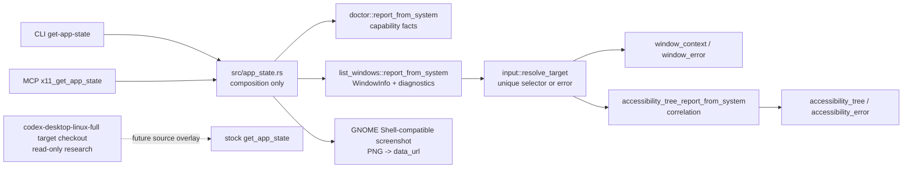

## Context

The standalone crate already exposes separate X11/EWMH layers:

- `list_windows` maps `wmctrl -lpGx` into upstream-shaped `WindowInfo` plus sidecar diagnostics.
- `input::resolve_target` provides safe selector semantics for `window_id`, `pid`, `wm_class`, and `title`.
- `accessibility` correlates one resolved X11 window to AT-SPI candidates and refuses ambiguous/low-confidence matches.
- `coordinates` validates root-coordinate window bounds and screenshot crop provider boundaries.
- `doctor` reports X11, portal, screenshot, accessibility, and input diagnostics, but live `gather_system_facts()` currently does not populate portal screenshot/RemoteDesktop/AT-SPI probe outputs even though parser fixture support exists.
- `mcp` exposes deterministic project-owned `x11_*` tools.

The target checkout's stock `computer-use-linux/src/server.rs` already defines the desired conceptual shape for `get_app_state`: target selectors feed `resolve_window_context`, screenshot capture is independent, AT-SPI filtering is independent, and errors are reported per layer. This change keeps `/home/as/Документы/AI_PROJECTS/codex-desktop-linux-full` read-only.

Relevant constraints:

- `CONSTITUTION.md`: Rust 2021/Cargo, root `make fmt` / `make check` / `make test`, no secrets, target checkout read-only unless explicitly targeted, OpenSpec validation required.
- `CONTEXT.md`: canonical backend id `x11-ewmh`; `App state` and `Layer-degraded app state` now define the composed read model and per-layer degradation.
- ADR 0008: X11 root/global coordinates are canonical; screenshot crop/full screenshot behavior must not create a competing target screenshot stack in future source-overlay work.

## Goals / Non-Goals

**Goals:**

- Add `src/app_state.rs` as a shallow composition layer that reuses existing public standalone report builders instead of duplicating parser or matcher logic.
- Add CLI `get-app-state` with selectors, `--json`, and `--no-screenshot`.
- Add MCP `x11_get_app_state` with optional `include_screenshot` and target selectors.
- Add screenshot capture for app-state that returns target-compatible `ScreenshotCapture` fields: `mime_type`, `data_url`, `source`, `width`, and `height`.
- Improve doctor live fact gathering so app-state diagnostics include strict RemoteDesktop, screenshot provider, and AT-SPI bus facts.
- Update README and integration contract with standalone and source-overlay guidance.

**Non-Goals:**

- No writes to the target checkout.
- No unnamespaced stock `get_app_state` tool in the standalone MCP server.
- No Cinnamon/Muffin extension, native X11 library dependency, portal RemoteDesktop input implementation, or source-overlay registration patch.
- No replacement of existing `accessibility-tree`, `screenshot-crop`, or targeted input behavior.

## Decisions

### 1. Composition module and report shape

Create `src/app_state.rs` with:

- `GetAppStateParams { target: input::WindowTarget, include_screenshot: bool }`.
- `GetAppStateReport` fields aligned to target concepts: `project`, `version`, `backend`, `window_context`, `window_error`, `screenshot`, `screenshot_error`, `accessibility_tree`, `accessibility_error`, `diagnostics`, `message`.
- `AppStateDiagnostics` containing `doctor::DoctorReport`, optional window-listing diagnostics, target candidates, optional accessibility correlation/diagnostics, and layer summary strings.

The module calls `list_windows::report_from_system()` once for target resolution. If there is a target:

1. use `input::resolve_target(&listing.windows, &target)`;
2. on success, set `window_context` and call `accessibility::accessibility_tree_report_from_system(window_id)`;
3. on target error, set `window_error` with error code/note and candidates, and skip AT-SPI collection because no concrete window is safe to correlate.

If there is no target, do not treat it as an error. Return no `window_context`, no `window_error`, screenshot if requested, doctor diagnostics, and an explanatory message.

### 2. Screenshot provider for app state

Add a small `app_state` screenshot boundary rather than reusing `screenshot-crop`, because app-state needs target-compatible screenshot data and does not necessarily have a target/output path.

Runtime order for this change:

1. Try GNOME Shell-compatible DBus through `gdbus call --session --dest org.gnome.Shell.Screenshot --object-path /org/gnome/Shell/Screenshot --method org.gnome.Shell.Screenshot.Screenshot false false <temp.png>`.
2. Read the PNG, parse dimensions using the existing PNG dimension logic pattern, base64 encode the bytes, and remove the temp file.
3. Report provider failure in `screenshot_error` without failing other layers.

The implementation will add a `base64` crate dependency. This mirrors target `screenshot.rs` and keeps screenshot data opt-out through `--no-screenshot` / `include_screenshot=false`.

### 3. Doctor live probes

Keep existing fixture parser functions, but make `gather_system_facts()` populate live optional facts when safe tools are available:

- RemoteDesktop: `busctl --user introspect org.freedesktop.portal.Desktop /org/freedesktop/portal/desktop org.freedesktop.portal.RemoteDesktop`.
- Portal Screenshot: `gdbus introspect --session --dest org.freedesktop.portal.Desktop --object-path /org/freedesktop/portal/desktop` filtered by parser, or direct command output if parser can scan the full output.
- GNOME Shell-compatible screenshot: `gdbus introspect --session --dest org.gnome.Shell.Screenshot --object-path /org/gnome/Shell/Screenshot`.
- AT-SPI bus: `gdbus call --session --dest org.a11y.Bus --object-path /org/a11y/bus --method org.a11y.Bus.GetAddress`; tree availability remains conservative unless the existing AT-SPI collector/app-state correlation succeeds.

Failures become unavailable/degraded details; no secrets or screenshot bytes are gathered by doctor.

### 4. CLI and MCP surfaces

CLI grammar:

```text
codex-computer-use-x11 get-app-state [--window-id <id>|--title <text>|--wm-class <class>|--pid <pid>] [--no-screenshot] --json
```

MCP schema:

- optional `window_id` string/number;
- optional `pid` number;
- optional `wm_class`, `title` strings;
- optional `include_screenshot` boolean defaulting to true.

MCP tool errors are reserved for malformed arguments. Layer-degraded app-state reports return `isError: false` because the tool call succeeded and the JSON carries layer-specific errors.

### 5. Documentation and target boundary

Update `README.md` command list and standalone MCP tool list. Update `docs/integration-contract.md` with target guidance: future source overlay should register `x11-ewmh` as a fallback window backend and improve stock `get_app_state`, while screenshot should use target `screenshot.rs` and AT-SPI should use target `atspi_tree.rs`/correlation semantics.

### Boundary diagram



## Risks / Trade-offs

- **Large responses:** Full screenshot data URLs can be large. Mitigation: CLI/MCP opt-out with `--no-screenshot` / `include_screenshot=false`; tests use tiny fake PNGs.
- **AT-SPI variability:** Local AT-SPI may be disabled or app-specific. Mitigation: keep `accessibility_error` layer-degraded and preserve window/screenshot data.
- **Doctor live probes may be slow/unavailable:** Use short external commands already used by diagnostics; failures degrade. If live probes cause test fragility, keep parser tests with fake output and smoke tests separate.
- **GDBus output differences:** `gdbus call` return signatures can vary. The screenshot provider only relies on provider writing the requested PNG; command success plus readable PNG determines success.
- **Source-overlay drift:** Target repo may change. This change records guidance only and does not attempt a long-lived patch.

## Migration Plan

1. Add RED tests for CLI app-state target resolution and ambiguous title behavior.
2. Implement minimal `src/app_state.rs`, CLI parser, and no-screenshot report.
3. Add RED/GREEN tests for fake screenshot provider and missing target with screenshot retained.
4. Add RED/GREEN tests for AT-SPI matched and ambiguous/unavailable layer behavior using fake `python3` collector.
5. Add RED/GREEN tests for doctor live probe gathering using fake `PATH` commands and parser fixtures.
6. Add RED/GREEN MCP tests for `tools/list`, `x11_get_app_state`, `include_screenshot=false`, and malformed argument rejection.
7. Update README/docs.
8. Run OpenSpec validation, `make fmt`, `make check`, `make test`, and live/degraded smoke.

Rollback is local Git revert of the change commits before archive. The target checkout is not modified.

## Open Questions

None.
