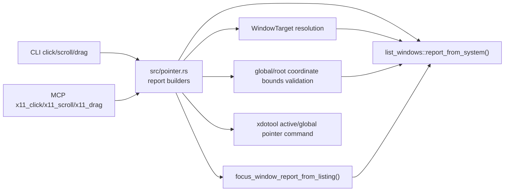

## Context

The project already has a standalone Rust CLI/MCP surface for X11/EWMH doctor, listing, focus, and verified keyboard input. `src/input.rs` defines the shared `WindowTarget` selectors and the keyboard report shape; `src/focus.rs` provides active-window focus verification; `src/list_windows.rs` provides `WindowInfo.bounds` from `wmctrl -lpGx` with signed X/Y and positive dimensions.

The target Codex Desktop Linux checkout already has stock `click`, `scroll`, and `drag` tools in `computer-use-linux/src/server.rs`, preferring `abs_pointer` and falling through to portal/ydotool. This change does not patch that target. The standalone plugin needs an isolated feedback loop using project-owned `x11_*` tool names and command-based fake tests.

Constitution and architecture constraints preserved:

- Rust 2021/Cargo root crate remains the implementation stack.
- No secret values or `.secrets.local.env` are needed.
- Target checkout is read-only research context for this change.
- Backend id remains `x11-ewmh`.
- OpenSpec validation and `make fmt`, `make check`, `make test` are required.
- Apply must follow vertical RED/GREEN/REFACTOR slices.

Boundary diagram:

## Goals / Non-Goals

**Goals:**

- Add `click`, `scroll`, and `drag` CLI commands that emit stable JSON reports.
- Add MCP tools `x11_click`, `x11_scroll`, and `x11_drag` in deterministic order after keyboard tools.
- Reuse current `WindowTarget` selectors: `window_id`, title substring, exact `wm_class`, and pid.
- For targeted pointer actions, require one resolved current window, known bounds, points inside those bounds, exact focus verification, and only then pointer backend invocation.
- Support explicit `--global` / `global: true` no-target mode with `verification_mode=global_unverified` and warning/degraded diagnostics.
- Cover behavior through public CLI/MCP tests with fake `PATH` commands before live smoke.

**Non-Goals:**

- No source overlay or target checkout mutation.
- No native Rust X11/XTest dependency in this stage.
- No screenshot capture, crop, client-area offset, or multi-monitor model beyond existing `WindowInfo.bounds` validation.
- No semantic AT-SPI pointer action; AT-SPI action preference belongs to the later AT-SPI correlation stage.
- No stock unprefixed MCP names such as `click`, `scroll`, or `drag` in the standalone plugin.

## Decisions

1. **Create `src/pointer.rs` and reuse `input::WindowTarget`.**
   - `input::resolve_target()` and its error/candidate types will be made public enough for pointer use instead of duplicating target resolution.
   - Pointer reports will have their own `PointerActionReport` / `PointerDiagnostics` so keyboard report compatibility stays unchanged.

2. **Use global/root X11 coordinates for this stage.**
   - CLI fields are absolute root coordinates: `--x/--y` for click/scroll and `--start-x/--start-y/--end-x/--end-y` for drag.
   - Targeted validation checks these absolute points against `WindowInfo.bounds` from the current listing.
   - `bounds.x` or `bounds.y` missing, absent `bounds`, or invalid dimensions returns `MissingBounds` before focus or injection.
   - Frame/client ambiguity is documented in `note`/diagnostics; this stage only proves the point lies within the reported window bounds.

3. **Safety pipeline order for targeted pointer actions:**
   1. Build the current listing.
   2. Resolve exactly one target window.
   3. Validate required bounds and point(s) against reported bounds.
   4. Refuse huge drags before focus.
   5. Focus requested window and require `exact_window_focused=true`.
   6. Verify `xdotool` exists.
   7. Run one finite active-context xdotool command.

   This order prevents activation side effects when the request is already unsafe due to stale/ambiguous target, missing bounds, out-of-bounds coordinates, or huge drag.

4. **Use standalone active-context `xdotool` pointer commands.**
   - Click: `xdotool mousemove --sync <x> <y> click --repeat <count> <button>`.
   - Scroll: `xdotool mousemove --sync <x> <y> click --repeat <amount> <wheel-button>`.
   - Drag: `xdotool mousemove --sync <start-x> <start-y> mousedown <button> mousemove --sync <end-x> <end-y> mouseup <button>`.
   - Direct `--window` events are not used or reported as safety evidence.
   - `PointerAttempt` records `command`, `args`, `ok`, `detail`, `active_context`, `used_direct_window`, and `global_injector`.

5. **Finite limits:**
   - Click count defaults to 1 and clamps to `1..=10`.
   - Scroll amount defaults to 1 and clamps to `1..=20`.
   - Drag button defaults to left/primary; huge drag is refused with `DragDistanceTooLarge` when either axis delta exceeds 4096 pixels.
   - Supported buttons: `left`/`primary` = 1, `middle` = 2, `right`/`secondary` = 3. Unsupported buttons return CLI/MCP validation errors before a report is built.
   - Supported scroll directions: `up` = 4, `down` = 5, `left` = 6, `right` = 7.

6. **Global/unverified mode is explicit and honest.**
   - Without target selectors and without `--global`, pointer actions return `MissingTarget`, `input_sent=false`, and no backend invocation.
   - With `--global`, target resolution and focus are skipped, `targeted=false`, `verification_mode=global_unverified`, and diagnostics include a warning that the action is not window-isolated.
   - Global mode still requires finite coordinates, finite amount/count, drag distance limit, and available backend.

7. **CLI parsing stays explicit by command.**
   - `click`: `(--window-id <id>|--title <text>|--wm-class <class>|--pid <pid>|--global) --x <i32> --y <i32> [--button <button>] [--count <u32>] --json`.
   - `scroll`: same target/global and point flags plus `--direction <up|down|left|right>` and optional `--amount <u32>`.
   - `drag`: same target/global flags plus `--start-x`, `--start-y`, `--end-x`, `--end-y`, optional `--button`.
   - Unsupported or missing required arguments return stderr and non-zero status without attempting focus/input.

8. **MCP wraps report builders.**
   - Tool order becomes `x11_doctor`, `x11_list_windows`, `x11_focused_window`, `x11_focus_window`, `x11_type_text`, `x11_press_key`, `x11_click`, `x11_scroll`, `x11_drag`.
   - MCP schemas describe payload fields and target selectors; runtime validation enforces target-or-global and returns report-level `MissingTarget` for safe refusals.
   - `isError` is true whenever `PointerActionReport.success` is false.

## Risks / Trade-offs

- **Global injector race:** focus can change after verification and before xdotool runs. Mitigation: verify immediately before command and report active-context/global-injector semantics.
- **Frame/client ambiguity:** `wmctrl` bounds may include decorations. Mitigation: validate only reported window bounds now and leave content/client precision to backlog/09.
- **Pointer side effects in live smoke:** real click/scroll/drag can affect the desktop. Mitigation: fake tests first; live smoke uses a disposable X11 test window if available, otherwise records a degraded limitation.
- **`xdotool` dependency:** standalone pointer actions fail when `xdotool` is missing. Mitigation: structured `InputBackendUnavailable` and doctor already reports `xdotool_candidate`.
- **MCP schema expressiveness:** the hand-written JSON schema will not encode all target-or-global conditions. Mitigation: runtime validation and report builders enforce safety.

## Migration Plan

1. Add failing public-interface CLI tests for pointer safety gates and backend command order.
2. Add `src/pointer.rs`, expose shared target resolution, and wire CLI commands.
3. Add MCP tool definitions, schemas, and tool-call wrappers.
4. Update tests for MCP tool order and missing-target safe refusals.
5. Run OpenSpec validation and project checks.
6. Rollback is deleting the new module/tests and reverting CLI/MCP wiring; no target checkout or user-local plugin config migration is required. Existing installer scripts continue to copy whichever binary is built.

## Open Questions

None
