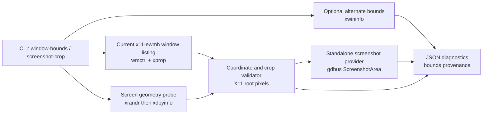

## Context

This change follows the project constitution: Rust 2021 at repository root, OpenSpec as source of truth, no secrets, read-only target checkout inspection, and verification through `make fmt`, `make check`, and `make test`. The relevant architecture snapshot keeps `x11-ewmh` as the generic X11/EWMH backend id, treats upstream `WindowInfo` as the primary model, and keeps X11-only reliability/provenance in sidecar diagnostics.

Current standalone code already lists windows through `wmctrl -lpGx`, marks focus through `_NET_ACTIVE_WINDOW`, and performs verified global/root pointer actions. Target `computer-use-linux/src/windowing/types.rs` confirms upstream `WindowBounds` shape:

```rust
pub struct WindowBounds {
    pub x: Option<i32>,
    pub y: Option<i32>,
    pub width: u32,
    pub height: u32,
}
```

Research refresh (2026-05-31):

- Target checkout `/home/as/Документы/AI_PROJECTS/codex-desktop-linux-full` was clean on `main`; relevant target files inspected read-only: `windowing/types.rs`, `windowing/target.rs`, `windowing/registry.rs`, `server.rs`, `diagnostics.rs`, `screenshot.rs`, `remote_desktop.rs`, `atspi_tree.rs`.
- Live Cinnamon/X11 session: `XDG_CURRENT_DESKTOP=X-Cinnamon`, `XDG_SESSION_TYPE=x11`, `DISPLAY=:0`.
- Tools available locally: `wmctrl`, `xprop`, `xwininfo`, `xrandr`, `xdpyinfo`, `gdbus`, `busctl`, `xdotool`.
- Live display geometry: `xrandr --listmonitors` reported three monitors and `xdpyinfo` reported one root screen of `5760x1547` pixels.
- Live screenshot providers: `org.gnome.Shell.Screenshot` exposes `ScreenshotArea`, `ScreenshotWindow`, and `Screenshot`; portal Screenshot exposes method `Screenshot` and version `2`.
- Live geometry gotcha: for one active browser window, `wmctrl -lpGx` reported `x=3840` while `xwininfo` and `xdotool getwindowgeometry` reported `x=1920`; therefore reports must expose source disagreement and bounds provenance.
- License refresh via GitHub license API preserved the no-copy policy: MIT/Apache references may inform design with attribution if code is ever copied; GPL/AGPL/unlicensed/NOASSERTION sources remain copy-unsafe for this MIT-oriented project. This change copies no external source code.



## Goals / Non-Goals

**Goals:**

- Add `window-bounds --window-id <id> --json` with upstream-compatible bounds, coordinate model metadata, and provenance diagnostics.
- Add reusable coordinate/crop validation that preserves signed coordinates, validates positive dimensions, supports negative monitor offsets in parsed display geometry, and reports clamp/refusal reasons.
- Add `screenshot-crop --window-id <id> [--x --y --width --height] --output <path> --json` as a standalone live-smoke crop provider boundary after validation.
- Keep screenshot provider availability separate from input readiness and document that source overlay should prefer target `screenshot.rs` instead of moving screenshot capture into the X11 backend.
- Add tests through public CLI and pure parser/validator functions using fake command `PATH` fixtures before live smoke.

**Non-Goals:**

- Do not implement backlog 09b `get_app_state`; this change only makes screenshot/bounds data compatible with that future integration.
- Do not modify the Codex Desktop Linux target checkout.
- Do not implement a custom full screenshot pipeline in the X11 backend or emit screenshot pixels/data URLs by default.
- Do not solve exact client-area geometry; frame/client differences are reported as provenance/uncertainty.
- Do not support Cinnamon Wayland or a Cinnamon/Muffin extension in this stage.

## Decisions

1. **Canonical coordinate space: X11 root/global pixels**
   - All standalone window bounds, pointer coordinates, and crop rectangles use root X11 pixels.
   - This aligns with current pointer action specs and target screenshot/pointer provider expectations.
   - Alternatives rejected: client-local coordinates by default (ambiguous without frame extents), per-monitor coordinates (breaks upstream `WindowBounds`), and mixed provider-specific coordinates (too error-prone).

2. **Preserve upstream `WindowBounds` exactly**
   - Reuse `list_windows::WindowBounds` for primary window bounds.
   - Add helper structs for crop rectangles and screen geometry, not new fields on `WindowInfo`.
   - Unknown x/y serialize as null; known negative x/y serialize as signed numbers.

3. **Primary vs alternate bounds**
   - `wmctrl -lpGx` remains the primary listing/bounds source for continuity with existing window-listing, focus, and pointer code.
   - `xwininfo -id <id>` is an optional alternate source in `window-bounds` diagnostics.
   - If sources disagree, the command reports `bounds_agree=false` and a degraded reason. It does not silently replace primary `WindowInfo.bounds`.

4. **Display geometry probing**
   - Prefer parsing `xrandr --listmonitors` because it can express monitor offsets, including negative offsets.
   - Fall back to `xdpyinfo` dimensions with origin `0,0` when xrandr is unavailable or unparseable.
   - Keep geometry diagnostics in report sidecars.

5. **Crop validation and provider invocation**
   - `screenshot-crop` defaults to the full target bounds when no explicit crop is provided.
   - Explicit crop rectangles are global/root coordinates, not window-local offsets.
   - Non-positive dimensions fail before provider invocation.
   - Targeted crops outside the target bounds fail before provider invocation.
   - Valid crops are intersected with known root screen geometry before provider invocation; if the intersection is empty, fail.

6. **Screenshot provider boundary**
   - Standalone live smoke uses `gdbus ... org.gnome.Shell.Screenshot.ScreenshotArea` only after validation.
   - Reports include the output path and provider metadata but no screenshot bytes/data URLs.
   - Future source overlay should call the target repo's existing screenshot provider (`screenshot.rs`) and feed it validated crop/window context; it should not make `x11-ewmh` own screenshot capture.

7. **Durable ADR needed**
   - The coordinate model and provider boundary affect future pointer, screenshot, and `get_app_state` work and are surprising because of observed geometry-source disagreement. The ADR gate should create a top-level ADR and update `ARCHITECTURE.md`/`adr/README.md`.

## Risks / Trade-offs

- `wmctrl` vs `xwininfo` can disagree. Mitigation: keep primary source stable but show alternate diagnostics and degraded reasons.
- X11 frame/client geometry is inherently ambiguous. Mitigation: report bounds provenance and do not claim content-area bounds.
- `gdbus ScreenshotArea` is Cinnamon/GNOME-compatible but not universal X11. Mitigation: standalone command reports provider unavailable; source overlay reuses existing Codex provider.
- Screenshot output files may contain sensitive screen content. Mitigation: require caller-provided `--output`, do not print image data, and keep tests on fake providers.
- Multi-monitor negative offsets are hard to live-test on this machine because current monitors use non-negative offsets. Mitigation: pure parser/validator tests cover negative xrandr fixtures.

## Migration Plan

1. Add `src/coordinates.rs` (or similarly named module) for screen geometry parsing, crop validation, alternate bounds parsing, and report types.
2. Add CLI parsing and help text for `window-bounds` and `screenshot-crop`.
3. Add public CLI tests with fake command fixtures for negative coordinates, source disagreement, crop validation refusal, and provider invocation.
4. Add durable ADR and update architecture snapshot/ADR index.
5. Update README/docs with coordinate model and commands.
6. Run OpenSpec and Rust verification, then live smoke on Cinnamon/X11:
   - `cargo run -- window-bounds --window-id <active> --json`
   - `cargo run -- screenshot-crop --window-id <active> --output <tempfile> --json` (delete output after evidence)

Rollback is local: remove the new commands/module/docs and revert the OpenSpec change before archive. No external systems or target checkout writes are involved.

## Open Questions

None.
