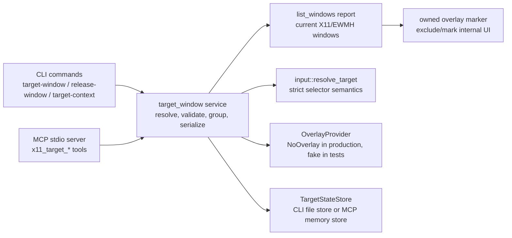

## Context

The standalone crate already exposes X11/EWMH listing, focus verification, targeted keyboard and pointer actions, screenshot/crop metadata, AT-SPI correlation, composed app-state, and a project-owned MCP server. The current public selector vocabulary is `window_id`, `title`, `wm_class`, and `pid`, implemented through `src/input.rs::WindowTarget` and `resolve_target()`. Existing safety rules require explicit target selectors and fresh focus/bounds verification before targeted input; saved target state must not weaken that rule.

Relevant project constraints:

- `CONSTITUTION.md` requires Rust 2021/Cargo, root `Makefile` checks (`make fmt`, `make check`, `make test`), no target-checkout writes, and no secret values in Git-tracked files or chat output.
- `CONTEXT.md` defines target-window terms as session context, not proof that the window still exists or is focused.
- `ARCHITECTURE.md` and ADR 0008 require X11 root/global pixel coordinates for bounds and future composition; overlay requests should use the same coordinate model.
- `grill.md` resolved three design constraints: state-first overlays, file-backed CLI state plus in-memory MCP state, and no implicit saved-target defaults for input/app-state commands in this change.

Boundary overview:



## Goals / Non-Goals

**Goals:**

- Add `target-window`, `release-window`, and `target-context` JSON CLI commands that are observable across CLI invocations without a live X server in tests.
- Add `x11_target_window`, `x11_release_window`, and `x11_target_context` MCP tools with state scoped to the stdio server process.
- Implement target groups with deterministic ids, color, active target tracking, idempotent add/update, release-one, release-all, and stale validation.
- Add a testable overlay provider seam where production can report unsupported/no-overlay cleanly and tests can assert show/hide behavior.
- Update listing metadata so project-owned overlay/helper windows are excluded from primary application targets or clearly marked internal.

**Non-Goals:**

- Do not modify `/home/as/Документы/AI_PROJECTS/codex-desktop-linux-full`.
- Do not add a mandatory GTK/GUI dependency or require a real visual overlay for tests or completion.
- Do not make saved active targets implicit defaults for `type-text`, `press-key`, `click`, `scroll`, `drag`, or `get-app-state`.
- Do not add unnamespaced stock MCP tools or change the target repo's stock tool names.
- Do not use external credentials or read `.secrets.local.env`.

## Decisions

### 1. New `target_window` module owns state and reports

Add `src/target_window.rs` with public report builders similar to existing modules:

- `TargetWindowParams { target: input::WindowTarget, group: Option<String>, color: TargetColor, overlay: bool }`
- `ReleaseWindowParams { window_id: Option<u64>, all: bool }`
- `TargetWindowReport`, `TargetContextReport`, `ReleaseWindowReport`
- `TargetState`, `WindowGroup`, `TrackedTarget`, `OverlayReport`, and `TargetDiagnostics`

The module reuses `list_windows::WindowInfo`, `list_windows::WindowBounds`, `input::WindowTarget`, and `input::resolve_target()` rather than creating a parallel resolver. The target report records `project`, `version`, `backend`, `success`, `error_code`, `note`, current `state`, and `diagnostics` so CLI/MCP output remains machine-readable.

Alternatives considered:

- Put this logic in `input.rs`: rejected because target groups are context management, not input injection.
- Reuse `app_state.rs` for target context: rejected because app-state is a read-model composition layer, while target groups are mutable session state.

### 2. CLI state is explicit local file-backed state; MCP state is in-memory

Create a small `TargetStateStore` abstraction:

- CLI commands use JSON state at `CODEX_X11_TARGET_STATE` when set, otherwise an ignored local runtime path such as `${XDG_RUNTIME_DIR}/codex-computer-use-x11/target-state.json`, falling back to `std::env::temp_dir()` if no runtime dir exists.
- Tests set `CODEX_X11_TARGET_STATE` to a temp file for deterministic isolation.
- MCP `serve_stdio` owns a `TargetState` value for the lifetime of that server process and passes it into `call_tool`.

The persisted state contains no credentials. It stores target ids, selected `WindowInfo` facts, group ids/names/colors, active target ids, and timestamps. Every read path runs stale validation against the current listing before reporting state as current.

Alternatives considered:

- Global project-root state: rejected because it would dirty the repository or leak runtime UI context into Git-tracked paths.
- In-memory-only CLI state: rejected because process-per-command CLI save/release behavior would be unobservable.
- MCP file persistence: rejected because separate MCP processes should not share target state accidentally.

### 3. Deterministic group and target semantics

Groups are created on demand. The default group id is `default`; a caller-provided `--group` / `group` argument becomes a normalized safe id. Color defaults to `blue` and supports the proposal colors `blue`, `purple`, `green`, `orange`, `red`, and `cyan`.

A tracked target id is derived deterministically from the X11 window id, e.g. `x11-0x2`, inside each group. Adding the same current window to the same group updates the stored window snapshot, color, active flag, and `targeted_at` instead of duplicating. Adding the same X11 window to a different group moves it to the newly requested group instead of duplicating it across groups; this keeps `release-window --window-id` deterministic. Adding a second window to a group makes the new target active and marks existing group targets inactive.

Alternatives considered:

- Random `win_N` ids like `linux-desktop-mcp`: rejected for standalone CLI persistence because deterministic ids make release/idempotence easier and avoid hidden counters in file state.
- Making the first window permanently active until explicit switch: rejected because `target-window` should make the user's latest explicit target the active one.

### 4. Stale validation runs before context and mutation results are trusted

`validate_state_against_listing(state, listing)` removes or marks targets whose `window_id` is absent from the fresh listing. If the active target vanishes, the group chooses another remaining target or clears `active_window_id`. Reports include `stale_removed` entries and warnings.

Target save flow:

1. Load state.
2. Get fresh listing.
3. Validate stale saved targets.
4. Resolve requested target from fresh listing using `input::resolve_target()`.
5. Save/update target if resolution succeeds.
6. Optionally request overlay show.
7. Persist state and emit report.

Release flow:

1. Load state.
2. Optionally validate against fresh listing when available.
3. Remove one window or all targets.
4. Request overlay hide/hide-all through the provider.
5. Persist state and emit report.

### 5. Overlay provider seam is test-first and production-degraded

Define an `OverlayProvider` trait or equivalent small interface with:

- `show_border(target_id, bounds, color) -> OverlayReport`
- `hide_border(target_id) -> OverlayReport`
- `hide_all() -> OverlayReport`

Production uses `NoOverlayProvider` for this change. It returns `shown: false` with a clear warning such as `visual overlay provider is not implemented in the standalone Rust build`. Tests use a fake provider to assert show/hide calls and failure-as-warning behavior.

Real X11 overlay drawing remains deferred. If implemented later, it must set project-owned class/name metadata (`codex-computer-use-x11-overlay`), skip taskbar/pager hints, avoid accepting focus, and use X11 input-shape/click-through behavior before it can be considered safe by default.

### 6. Owned overlay/helper listing safety

Extend `WindowMetadata` with project-owned/internal markers, e.g.:

- `owned_by_project: bool`
- `internal: bool`

Parser logic treats rows with raw class/title/app id containing `codex-computer-use-x11-overlay` or `codex-computer-use-x11-helper` as internal. Internal rows are excluded from `windows` primary targets and recorded in diagnostics metadata with a warning. This satisfies the listing safety requirement before real overlay drawing exists.

Alternative considered: keep overlay rows in `windows` with warnings only. Rejected because downstream resolvers select from `windows`; filtering internal rows is safer and simpler.

### 7. CLI and MCP API shape

CLI commands:

```text
codex-computer-use-x11 target-window [--window-id <id>|--title <text>|--wm-class <class>|--pid <pid>] [--group <id>] [--color <color>] [--overlay] --json
codex-computer-use-x11 target-context --json
codex-computer-use-x11 release-window (--window-id <id>|--all) --json
```

MCP tools:

- `x11_target_window` arguments: existing selector fields plus optional `group`, `color`, and `overlay`.
- `x11_release_window` arguments: `window_id` or `release_all`.
- `x11_target_context` arguments: none.

MCP server state requires refactoring `mcp::serve_stdio` so `handle_message` / `call_tool` receive a mutable server state. Existing stateless tools continue returning the same JSON shapes.

## Risks / Trade-offs

- File-backed CLI state may retain titles/classes for closed windows; stale validation and release-all mitigate this. State is local non-secret runtime context and is not staged.
- Production no-overlay behavior may disappoint users expecting a visible border; however the spec/backlog explicitly allow unsupported overlay reasons, and this avoids unsafe focus/input interception.
- Filtering internal rows by class/title convention depends on real overlay providers setting the convention later. Tests must lock this contract before any provider exists.
- Refactoring MCP for mutable state can accidentally alter existing tools; MCP regression tests must cover `tools/list`, existing `x11_*` calls, and new target tools.
- Deterministic target ids are less human-friendly than `win_N`, but they are safer for idempotent CLI state and direct `release-window --window-id` behavior.

## Migration Plan

1. Add failing CLI tests for target save/release/context using fake `wmctrl`/`xprop` and `CODEX_X11_TARGET_STATE`.
2. Add minimal `target_window` state/report code and CLI parsing until tests pass.
3. Add stale validation tests and implementation.
4. Add group idempotence and active-window tests and implementation.
5. Add overlay provider fake tests and NoOverlay production behavior.
6. Add listing internal-overlay parser test and metadata/filter implementation.
7. Refactor MCP server state and add target-tool tests while preserving existing MCP tests.
8. Update README/docs.
9. Run `make fmt`, `make check`, `make test`, strict OpenSpec validation, and live/degraded Cinnamon/X11 smoke.

Rollback is a normal Git revert of this change. Runtime target-state files can be removed manually or through `release-window --all`; no target checkout or external system state is modified.

## Open Questions

None.
