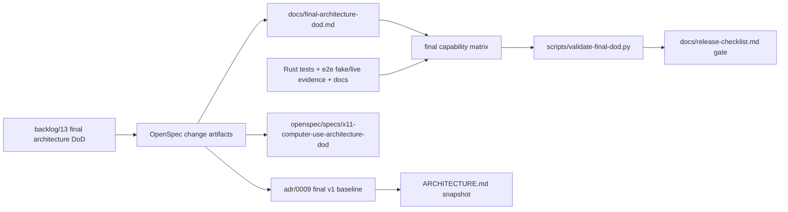

## Context

The repository is on `main` with prior backlog stages archived through packaging/docs/upstreaming. The final stage must consolidate the v1 Cinnamon/X11 Computer Use baseline rather than add another partial backend feature. Relevant constraints:

- `CONSTITUTION.md` requires Rust 2021/Cargo for implementation, root `Makefile` checks, OpenSpec validation, strict secret handling, and no target checkout mutation unless an OpenSpec task explicitly owns it.
- `CONTEXT.md` defines `x11-ewmh`, app state, target window, E2E harness, capability matrix evidence, upstream target matrix, runtime command dependency, release checklist, Final DoD, and architecture decision ledger.
- `ARCHITECTURE.md` already records the intent-driven OpenSpec overlay and ADR 0008's X11 root-coordinate model.
- `adr/0008-adopt-x11-root-coordinate-model.md` remains in force for bounds, pointer, screenshot crop, and future app-state composition.
- The target checkout is clean and currently exposes stock `activate_window`, `get_app_state`, `type_text`, `press_key`, `click`, `scroll`, and `drag` in `computer-use-linux/src/server.rs`.

Boundary overview:



## Goals / Non-Goals

**Goals:**

- Add tracked final architecture/DoD documentation with a decision ledger and fine-grained capability matrix.
- Add a deterministic no-GUI validator that fails on missing final capability rows, empty evidence, missing degraded reasons, missing decision topics, or missing research/license sections.
- Update release documentation so the validator is part of v1 handoff and archive verification.
- Create a durable ADR for the final Cinnamon/X11 v1 baseline and update `ARCHITECTURE.md`.
- Preserve existing e2e fake/live evidence paths and make the final validator complementary, not a replacement.

**Non-Goals:**

- Do not add Cinnamon Wayland support.
- Do not build a Cinnamon/Muffin extension.
- Do not directly mutate the Codex Desktop Linux target checkout outside existing reversible source-overlay smoke.
- Do not make the final validator send real keyboard/pointer input or require a live desktop.
- Do not copy or vendor external source code.

## Decisions

### 1. Use a tracked Markdown DoD document plus embedded machine-readable matrix

Create `docs/final-architecture-dod.md` as the human-facing final report. It will contain:

- research refresh;
- final architecture answer;
- architecture decision ledger;
- capability matrix table;
- validation commands;
- scope/degraded limitations;
- license/upstreaming summary.

For machine validation, the same document will include fenced JSON blocks identified by labels such as `final-dod-decisions` and `final-dod-capability-matrix`. Keeping the data inside the report avoids drift between a human table and a hidden fixture while still letting tests parse deterministic data.

Alternative considered: separate `docs/final-capability-matrix.json`. Rejected for this stage because it increases two-file drift and the matrix is primarily release documentation.

### 2. Validator checks tracked evidence, not live desktop behavior

Add `scripts/validate-final-dod.py` with default input `docs/final-architecture-dod.md` and optional `--document <path>` for tests. The script will:

- parse labeled fenced JSON blocks;
- require every architecture decision topic;
- require every final capability row;
- require `required_for_v1`, `status`, `evidence`, and `degraded_behavior` semantics;
- reject missing/empty evidence;
- reject degraded rows with empty degraded behavior;
- require research/license/update sections by checking documented strings/JSON fields;
- print a concise pass/fail summary.

It will not run `cargo`, e2e smoke, OpenSpec, live GUI commands, or read `.secrets.local.env`. Those remain release/verify commands.

### 3. Matrix rows are finer-grained than the existing e2e matrix groups

The existing e2e matrix groups (`doctor/capabilities`, `window listing/focus`, `get_app_state`, `keyboard input`, `pointer input`, `screenshot`, `AT-SPI`, `install/rollback`) stay as delivery-path smoke evidence. The final DoD matrix expands those groups into the backlog row set, including stock `activate_window`, stock `mousemove` absence handling, Cinnamon X11 input backend, source overlay, E2E from Codex, and uninstall/rollback.

This avoids overloading the e2e harness with architecture/status assertions while still requiring each final row to cite e2e, tests, docs, or explicit degraded evidence.

### 4. Durable ADR 0009 records the final v1 baseline

The grill resolved that final v1 readiness is a durable decision. Add `adr/0009-adopt-final-cinnamon-x11-v1-dod-baseline.md` with status Accepted. It will not rewrite ADR 0008; it will cite ADR 0008 and consolidate final baseline decisions across prior stages. `ARCHITECTURE.md` and `adr/README.md` will list ADR 0009 as in force.

### 5. Release checklist becomes the operational gate

Update `docs/release-checklist.md` to run:

```bash
scripts/validate-final-dod.py
```

alongside existing `make fmt`, `make check`, `make test`, fake e2e, e2e matrix validation, OpenSpec validation, license refresh, secret-safety, archive, and push gates.

## Risks / Trade-offs

- A tracked matrix can become stale if future tasks change capabilities without updating final DoD. Mitigation: validator and release checklist make the document a gate.
- Some rows are environment-dependent. Mitigation: allow explicit `degraded` rows with non-empty degraded behavior and evidence, rather than fake pass claims.
- A Markdown-embedded JSON block is less discoverable to generic JSON tooling. Mitigation: the validator exposes `--document` and tests cover failure fixtures; the human table remains readable.
- ADR 0009 consolidates several prior decisions. Mitigation: keep it as a final baseline ADR and cite existing detailed sources instead of duplicating every implementation detail.

## Migration Plan

1. RED: add tests that call the final DoD validator against an incomplete fixture and expect missing row/decision failures.
2. GREEN: implement `scripts/validate-final-dod.py` and `docs/final-architecture-dod.md` with the full ledger/matrix.
3. Add/adjust docs tests to require final DoD validator and README/release links.
4. Add durable ADR 0009, update `ARCHITECTURE.md` and `adr/README.md`.
5. Run project checks and e2e fake validation.
6. Archive the OpenSpec change only after verification is clean.

Rollback is a normal Git revert of the DoD docs/script/tests/ADR if the final gate needs to be reworked. The change does not modify external systems or the target checkout.

## Open Questions

None.
