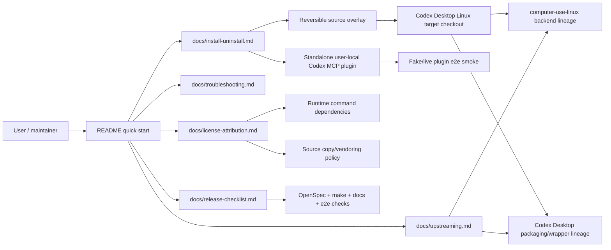

## Context

Backlog 12 is the handoff/documentation stage after implementation stages for doctor/capabilities, X11/EWMH window listing/focus/input, screenshot/root coordinates, app state, target-window context, source overlay, standalone plugin, and e2e harness. The repository already has a Rust 2021 standalone CLI/MCP crate, reversible source-overlay scripts, and fake/live e2e smoke scripts. The gap is durable user/upstream documentation plus tests that keep command snippets, rollback steps, license policy, and target ownership from drifting.

Relevant project constraints:

- `CONSTITUTION.md`: Rust/Cargo/Makefile checks are mandatory for Rust changes; no secrets may be printed or committed; OpenSpec validation and git cleanliness are required.
- `CONTEXT.md`: canonical terms include `x11-ewmh`, standalone plugin, source overlay, E2E harness, capability matrix evidence, upstream target matrix, runtime command dependency, and release checklist.
- `ARCHITECTURE.md` / ADR 0008: X11 root coordinates remain canonical for bounds/pointer/screenshot crop docs; source overlay should reuse target screenshot/AT-SPI/windowing paths rather than inventing competing stock tool shapes.
- Target checkout research: `/home/as/Документы/AI_PROJECTS/codex-desktop-linux-full` has clean `main`; backend/windowing code is in `computer-use-linux/`, while packaging, launcher, update-manager, and `linux-features/` are wrapper concerns.

### Boundary diagram

## Goals / Non-Goals

**Goals:**

- Make README a concise v1 landing page with supported scope, delivery paths, and links to deeper docs.
- Add deeper docs for install/uninstall, troubleshooting, architecture/upstreaming, license/attribution, and release checklist.
- Add behavior-focused docs tests that fail first on missing required sections, stale script names, missing license/upstream classifications, and missing source-overlay rollback steps.
- Keep command snippets executable where practical through existing public script `--help`/`--dry-run` behavior.
- Preserve existing source-overlay and standalone-plugin runtime behavior while documenting rollback-first usage.

**Non-Goals:**

- No new native package formats, installer framework, or Codex Desktop package generation in this repo.
- No new X11 backend behavior, MCP tools, target overlay code generation, or source-overlay target mutations beyond docs/tests.
- No Cinnamon Wayland support or Cinnamon/Muffin extension implementation.
- No copying or vendoring external project source code.
- No durable ADR unless design review finds a new hard-to-reverse architecture decision.

## Decisions

### 1. Documentation topology

Use README as the high-level entry point and add focused docs under `docs/`:

- `docs/install-uninstall.md` — standalone plugin and source-overlay install, smoke, rollback, and ownership.
- `docs/troubleshooting.md` — doctor/dependency layers, plugin install issues, source-overlay drift, screenshot/AT-SPI degradation, strict RemoteDesktop false positive, e2e logs.
- `docs/upstreaming.md` — upstream target matrix, PR boundaries, source-overlay-as-staging rule.
- `docs/license-attribution.md` — refreshed project/reference table, runtime command dependency policy, copy-safe/copy-unsafe rules, attribution/NOTICE expectations.
- `docs/release-checklist.md` — archive/handoff checklist with OpenSpec, make, docs, fake e2e, optional live e2e, rollback, license, and git checks.

Existing `docs/e2e-harness.md` and `docs/integration-contract.md` remain canonical for their subjects; new docs link to them instead of duplicating every detail.

### 2. Docs-check implementation

Add a Rust integration test file such as `tests/packaging_docs.rs`. It will use only `std` and the existing test style. The tests should inspect public documentation and scripts rather than private helper functions.

Checks:

- Required README sections and links exist.
- Required docs files exist and contain stable section headings.
- Referenced script paths exist.
- Supported help/dry-run commands execute successfully:
  - `scripts/install-codex-plugin.sh --dry-run` with isolated temp `CODEX_HOME`.
  - `scripts/uninstall-codex-plugin.sh --dry-run` with isolated temp `CODEX_HOME`.
  - `scripts/{status,install,uninstall}-codex-source-overlay.sh --help`.
  - `scripts/e2e/codex-plugin-smoke.sh --help` and `scripts/e2e/codex-source-overlay-smoke.sh --help`.
- License/attribution docs contain required reference classifications and command dependency distinctions.
- Upstreaming docs contain distinct backend-upstream and wrapper-integration targets.
- Install/uninstall docs contain source-overlay status/install/uninstall/final-clean commands.
- Release checklist contains the required validation commands and secret-safety guidance.

The tests should be precise about contract phrases and command paths, but avoid brittle paragraph snapshots.

### 3. TDD shape for documentation-only work

Because this change is docs/tests, RED evidence comes from failing public docs checks before writing the corresponding docs section. Each slice should add one check or a small related set of checks, observe failure, add minimal docs, then rerun the check. Production code is not required unless docs checks need a tiny helper function inside the test file.

### 4. Upstream target ownership

The upstreaming guide will use a matrix with at least these columns: area, target, repo/path, evidence before PR, and notes. It must keep:

- Backend/windowing/diagnostics/input-safety/get_app_state integration mapped to Computer Use Linux backend lineage (`agent-sh/computer-use-linux` / target `computer-use-linux/`).
- Codex Desktop wrapper integration mapped to `codex-desktop-linux-full` packaging, launcher, update-manager, linux-features, bundled plugin staging.
- This repo's source overlay mapped as reversible staging/evidence only.

### 5. License posture

The docs will record the refreshed SPDX/license results from the proposal research and the policy:

- MIT/Apache-2.0 references are potentially copy-safe only with attribution/NOTICE compliance.
- BSD-3-Clause source copying requires BSD attribution.
- NOASSERTION, no-license, GPL, AGPL, and unclear-license sources are copy-unsafe for MIT upstream code without a separate explicit decision.
- Invoking an installed runtime command is not source copying/vendoring.

No external code will be copied in this change, so no new NOTICE file is required unless implementation unexpectedly introduces copied Apache/BSD code, which is out of scope.

## Risks / Trade-offs

- Docs-check tests can become too rigid if they assert long prose. Mitigation: assert stable headings, command paths, matrix labels, and safety phrases only.
- Some commands are live/environment-dependent. Mitigation: automated docs tests use `--help`, isolated `--dry-run`, and fake e2e commands where practical; release checklist marks live target smoke optional/environment-dependent.
- License metadata can change. Mitigation: docs state "observed during 2026-05-31 refresh" and require re-checking before copying code or upstream release claims.
- Upstream target names may change. Mitigation: upstreaming guide describes current mapping and the requirement to rerun fresh target research before PR work.

## Migration Plan

1. Add RED docs checks for required README/deep-doc structure and command snippets.
2. Add minimal README and `docs/install-uninstall.md` content to pass the first checks.
3. Add RED checks for license/attribution and upstream target matrix; add `docs/license-attribution.md` and `docs/upstreaming.md`.
4. Add RED checks for troubleshooting and release checklist; add `docs/troubleshooting.md` and `docs/release-checklist.md`.
5. Run `cargo test --test packaging_docs` after each slice, then full `make fmt`, `make check`, `make test`, and OpenSpec validation.
6. Rollback plan: because runtime behavior is unchanged, rollback is a git revert of docs/tests. Source-overlay docs continue to instruct real target uninstall/final clean when users run live checks.

## Open Questions

None.
