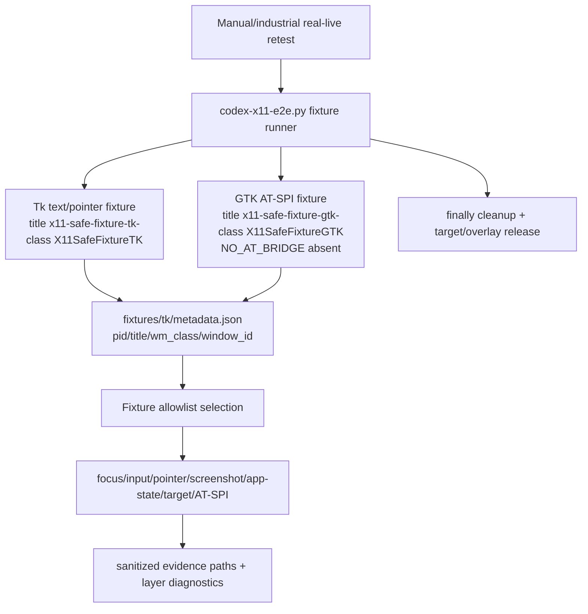

## Context

The installed standalone `codex-computer-use-x11` plugin passed the 2026-06-01 REAL LIVE Cinnamon/X11 retest for most controlled-window capability rows, including focus, target context, keyboard/pointer, screenshot-crop, AT-SPI, and MCP surface. The remaining material defect is safe evidence serialization: `target/e2e-logs/real-live-full-retest/20260601T162050Z/get-app-state.json` contains `$.screenshot.data_url` with an inline `data:image/png;base64,...` payload, while `get-app-state-no-screenshot.json` proves the non-screenshot layers stay usable without the blob.

Relevant constraints:

- `CONSTITUTION.md` requires Rust 2021/root Cargo/Makefile verification, OpenSpec validation, no secret access unless needed, and no implementation before full planning gates complete.
- ADR 0008 requires X11 root/global coordinates and already states standalone screenshot crop reports should not serialize screenshot pixels/data URLs by default; output paths are caller-provided.
- ADR 0009 keeps the supported claim limited to Cinnamon/X11 `x11-ewmh`, requires explicit pass/degraded evidence, verified input safety, and no arbitrary AT-SPI subtree.
- ADR 0010 preserves standalone plugin identity, `x11_*` MCP names, bundled rollback, and no global masquerade as bundled `computer-use`.
- Existing `src/app_state.rs` captures to a temporary PNG, reads it, base64-encodes it into `ScreenshotCapture.data_url`, and deletes the temporary file. Existing CLI/MCP parameters have only `include_screenshot` / `--no-screenshot`.
- Existing `scripts/e2e/codex-x11-e2e.py` has a `ControlledFixtureManager`, but it uses `codex-x11-fixture-...` titles and `CodexX11Fixture...` classes; this change needs neutral controlled fixture identity for real-live retests that may filter project-owned or overlay-looking windows.

## Goals / Non-Goals

**Goals:**

- Make default app-state JSON evidence screenshot-safe: no `data:image`, no base64 screenshot payload, and no inline pixels.
- Preserve screenshot layer observability through path-oriented metadata: path, MIME/type, dimensions, provider/source, bounds/provenance where available, and file integrity facts.
- Add `--screenshot-output <path>` to the CLI and equivalent MCP argument, while keeping `--no-screenshot`.
- Preserve layer-degraded app-state behavior: screenshot failures populate `screenshot_error` and do not discard window/accessibility/capability diagnostics.
- Keep `screenshot-crop` path-only and unchanged except for regression tests.
- Rework the controlled real-live fixture runner to use neutral names, record metadata, keep fixtures alive for retest, and clean up reliably.
- Update docs for path-only app-state evidence, fixture retest usage, and `NO_AT_BRIDGE=1` remediation.

**Non-Goals:**

- No Wayland, portal-required runtime path, Cinnamon/Muffin extension, or RemoteDesktop portal dependency changes.
- No bundled `computer-use` edits, source-overlay installation, provider takeover changes, plugin identity changes, or tool namespace changes.
- No weakening of verified-focus input safety, target-window safety, screenshot-crop coordinate validation, or AT-SPI confidence rules.
- No reading or printing `.secrets.local.env`; no real secret values in docs, evidence, commits, or artifacts.

## Decisions

### App-state screenshot output model

Use a path-oriented `ScreenshotCapture` model for default JSON:

```text
GetAppStateParams
  target: WindowTarget
  include_screenshot: bool
  screenshot_output: Option<PathBuf>
  inline_screenshot: bool (optional compatibility/debug only)

ScreenshotCapture
  mime_type: "image/png"
  path: String
  source: "gnome-shell-compatible-dbus"
  width: u32
  height: u32
  size_bytes: u64
  bounds/provenance: optional metadata if available
  inline data_url: absent by default; optional only under explicit unsafe opt-in if retained
```

The default provider flow changes from “capture temp file -> read -> base64 -> delete” to “resolve output path -> capture PNG -> verify PNG -> report path/metadata”. If the caller supplies `--screenshot-output`, resolve it before provider invocation, preflight its parent, and report the resolved path. If the caller does not supply a path, generate a stable safe artifact path under a documented evidence directory such as `target/e2e-logs/app-state/<pid>-<nanos>.png`, creating that directory when possible; if directory creation fails, degrade only the screenshot layer.

Provider success must be checked together with output integrity. The implementation should reuse the PNG signature/dimensions logic already present in `src/app_state.rs` and the output-path verification patterns from screenshot-crop work.

### CLI and MCP compatibility

CLI:

- Keep `get-app-state --json` and target selectors unchanged.
- Keep `--no-screenshot` unchanged.
- Add `--screenshot-output <path>`.
- Optionally add `--inline-screenshot` only if retaining legacy debug output is lower risk than removal; the flag must be documented as unsafe for evidence and must be absent from normal harness commands.

MCP:

- Keep `x11_get_app_state` tool name and `include_screenshot` argument.
- Add optional `screenshot_output` string argument.
- Add optional `inline_screenshot` boolean only if CLI supports it.
- Default MCP result must be no-inline, matching CLI default, because MCP tool output is machine-readable evidence.

### Layer degradation and message behavior

`diagnostics.layers` remains the machine-readable layer summary. Screenshot layer status rules:

- `include_screenshot=false`: layer is OK/degraded only as already documented for no-screenshot; no screenshot object and no error unless current code/message requires a disabled diagnostic.
- capture succeeds and PNG verifies: screenshot layer OK, `screenshot` path metadata present, `screenshot_error=null`.
- path preflight, provider, read, PNG validation, or dimensions fail: screenshot layer degraded, `screenshot=null`, `screenshot_error=<specific detail>`, window/accessibility layers preserved.

### Controlled fixture runner rework



The existing fixture manager should be reused rather than replaced, but its public evidence contract should change:

- Use neutral titles/classes that do not contain `Codex`, `codex-computer-use`, or overlay marker strings.
- Keep controlled ownership in metadata fields, readiness files, and evidence rows.
- Ensure GTK fixture environment removes `NO_AT_BRIDGE` by deleting the variable, not setting it to `0`.
- Record metadata JSON with pid, title, wm_class, readiness path, metadata path, selected window id when discovered, bridge environment facts, and cleanup status.
- Keep fake/fake-live fixtures available for deterministic CI, but do not present them as primary REAL LIVE evidence.

### Documentation updates

Docs should update the operator-facing contract without adding secrets or local private URLs:

- `docs/e2e-harness.md`: app-state path-only screenshot behavior, `--screenshot-output`, controlled real-live fixture runner, metadata files, fake vs fake-live vs real-live evidence.
- `docs/troubleshooting.md`: no inline screenshot blob by default, invalid screenshot output path diagnostics, `NO_AT_BRIDGE=1` presence-based bridge suppression, restart/retest guidance.
- `docs/release-checklist.md`: industrial real-live evidence should reference screenshot/app-state files by path and reject inline screenshot blobs in evidence JSON.

## Risks / Trade-offs

- Keeping screenshot capture enabled by default preserves capability expectations but creates files by default. Mitigation: use a documented evidence directory, report paths, and clean up only when a caller explicitly chooses temp/debug behavior.
- Removing `data_url` may break any hidden consumer that expected inline pixels. Mitigation: offer explicit unsafe opt-in if practical, update docs, and keep MCP/CLI default safe.
- Generated artifact paths may accumulate files. Mitigation: place them under `target/e2e-logs/app-state/` so normal build/evidence cleanup applies.
- Neutral fixture titles reduce filter collisions but may require test updates and operator docs; metadata still proves ownership.
- Real-live fixture orchestration can be environment-sensitive. Mitigation: classify environment limitations explicitly and keep fake/fake-live CI coverage separate.

## Migration Plan

1. Add RED tests for `get-app-state --json` proving default output contains no `data:image`/`;base64,` and references a non-empty PNG path when the fake provider succeeds.
2. Add CLI/MCP argument parsing tests for `--screenshot-output` / `screenshot_output` and invalid path degraded screenshot layer.
3. Change `src/app_state.rs` to write/verify path-oriented screenshots and remove default `data_url` serialization.
4. Update `src/cli.rs`, `src/mcp.rs`, and usage text for new arguments and optional inline flag if retained.
5. Update e2e harness summarization/tests to use the new screenshot path field and reject inline blobs in raw app-state evidence.
6. Rename/rework controlled fixture runner titles/classes and metadata, then update fake-live/fixture self-tests.
7. Update docs and docs tests.
8. Run targeted tests, full `make fmt`, `make check`, `make test`, and `openspec validate --all --strict`.
9. Rollback is standard git revert. Runtime cleanup is normal harness cleanup of generated fixture processes and target/overlay state.

## Open Questions

None.
