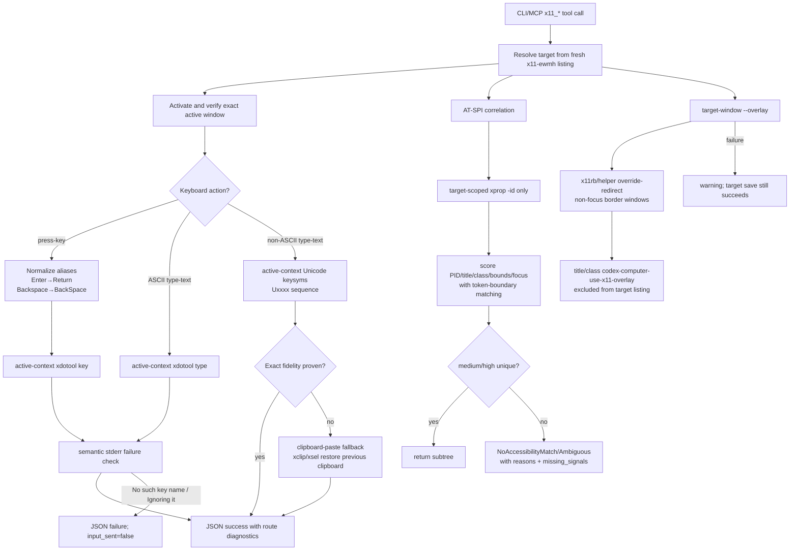

## Context

The 2026-06-01 live functional run established that the installed `codex-computer-use-x11` provider can operate the Cinnamon/X11 `x11-ewmh` path for discovery, focus, pointer, ASCII text, screenshots, and target context. It also showed four degraded areas that should be hardened before claiming stronger live functional readiness:

1. Cyrillic text sent through current `xdotool type --clearmodifiers <text>` was layout-dependent and did not prove exact Unicode fidelity.
2. Tkinter safe windows produced `NoAccessibilityMatch`; this is acceptable as degraded evidence only if the matcher improves diagnostics and the harness adds an AT-SPI-positive GTK fixture.
3. `target-window --overlay` currently saves target state but reports that the standalone Rust build has no overlay provider.
4. App-state and harness evidence need cleanup: summary extraction must use `diagnostics.layers`, live summaries must not embed huge base64 screenshot payloads, and RemoteDesktop portal absence must remain optional/report-only for the working X11 path.

Relevant constraints:

- `CONSTITUTION.md` requires Rust 2021/root Cargo/Makefile verification and OpenSpec planning gates before implementation.
- ADR 0008 keeps X11 root/global pixels canonical for bounds, pointer, screenshot crops, and app-state composition.
- ADR 0009 keeps verified focus as the input safety boundary, rejects direct `xdotool --window` as proof of targeted safety, and forbids arbitrary AT-SPI subtree selection on ambiguity or low confidence.
- ADR 0010 keeps standalone plugin identity and limits provider takeover compatibility aliases to localized settings/provider surfaces.
- `grill.md` resolved that no scope item requires lowering safety thresholds or changing in-force durable ADRs.

No production implementation is part of this artifact.

## Goals / Non-Goals

**Goals:**

- Make targeted keyboard reports distinguish key alias normalization, backend semantic failures, exact Unicode typing route, and explicit clipboard fallback.
- Improve AT-SPI correlation precision and explainability without accepting unsafe bounds-only matches.
- Add a standalone overlay provider boundary that can show non-focus X11 target borders and exclude project overlay windows from normal targets.
- Make app-state/e2e evidence smaller, accurate, and clearer about optional portal degradation.
- Extend live e2e fixtures and capability matrix validation to prove exact Cyrillic value, GTK AT-SPI positive match, and overlay lifecycle.
- Preserve existing standalone `x11_*` tool names, `x11-ewmh` backend identity, and target-source separation.

**Non-Goals:**

- No implementation before planning artifacts are complete.
- No direct `xdotool --window` or XSendEvent route as a targeted-safety boundary.
- No `ydotool` primary Unicode fix.
- No bounds-only AT-SPI pass threshold.
- No unbounded per-window `xprop -id` in ordinary list-windows.
- No unrecoverable clipboard mutation.
- No global plugin identity masquerade beyond ADR 0010 takeover shim.
- No attempt to make RemoteDesktop portal support a blocker for the Cinnamon/X11 `x11-ewmh` path.

## Decisions

### Runtime boundary diagram

### Keyboard route design

- Add a small key normalization layer before the backend. It should be pure and unit-testable: input alias -> normalized X11 keysym string plus diagnostics.
- Extend `KeyboardAttempt` or compatible report fields with:
  - `route` (`xdotool-type`, `xdotool-key`, `xdotool-unicode-keysyms`, `clipboard-paste`);
  - `requested_key` and `normalized_key` for key presses;
  - `unicode_keysyms` or equivalent diagnostics for non-ASCII text;
  - `semantic_stderr_error` when stderr indicates an ignored/unknown key.
- Keep focus verification unchanged and before every backend route.
- Detect `xdotool` semantic stderr failures independently from exit status. A process exit code of 0 is not success if stderr shows a refused key.
- For non-ASCII text:
  1. Convert Unicode scalar values to uppercase hexadecimal `Uxxxx` keysyms accepted by X11/xdotool.
  2. Invoke active-context `xdotool key --clearmodifiers <Uxxxx...>` after verified focus.
  3. If fake or live evidence proves the route cannot produce exact text, fall back to clipboard-paste only when `xclip` or `xsel` can set and restore clipboard contents.
  4. If restore cannot be verified, report failure or a strong degraded warning rather than claiming safe success.
- The apply phase should first build fake-command tests for aliases/stderr and Unicode args, then a live harness value check for exact Cyrillic.

### AT-SPI correlation design

- Replace substring class matching with token-aware comparison:
  - normalize case and split class/app/candidate names on non-alphanumeric boundaries while preserving dotted app ids as comparable full tokens;
  - tokens of length <= 3 require exact-token or recognized full-token match;
  - long tokens may use stricter contains semantics only when bounded by token separators.
- Add target-scoped enrichment function that accepts one resolved `WindowInfo` and runs at most one `xprop -id <window_id>` call per correlation request. It should parse `_NET_WM_PID`, `WM_CLIENT_MACHINE`, `WM_NAME`, `_NET_WM_NAME`, `WM_CLASS`, and `_NET_WM_WINDOW_TYPE` into diagnostics and optional scoring signals.
- Keep `list-windows` normal listing at `per_window_xprop_enabled=false`; do not fan out to every window.
- Add candidate diagnostics:
  - score;
  - confidence;
  - positive reasons;
  - negative reasons where useful;
  - `missing_signals` for unavailable reliable PID, title/name, class/app, bounds, focus, or xprop data.
- Preserve threshold behavior: bounds overlap can corroborate but cannot select a subtree alone.
- Add a GTK fixture for positive AT-SPI acceptance. Tkinter stays in live mode for keyboard/pointer and can remain fixture-specific degraded for AT-SPI.

### Overlay provider design

- Introduce a provider trait or module boundary in `src/target_window.rs` / new overlay module:
  - `show(target_window_id, bounds, color) -> OverlayReport`;
  - `hide(target_window_id) -> OverlayReport`;
  - `hide_all() -> OverlayReport`.
- Preferred implementation: `x11rb` creates one or four override-redirect windows around target bounds in X11 root coordinates. If `x11rb` is too invasive for v1, a helper process can own the border windows while Rust coordinates lifecycle through a small command boundary.
- Overlay windows should set title/class to `codex-computer-use-x11-overlay` and avoid input focus. If possible, set window type hints and event masks so they are visible but not targetable application windows.
- Update listing/target resolution to filter project overlay windows by title/class/window type before presenting application targets.
- Persist enough target-state metadata to hide overlays on `release-window`, stale cleanup, and `release-window --all`.
- Overlay failure remains warning/degraded; it must not roll back target save if target resolution succeeded.

### App-state and evidence cleanup design

- Update evidence summary code to read `app_state["diagnostics"]["layers"]`; treat missing path as explicit degraded/failure evidence.
- Add a sanitization path for summary output that retains screenshot metadata and layer status but removes `screenshot.data_url` by default in live summaries. If raw screenshot evidence is needed, store it as a separate file path rather than inline base64.
- Adjust readiness/recommended-next-step text to distinguish:
  - real blockers for `x11-ewmh` focus/input/screenshot/app-state;
  - degraded AT-SPI/Unicode/overlay layers;
  - optional/future RemoteDesktop portal gaps.

### E2E harness design

- Extend `scripts/e2e/codex-x11-e2e.py` live mode with safe fixtures:
  - keep Tkinter fixtures for keyboard/pointer if they are already reliable;
  - add a GTK fixture using PyGObject when available, or a documented GTK-safe app fallback, with clear skip/degraded behavior if GTK dependencies are unavailable;
  - expose a way to read actual text/entry value after typing so exact Cyrillic can be asserted.
- Add live checks:
  - keyboard exact Cyrillic value;
  - AT-SPI matched GTK subtree with expected accessible node;
  - overlay shown -> listing exclusion -> release/hide;
  - app-state summary `diagnostics.layers` and no-screenshot-data output.
- Capability matrix must include every v1 group with `pass` or `degraded`, evidence path/tool, and reason. Missing rows fail validation.

## Risks / Trade-offs

- X11 Unicode keysyms may vary by desktop/input method; clipboard fallback is more reliable for text but touches user clipboard. The design mitigates this by trying keysyms first and making clipboard route explicit/restorable.
- `xclip`/`xsel` may be absent. The fallback must degrade clearly and doctor/readiness should mention optional dependency availability.
- PyGObject/GTK fixture availability may differ across machines. Harness should report GTK fixture unavailable as degraded evidence with dependency details, not silently pass AT-SPI.
- `x11rb` overlay windows add a Rust dependency and more direct X11 lifecycle complexity. A helper process may be simpler to isolate but adds process management risk. Both keep overlay failure non-blocking.
- Overlay window exclusion must not hide real application windows whose titles accidentally contain the overlay string unless class/title/window-type evidence is strong enough to identify project-owned overlays.
- More detailed diagnostics can expose local application titles. This project already lists window titles; no secret values should be copied into tracked summaries beyond sanitized evidence required for debugging.

## Migration Plan

1. Planning-only phase: complete `design-review.md`, `adr.md`, `test-plan.md`, and `tasks.md`; validate OpenSpec strictly; do not implement production code.
2. Apply phase starts only after planning artifacts are checkpointed and available according to git discipline.
3. Implement as small TDD slices:
   - key aliases/stderr detection;
   - Unicode keysyms and fallback decision;
   - AT-SPI token matching and target xprop enrichment;
   - GTK fixture;
   - overlay provider;
   - app-state/evidence cleanup;
   - live e2e harness/matrix.
4. Rollback posture:
   - keyboard/AT-SPI/evidence changes are code-level and can be reverted by git;
   - overlay provider failure remains non-blocking, so runtime overlay issues should not break target save;
   - clipboard route must restore previous clipboard when possible and report failure if it cannot.

## Open Questions

None.
