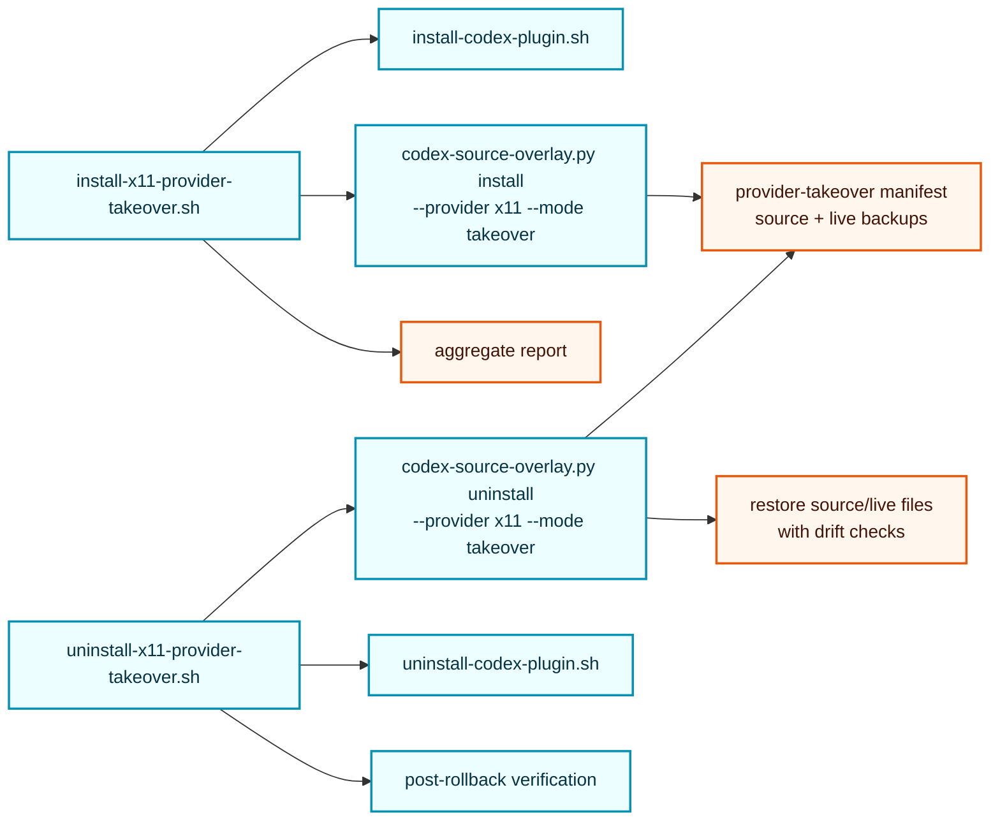

## Context

`install-x11-provider-takeover.sh` is a one-command rollout that can install the standalone plugin, apply the provider takeover source overlay to a Codex Desktop Linux checkout, and optionally patch live Electron webview assets. The current rollback path is not symmetrical: `uninstall-codex-plugin.sh` removes only `$CODEX_HOME` state, while `codex-source-overlay.py uninstall --provider x11 --mode takeover` restores target source files but cannot recover live assets unless their backups were recorded.

Manual residue found after uninstall confirmed this gap: the standalone plugin cache/config was absent, but `codex-source-overlay.py status` reported provider takeover `state=applied` in the target checkout and `/opt/codex-desktop/content/webview/assets/computer-use-settings-*.js` still contained the takeover marker/row.

This design keeps the provider takeover localized per ADR 0010 and strengthens the install/uninstall lifecycle around backup manifests and safe restore.

## Goals / Non-Goals

### Goals

- Provide `scripts/uninstall-x11-provider-takeover.sh` as the symmetric rollback command for `scripts/install-x11-provider-takeover.sh`.
- Ensure install writes backup metadata for every source file and live asset it mutates.
- Ensure uninstall restores from manifest backups and refuses unsafe blind deletion when a marked file has no backup.
- Support dry-run/report mode for both install and uninstall.
- Preserve unrelated plugin caches, bundled `computer-use` state, target git metadata, and unrelated live assets.
- Verify install → uninstall round trips in fake targets and fake live asset directories.

### Non-Goals

- Do not change the standalone plugin identity, tool names, or MCP behavior.
- Do not patch installed OpenSpec packages.
- Do not implement a new Codex Desktop packaging system or service restart mechanism.
- Do not require sudo in tests; live root-owned assets remain optional runtime behavior guarded by permissions and clear errors.
- Do not blindly remove marker strings from live assets without a restorable backup in normal rollback.

## Design Overview

No new long-lived architecture boundary is introduced; this is a lifecycle hardening of existing scripts.



## Manifest and Backup Model

`codex-source-overlay.py` remains the source of truth for provider takeover source/live backup metadata. Its provider manifest will be extended from the current shape:

```json
{
  "provider": "x11",
  "mode": "takeover",
  "marker_version": "codex-computer-use-x11-provider-takeover:v1",
  "target_commit": "...",
  "source_backups": [...],
  "live_asset_backups": [...]
}
```

to include per-file restore metadata:

- `rel` for target source files or `asset` for live assets;
- backup path relative to the target metadata directory;
- `before_sha256`, `before_size`, and when available `before_mode`, `before_uid`, `before_gid`;
- `installed_sha256` and `installed_size` after a successful write;
- `kind`: `source` or `live_asset`;
- optional `source`: `git-parent`, `working-tree`, or `live-asset`.

For backward compatibility with existing archived evidence/tests, uninstall should tolerate older keys such as `sha256` as the original checksum, but new installs must write the richer metadata.

## Install Transaction Behavior

Provider install will run as a transaction inside `codex-source-overlay.py`:

1. Preflight target files, provider/mode, and live asset directory if requested.
2. Build a transaction backup root under `.codex-computer-use-x11-overlay/provider-takeover/backups/<stamp>/`.
3. Before each write:
   - copy source file or live asset to backup;
   - record original metadata;
   - write desired content;
   - record installed metadata.
4. Save the provider manifest only after all requested writes succeed.
5. If a later write fails, restore every file changed in the current transaction from its backup and write a failure report with restore outcomes.
6. Return non-zero on failure and do not claim `state=applied`.

`install-x11-provider-takeover.sh` should continue to call the lower-level plugin install and source overlay install, but its report should reflect whether plugin/source/live phases installed, dry-ran, skipped, rolled back, or failed.

## Uninstall Behavior

Add `scripts/uninstall-x11-provider-takeover.sh` with options mirroring the install wrapper:

- `--target <path>`
- `--codex-home <path>`
- `--live-assets-dir <path>` for scan/verification context
- `--no-plugin`
- `--no-live-assets`
- `--require-live-assets`
- `--report-json <path>`
- `--dry-run`

Default behavior:

1. Resolve target and report path using the same defaults as the installer.
2. Call `codex-source-overlay.py uninstall --provider x11 --mode takeover`, passing live asset options unless disabled.
3. Call `uninstall-codex-plugin.sh` unless `--no-plugin` is set.
4. Verify postconditions:
   - provider overlay status is clean;
   - standalone plugin cache/marketplace/config sections are absent when plugin uninstall ran;
   - live `computer-use-settings-*.js` assets contain no owned takeover marker/string when live asset verification is enabled.
5. Remove owned provider-takeover metadata only after successful source/live restore and clean status.
6. Write an aggregate rollback report.

The lower-level provider uninstall must refuse to overwrite a file when:

- a manifest backup is missing;
- the current source/live file does not contain the owned marker while the manifest claims it should be restored;
- the current installed checksum is recorded and does not match, indicating drift;
- a live asset marker is present but no backup exists.

No-op success is allowed when provider overlay status is clean, manifest is absent, and optional live asset scan finds no owned takeover strings.

## Live Asset Handling

Live assets are riskier than target source files because they can be root-owned and may be generated from a target checkout. The lower-level overlay tool will handle only live assets it was asked to patch and backed up. It should not use ad-hoc reverse regex cleanup as normal uninstall behavior.

When `--live-assets-dir` is supplied to uninstall, the tool will scan matching `computer-use-settings-*.js` files for owned takeover markers/strings. Outcomes:

- marker absent and no manifest entry: clean;
- marker present and matching manifest backup: restore;
- marker present but no backup: fail with missing backup blocker;
- marker absent but manifest entry exists: treat as drift and fail before overwrite unless dry-run.

The emergency manual reverse patch used in this session stays a human recovery action, not a default uninstaller path.

## Testing Strategy

- Extend `tests/source_overlay_scripts.rs` fake target coverage:
  - provider install records richer source backup metadata;
  - live asset patch records original and installed checksums/mode metadata;
  - provider uninstall restores source and live asset bytes and removes manifest;
  - uninstall no-ops cleanly when takeover is absent;
  - uninstall fails safely when manifest/backups are missing but markers remain;
  - dry-run install/uninstall writes no files.
- Extend installer tests for the new `uninstall-x11-provider-takeover.sh` wrapper:
  - fake `CODEX_HOME` plugin state is removed;
  - fake target overlay is restored;
  - aggregate report lists plugin/source/live outcomes.
- Keep existing `make fmt`, `make check`, and `make test` as required verification.
- Run OpenSpec strict validation and targeted tests before marking tasks complete.

## Rollout / Backward Compatibility

- Existing standalone plugin uninstall remains scoped to `$CODEX_HOME`; docs must direct users who ran provider takeover install to the new provider-takeover uninstaller.
- Older provider manifests with `sha256` but without `before_sha256` should remain restorable for source files. Live assets without backups should fail safely rather than silently mutate.
- The change affects local install scripts only; no public MCP tool or Rust API compatibility change.

## Risks and Mitigations

- **Risk:** Tests accidentally depend on root-owned `/opt` live assets.  
  **Mitigation:** All automated tests use fake live asset directories; real `/opt` remains optional manual/live behavior.

- **Risk:** Over-strict drift checks make rollback harder.  
  **Mitigation:** Report exact blocker and leave files untouched; manual recovery remains possible with backups or clean rebuild.

- **Risk:** Partial install after plugin install but before overlay success leaves plugin installed.  
  **Mitigation:** Wrapper should either uninstall the plugin on later phase failure or report plugin phase state explicitly; lower-level source transaction protects source/live writes.

## Open Questions

None.
