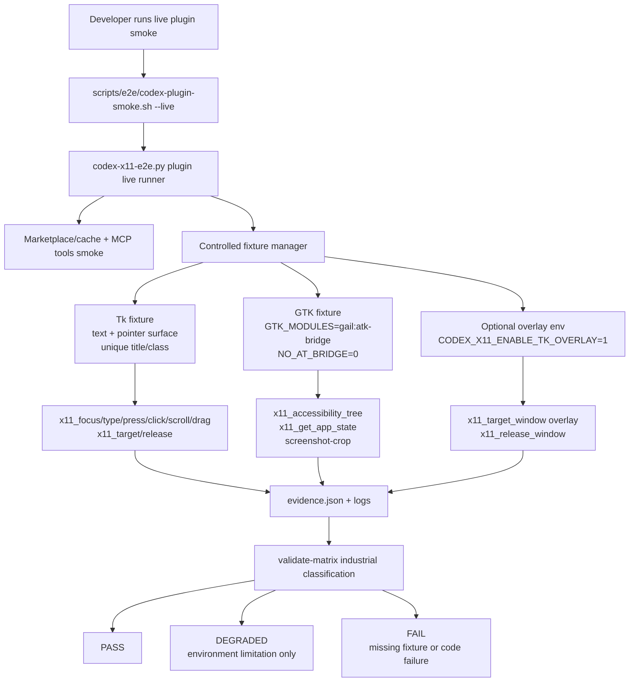

## Context

The full retest at `target/e2e-logs/full-x11-retest-20260601T123839Z/` established that the installed standalone plugin matches current HEAD and works for core Cinnamon/X11 functionality, including safe keyboard/pointer input against a Tk fixture, GTK bridge AT-SPI, absolute-path screenshot crop, `get_app_state`, and overlay when `CODEX_X11_ENABLE_TK_OVERLAY=1`. The same retest exposed two production-readiness gaps:

1. `screenshot-crop` with a relative output path returned a success-ish JSON shape even though the provider detail was `(false, 'relative/path')` and no file was created.
2. `scripts/e2e/codex-plugin-smoke.sh --live` validates metadata/tools but does not orchestrate controlled fixtures, so fixture-dependent capability rows remain degraded because the harness is incomplete rather than because the runtime environment is truly limited.

Relevant constraints:

- `CONSTITUTION.md` requires Rust 2021/root Cargo/Makefile verification, OpenSpec validation, no secret access, and no implementation before full planning gates complete.
- ADR 0008 keeps X11 root/global pixels canonical for window bounds, pointer points, and screenshot crop rectangles.
- ADR 0009 keeps verified focus/bounds as the input safety boundary and requires explicit pass/degraded capability evidence instead of fabricated pass claims.
- ADR 0010 keeps standalone plugin identity and `x11_*` MCP names; this change does not alter provider takeover architecture.
- Existing `docs/e2e-harness.md` already separates fake deterministic evidence from live environment-dependent evidence; this change adds an industrial live acceptance layer rather than removing fake mode or metadata-only freshness checks.

## Goals / Non-Goals

**Goals:**

- Make screenshot crop success depend on provider outcome and verified PNG output integrity.
- Resolve relative crop output paths against process cwd before provider calls and report the resolved absolute path.
- Add controlled live fixture orchestration to standalone plugin smoke for keyboard, pointer, focus, target/release, screenshot, app-state, GTK AT-SPI, and optional overlay.
- Keep all live input/pointer/screenshot/app-state operations fixture-only, with unique titles/classes and cleanup traps.
- Extend `evidence.json` and matrix validation so industrial readiness differentiates `environment_limitation`, `missing_fixture_setup`, and `code_failure`.
- Preserve safe evidence storage: screenshots as files/paths, sanitized logs, no secrets, no huge inline data URLs.

**Non-Goals:**

- No implementation in this planning change.
- No backend architecture rewrite, global plugin identity rename, standalone tool namespace removal, or RemoteDesktop portal requirement on X11.
- No source-overlay live run against a dirty or missing target checkout.
- No hard requirement that Tk expose AT-SPI; GTK bridge remains the semantic live AT-SPI pass path.
- No weakening of verified-focus input safety or AT-SPI confidence thresholds.
- No patching installed OpenSpec packages or reading `.secrets.local.env`.

## Decisions

### Runtime/evidence boundary



The harness has two layers:

- **Freshness smoke**: marketplace/cache metadata and `tools/list` prove the installed plugin is current and exposes expected standalone `x11_*` tools.
- **Industrial live verification**: controlled fixture-backed checks prove fixture-dependent capabilities. Industrial acceptance can use the same script with a new flag/mode such as `--industrial`, or can make live mode run industrial checks by default while allowing an explicit metadata-only submode. The implementation should choose the smallest CLI that preserves existing tests while making acceptance semantics unambiguous.

### Screenshot output integrity

Implementation should centralize crop output handling behind a small function used before and after provider invocation:

1. **Preflight path resolution**
   - Convert `--output` to an absolute path by resolving relative paths against `std::env::current_dir()`.
   - Reject paths with missing/unwritable parent directories before provider invocation.
   - Report both caller-provided and resolved output path when useful, but use the resolved absolute path for provider calls and verification.
2. **Provider invocation**
   - Preserve ADR 0008 root-coordinate validation before provider invocation.
   - Parse the GNOME Shell-compatible provider response enough to detect false status when available.
   - Record raw provider detail in diagnostics, sanitized to avoid irrelevant local data beyond the requested path.
3. **Postflight output verification**
   - Fail if provider status is false, regardless of file state unless a future provider contract proves false can still mean file completion. For current `ScreenshotArea`, false is failure evidence.
   - Fail if the output path does not exist, is not readable, is zero bytes, or lacks the PNG signature `89 50 4E 47 0D 0A 1A 0A`.
   - Return `success=true` only after provider success and PNG verification.
   - Add diagnostics fields such as `resolved_output_path`, `output_size_bytes`, `output_format`, `provider_success`, and `output_verified`.

Candidate error codes:

- `InvalidOutputPath`
- `OutputPathUnavailable`
- `ScreenshotProviderFailed`
- `ScreenshotOutputMissing`
- `ScreenshotOutputEmpty`
- `ScreenshotOutputInvalidFormat`
- `ScreenshotOutputUnreadable`

### Fixture manager design

The live runner should add a fixture manager module in `scripts/e2e/codex-x11-e2e.py` or adjacent helper scripts under `scripts/e2e/`:

- Start fixtures with unique run-scoped titles such as `codex-x11-tk-fixture-<run-id>` and `codex-x11-gtk-atspi-fixture-<run-id>`.
- Write fixture readiness files under the run directory, e.g. `live-mcp/tk-fixture-ready.json` and `live-mcp/gtk-fixture-ready.json`.
- Resolve fixture windows through `x11_list_windows` and allowlist title/class/pid metadata. Require exactly one match per fixture role.
- Register cleanup traps in Python (`try/finally`, process termination, state release) and shell wrappers (`trap`) so fixtures and overlays are cleaned even on failure.
- Keep fixture scripts deterministic and committed under `scripts/e2e/fixtures/` or equivalent; retest-local copied scripts should be converted into committed fixtures during apply.

Fixture roles:

| Role | Preferred fixture | Capabilities |
| --- | --- | --- |
| Text/focus/pointer | Tk fixture | focus, ASCII/Cyrillic value checks, Backspace/Enter, click, scroll, drag, target context/release |
| Semantic AT-SPI | GTK fixture with bridge env | `x11_accessibility_tree`, app-state accessibility layer |
| Screenshot/app-state | GTK or Tk fixture with stable bounds | `screenshot-crop`, `x11_get_app_state` screenshot/window layers |
| Overlay | Any controlled fixture with bounds | `x11_target_window --overlay`, overlay exclusion, release/hide |

### Safe target selection design

Before any live operation that can mutate desktop state or capture content, the harness must prove target ownership:

- A target is eligible only if it matches a run-scoped fixture title/class or a fixture readiness record.
- Overlay/helper windows are explicitly excluded.
- Non-fixture windows are never fallback targets. This includes terminal, browser, messenger, password manager, editor, and Codex windows that appear in normal listings.
- Ambiguous or missing fixture resolution blocks the capability row and records `missing_fixture_setup` or `unsafe_target_selection`.
- Tool JSON must still prove runtime safety, such as verified focus for input and bounds for pointer/crop; harness allowlisting does not replace tool-level safety.

### Evidence schema and matrix classification

Extend `evidence.json` without breaking existing fake evidence readers:

```json
{
  "schema_version": 2,
  "mode": "live",
  "acceptance_profile": "industrial",
  "fixtures": {
    "tk_text": {"status": "ready", "title": "codex-x11-tk-fixture-...", "window_id": 123},
    "gtk_atspi": {"status": "ready", "title": "codex-x11-gtk-atspi-fixture-...", "window_id": 456}
  },
  "capability_matrix": {
    "keyboard input": {
      "standalone_plugin": {
        "status": "pass",
        "reason_category": "fixture_pass",
        "evidence": ["live-mcp/fixture-content.txt"]
      }
    }
  }
}
```

Status handling:

- Accept legacy lower-case `pass`/`degraded` for existing evidence, but write new industrial evidence with a normalized status set (`pass`/`degraded`/`fail` or uppercase internally, consistently documented).
- Add `reason_category` values: `fixture_pass`, `environment_limitation`, `missing_fixture_setup`, `code_failure`, `unsafe_target_selection`, `malformed_evidence`, and `not_evaluated`.
- `validate-matrix --industrial` should fail on `missing_fixture_setup`, `code_failure`, `unsafe_target_selection`, malformed evidence, missing rows, and `not_evaluated` for required fixture-backed rows.
- `environment_limitation` may remain degraded only when the harness attempted fixture orchestration and recorded the concrete missing system/toolkit condition.

### Screenshot/app-state evidence sanitization

- Screenshot crop writes image files under the run directory and stores paths plus file metadata in `evidence.json`.
- `x11_get_app_state` raw JSON should either be sanitized before writing normal logs or accompanied by a summarized JSON file that removes `screenshot.data_url` and preserves `diagnostics.layers` and screenshot metadata.
- Ordinary chat-facing reports should mention file paths rather than inline image data.

## Risks / Trade-offs

- Running live input tests is inherently riskier than metadata-only smoke. Controlled fixtures, allowlists, verified focus, and bounds checks reduce but do not eliminate desktop automation risk.
- GTK bridge dependencies may be missing on some X11 desktops. That should be a real `environment_limitation` degraded result only after fixture launch was attempted and dependency details were captured.
- Resolving relative screenshot paths against cwd is convenient but must be explicit in JSON; otherwise logs from different cwd values can be confusing.
- Stricter matrix validation may turn previously green metadata-only live smoke into not-industrial-ready evidence. This is intended; fake and metadata smoke remain useful, but they no longer satisfy industrial acceptance.
- Committing fixture scripts increases maintenance surface. Keeping them small, deterministic, and isolated under `scripts/e2e/` limits that risk.

## Migration Plan

1. Keep existing fake plugin/source-overlay smoke behavior green while adding new fixture manager code behind a live industrial path.
2. Implement screenshot crop output path resolution and output integrity checks first because it is a focused correctness bug with deterministic tests.
3. Add fixture manager with lifecycle-only tests, then layer in Tk input/pointer checks, GTK AT-SPI, screenshot/app-state, and overlay.
4. Add matrix schema/version handling so old evidence still validates under the existing non-industrial profile while industrial profile enforces stricter fixture-backed requirements.
5. Update docs and release checklist to use the industrial profile before production readiness claims.
6. Rollback is standard git revert. Runtime cleanup must also release target-window state and terminate fixtures on failure.

## Open Questions

None.
