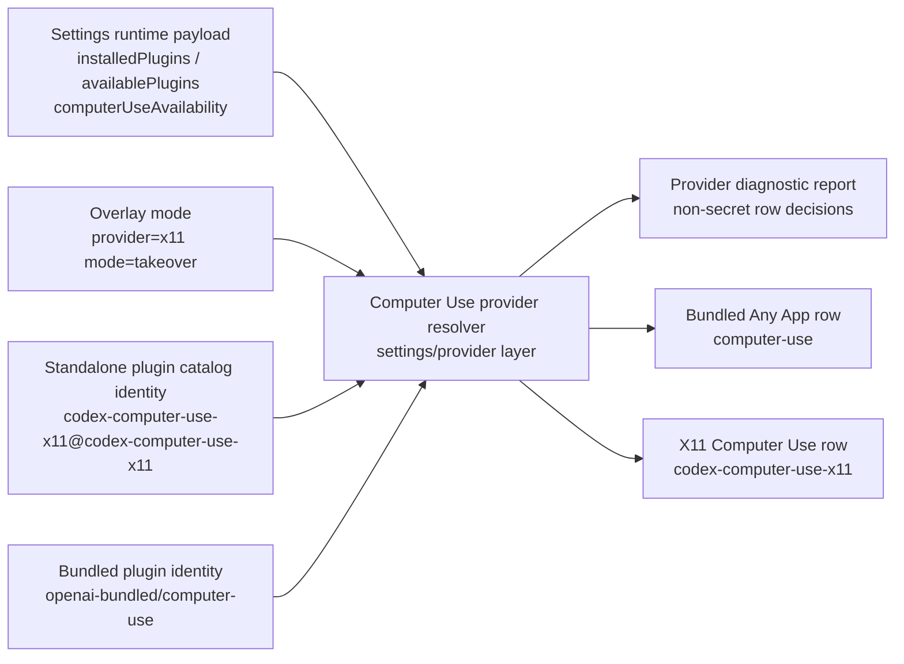
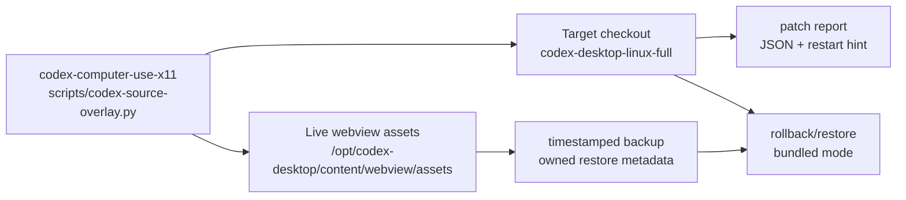

## Context

The previous active change, `show-x11-plugin-in-computer-use-settings`, implemented a side-by-side row patch in the target checkout, and the live installed asset `/opt/codex-desktop/content/webview/assets/computer-use-settings-aHZZtKP_.js` now contains the `codexLinuxX11Plugin` marker plus installed-first lookup literals. Live feedback still shows only Google Chrome on `Settings -> Computer use`, so the remaining failure is probably above the string injection itself: runtime payload shape, row/component gating, bundled Computer Use availability, or provider identity assumptions.

Relevant constraints:

- `CONSTITUTION.md` allows the local target checkout `/home/as/Документы/AI_PROJECTS/codex-desktop-linux-full` to be read and patched only when an OpenSpec task explicitly targets the integration overlay. No secrets or external systems are needed.
- `ARCHITECTURE.md` and ADR 0007 require safe local planning checkpoints but still require explicit approval for push/archive/destructive operations.
- ADR 0009 keeps the standalone `codex-computer-use-x11` plugin and `x11_*` tool namespace separate from stock Computer Use tools. This design must not globally rename the plugin to `computer-use`.
- The target repo's `README.md` documents Linux Computer Use UI as opt-in. Its ASAR/webview patches are fail-soft descriptor patches under `scripts/patches/core/**/patch.js`, with `scripts/patches/computer-use.js` owning Linux Computer Use UI gates.
- Current project source-overlay management is centralized in `scripts/codex-source-overlay.py` with shell wrappers for install/status/uninstall. This design extends that path instead of adding unrelated ad-hoc scripts.

Runtime boundary diagram:



Installer/rollback boundary diagram:



## Goals / Non-Goals

**Goals:**

- Establish a baseline diagnostic patch that explains when the bundled `computer-use` / `Any App` row is visible, unavailable, gated, hidden, or absent.
- Implement an explicit provider resolver for Computer Use settings rows with `provider=x11` and `mode=takeover` configuration.
- In takeover mode, render `codex-computer-use-x11` as the active Any App Computer Use provider row and hide or disable the bundled `computer-use` row for that provider surface.
- Keep any compatibility alias local to settings/provider row payloads and preserve global plugin identities and cache/marketplace ownership.
- Extend the current repository's overlay installer/status/uninstall path to apply takeover source patches over the target checkout, patch live assets only when explicitly requested, back up live assets, write patch reports, and roll back to bundled mode.
- Provide fixture-level RED/GREEN coverage for baseline bundled behavior, diagnostics, takeover row decisions, installer reports, and rollback.

**Non-Goals:**

- Do not implement code during planning.
- Do not archive, merge, push, or mutate live `/opt` assets without explicit apply tasks and user approval where required.
- Do not rewrite `$CODEX_HOME/plugins/cache/openai-bundled/computer-use`, bundled marketplace metadata, or the standalone plugin's MCP tool names.
- Do not remove Google Chrome row behavior or solve Chrome plugin availability.
- Do not make account-level OpenAI Statsig/rollout decisions controllable locally beyond the target repo's existing opt-in Linux UI patch posture.
- Do not introduce a generic plugin-category renderer for all possible Computer Use providers unless fixture evidence shows the provider resolver cannot stay local.

## Decisions

1. **Create a provider resolver before adding new row injection.**

   Add a target-side pure resolver near the existing Computer Use settings patch logic. In minified asset terms this may still compile down to string patches, but the source patcher/tests should model the behavior as a resolver with explicit inputs:

   - `installedPlugins`
   - `availablePlugins`
   - `computerUseAvailability`
   - provider config `{ provider: "x11", mode: "takeover" }` or bundled default
   - row/component shape facts for current and memoized settings bundle variants

   The resolver returns row decisions rather than only source replacement strings: bundled candidate, X11 candidate, Chrome candidate passthrough, selected provider, hidden/disabled/unavailable reasons, and diagnostics.

   **Alternative rejected:** continue inserting a side-by-side row with broader needles. That already produced a marker in the live asset without stable UI success and does not explain the missing bundled row.

2. **Collect baseline diagnostics first and keep them non-secret.**

   Add a diagnostic mode that can serialize sanitized runtime facts and resolver decisions. The report should be available through a patch-report/debug file path or an explicit console/debug surface chosen during implementation, not by exposing raw data to normal users by default.

   Required diagnostic fields:

   - plugin ids and marketplace names from `installedPlugins` and `availablePlugins`;
   - relevant `computerUseAvailability` booleans/status fields;
   - selected host/platform/gate booleans when visible to the settings bundle;
   - row decision list: candidate id, lookup source, shown/hidden/disabled/unavailable, reason;
   - source asset id/hash and patch marker version where available.

   **Alternative rejected:** inspect only the patched static asset. Static markers already exist and are insufficient to explain runtime row absence.

3. **Use takeover mode as an explicit settings/provider configuration.**

   Extend installer configuration and target patch behavior around two explicit values:

   ```text
   --provider x11 --mode takeover
   ```

   In default/bundled mode the settings page uses the target repo's existing bundled `computer-use` row decision. In X11 takeover mode the resolver searches `installedPlugins` first, then `availablePlugins`, for `codex-computer-use-x11`. If found, it returns an X11 row as the active Any App provider row and suppresses the bundled row for that provider surface. If absent, it returns a visible unavailable/diagnostic X11 state rather than silently showing only Chrome.

   **Alternative rejected:** silently fall back to bundled Computer Use in takeover mode. That hides misconfiguration and recreates the current failure mode.

4. **Localize any compatibility alias to the row payload.**

   If the existing settings row component requires fields shaped like a bundled provider, construct a row-local shim object that points at the X11 plugin while preserving the underlying plugin id and marketplace identity. The shim may adapt title/description/provider labels for UI controls, but it must not mutate the global plugin catalog, the standalone plugin manifest, the MCP tool namespace, or bundled cache/marketplace paths.

   **Alternative rejected:** install `codex-computer-use-x11` as `computer-use`. That is simpler for UI matching but breaks ownership, rollback, and ADR 0009 identity separation.

5. **Extend the existing overlay manager instead of adding one-off patch commands.**

   Extend `scripts/codex-source-overlay.py` and existing wrappers rather than introducing a separate unmanaged script. Add arguments such as:

   ```text
   scripts/install-codex-source-overlay.sh --provider x11 --mode takeover [--target <path>] [--patch-live-assets] [--report-json <path>] [--dry-run]
   scripts/status-codex-source-overlay.sh --provider x11 --mode takeover [--target <path>] [--report-json <path>]
   scripts/uninstall-codex-source-overlay.sh --provider x11 --mode takeover [--target <path>] [--restore-live-assets] [--report-json <path>]
   ```

   Implementation may internally split source-overlay backend files from provider-takeover files, but the public path remains one overlay manager with install/status/uninstall commands.

   **Alternative rejected:** patch `/opt` live assets directly as the primary implementation. Live patching is useful for local verification but must be reportable and reversible; source patching remains the durable target path.

6. **Version owned markers and backup metadata.**

   Use marker strings that distinguish this takeover from the prior side-by-side row patch, for example `codex-computer-use-x11-provider-takeover:v1`. Live asset backups should be timestamped and recorded in a JSON report with enough data for rollback: original asset path, backup path, checksum or byte size, patch marker, provider, mode, and restart hint.

7. **Keep target patches fail-soft but make installer status strict.**

   Target webview patch descriptors should continue the target repo's fail-soft warning style when upstream minified anchors drift. The overlay installer/status command should classify drift strictly in its report so the user knows the takeover was not applied cleanly.

## Risks / Trade-offs

- **Minified bundle drift:** The target settings bundle is hash-named and minified. Mitigation: current-shape and memoized-shape fixtures, marker versioning, fail-soft target patch warnings, strict installer status drift classification.
- **Runtime diagnostic surface sensitivity:** Plugin payloads should be non-secret, but diagnostics can still be noisy or personal. Mitigation: include ids/names/status only, never credentials or private URLs, and keep diagnostics off by default.
- **Feature gate semantics:** Hiding bundled row in takeover mode could be confused with bypassing account rollout. Mitigation: keep this as an explicit local UI provider selection mode and preserve bundled mode via rollback.
- **Rollback over live assets:** A live asset may have changed after backup or been repatched by an updater. Mitigation: report checksums/marker status, restore only owned backups/markers, and stop on drift rather than overwriting unknown content.
- **Active prior change:** `show-x11-plugin-in-computer-use-settings` remains complete but unarchived. Mitigation: treat it as evidence and do not archive/push without explicit permission; this change supersedes its side-by-side assumption for future work.

## Migration Plan

1. Add target fixture tests that reproduce the known baseline: bundled `Any App` row can render in bundled mode when payload/gates allow it, and diagnostics explain when it does not.
2. Add diagnostic resolver tests and minimal target patcher support to expose sanitized runtime plugin payload and row decisions in diagnostic mode.
3. Add takeover resolver tests: bundled row hidden/disabled, X11 provider selected from `installedPlugins`, fallback to `availablePlugins`, missing X11 provider reports unavailable, Chrome row preserved.
4. Extend target source patcher/descriptor code to apply the resolver/takeover shim and migrate/remove the prior side-by-side row marker when takeover mode is active.
5. Extend `scripts/codex-source-overlay.py` and shell wrappers in this repository with `--provider x11 --mode takeover`, dry-run/status/report options, live asset backup/patch support, and rollback/restore support.
6. Run installer tests on fake target/live-asset fixtures before touching the real target checkout.
7. Apply to `/home/as/Документы/AI_PROJECTS/codex-desktop-linux-full`, run target patcher and smoke tests, and record reports.
8. If explicitly requested during apply, patch live `/opt/codex-desktop/content/webview/assets/computer-use-settings-*.js` with backup/report and tell the user to restart Codex Desktop fully.
9. Rollback path: run the uninstall/restore command, remove owned takeover source markers, restore recorded live backups or remove owned takeover markers from live assets, verify bundled mode fixture and final git status.

## Open Questions

None. The per-change ADR step should evaluate the provider takeover/shim decision and likely record it as a durable ADR because it is a hard-to-reverse architecture choice that rejects global plugin-id masquerade.
