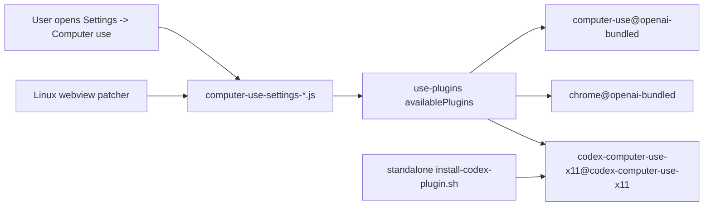

## Context

The standalone plugin install path is already owned by this repository: plugin id `codex-computer-use-x11`, display name `X11 Computer Use`, owned marketplace `codex-computer-use-x11`, and `x11_*` MCP tools. The current user-local install is present under `/home/as/.codex/plugins/cache/codex-computer-use-x11/...` and the local marketplace metadata is present under `/home/as/.codex/plugins/marketplaces/codex-computer-use-x11`.

Codex Desktop Linux's Computer Use settings page is implemented in hashed webview assets. The current extracted asset `/tmp/codex-asar-extract/webview/assets/computer-use-settings-Bj9s3CiH.js` hardcodes:

- `we = "computer-use"` and `X(d.availablePlugins,we,f)` for the `Any App` row;
- `Te = "chrome"`, `Ee = "chrome-dev"`, `De = "chrome-internal"` and `Ge(...)` for the `Google Chrome` row.

The target repo already patches Computer Use Linux support in `/home/as/Документы/AI_PROJECTS/codex-desktop-linux-full/scripts/patches/computer-use.js` and registers Computer Use UI webview patches under `scripts/patches/core/all-linux/webview/computer-use-ui/patch.js`. The correct integration point is this patcher layer, not the standalone plugin manifest and not the bundled marketplace sync.

Relevant constraints:

- `CONSTITUTION.md`: target checkout writes are allowed only when an OpenSpec task explicitly targets source-overlay compatibility; no secrets are needed.
- ADR 0005: apply must follow vertical RED/GREEN/REFACTOR evidence.
- ADR 0007: safe local checkpoints are automatic, but archive/push remain explicit.
- ADR 0009: standalone plugin remains project-owned and namespaced as `x11_*`; stock/bundled Computer Use remains separate.

Boundary diagram:

## Goals / Non-Goals

**Goals:**

- Add a target-repo webview patch function that injects a side-by-side `X11 Computer Use` row into the current Computer Use settings asset.
- Register that function as an opt-in Computer Use UI webview patch for `computer-use-settings-*.js`.
- Keep bundled `Any App` and `Google Chrome` row behavior unchanged.
- Add unit tests for RED/GREEN behavior, idempotence, and fail-soft drift handling.
- Add smoke-test assertions that the patch descriptor and exported patch function exist.
- Record automated and live/degraded verification evidence in `test-plan.md`.

**Non-Goals:**

- Do not change the standalone Rust binary, MCP tool list, or plugin installer metadata in this change.
- Do not rename `codex-computer-use-x11` to `computer-use`.
- Do not write to `$CODEX_HOME/plugins/cache/openai-bundled/computer-use` or bundled marketplace metadata.
- Do not require a full app rebuild/live screenshot as the only proof if current Codex app process caching blocks immediate visual verification.
- Do not introduce a generic plugin-category renderer for all Computer Use plugins.

## Decisions

1. **Patch the settings asset, not the plugin identity.**
   - Add `applyX11ComputerUseSettingsRowPatch(currentSource)` to the target repo's `scripts/patches/computer-use.js`.
   - Export it through `scripts/patch-linux-window-ui.js` for tests.
   - Register it in `scripts/patches/core/all-linux/webview/computer-use-ui/patch.js` with pattern `/^computer-use-settings-.*\.js$/` and the same `enabled: context => context.enableComputerUseUi` posture as other visible UI bypass patches.

2. **Use a surgical minified-source row injection with idempotent markers.**
   - Constant: `codex-computer-use-x11`.
   - Find the current settings-row construction around `p=X(d.availablePlugins,we,f)` and the later `r.available&&m!=null` row push.
   - Insert one additional lookup against `d.availablePlugins` using the imported helper `X(...)` so marketplace preference/home path behavior is identical to existing rows.
   - Insert one `w.push(...)` row object with title `X11 Computer Use`, a short description, and `plugin:<lookup-result>`.
   - Use the literal `codex-computer-use-x11` as the idempotency marker. If already present, return the source unchanged.

3. **Prefer fail-soft warning over build failure for upstream drift.**
   - If the asset contains Computer Use settings markers but not the expected row construction, warn `WARN: Could not find X11 Computer Use settings row insertion point — skipping settings row patch` and return unchanged.
   - This mirrors existing webview fail-soft behavior and avoids breaking unrelated Linux app builds when upstream minification changes.

4. **Tests exercise public patcher behavior.**
   - Patcher unit tests call the exported function directly with a representative current minified fixture.
   - The RED test first asserts the function is exported and injects the row; it fails before implementation because the export/function does not exist.
   - Tests assert idempotence by applying the function twice.
   - Tests assert drift warning/unchanged output for an asset with `settings.computerUse.anyApp` but no matching row construction.

5. **Smoke coverage stays lightweight.**
   - Extend `tests/scripts_smoke.sh` or existing patch smoke checks only enough to assert descriptor registration and/or patched extracted fake asset behavior.
   - Full `node --test scripts/patch-linux-window-ui.test.js` remains the core automated target check.

## Risks / Trade-offs

- **Minified bundle drift:** The patch relies on current asset structure. Mitigation: test fixtures for current shape, idempotency guard, and clear warning on drift.
- **Row rendering semantics:** The injected row uses existing `Le/he` plugin-control components, so install/enable behavior should match other rows; however visual layout is only proven by live UI smoke when the app can be rebuilt/restarted.
- **Marketplace availability:** If the standalone marketplace is not installed or plugin reload has not occurred, the row will not appear. This is expected and honest because the settings page cannot control a plugin absent from `availablePlugins`.
- **Cross-repo commits:** OpenSpec artifacts live in `codex-computer-use-x11`, but implementation lives in `codex-desktop-linux-full`. Final reporting must show git status and commits for both repositories.

## Migration Plan

1. Add RED target patcher tests in `/home/as/Документы/AI_PROJECTS/codex-desktop-linux-full/scripts/patch-linux-window-ui.test.js`.
2. Implement `applyX11ComputerUseSettingsRowPatch` and export/register it.
3. Run focused Node tests until GREEN.
4. Extend smoke coverage if needed and run relevant target smoke commands.
5. Record evidence in this change's `test-plan.md`, mark tasks done only after evidence exists.
6. Validate OpenSpec artifacts in this repository.
7. Rollback is a normal Git revert in the target repo plus reverting this OpenSpec change in the source repo; no persistent user cache migration is required.

## Open Questions

None.
