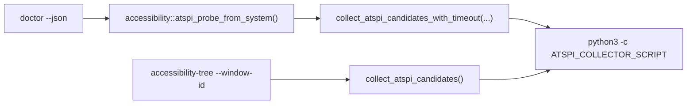

## Context

The current standalone Rust CLI has two AT-SPI-facing paths:

Independent live verification showed the direct window-scoped path can return a high-confidence tree for the focused Codex window while doctor reports `match_outcome=collector_unavailable` / `atspi_tree_extraction_unavailable`. That violates the archived `doctor-cli` and `x11-atspi-window-correlation` intent: doctor is allowed to be a lightweight ambient probe, but it must not diverge from the collector success contract.

Project constraints from `CONSTITUTION.md` and `ARCHITECTURE.md`:

- Rust 2021, root Cargo/Makefile verification.
- `doctor --json` is non-invasive, read-only, no secrets, no screenshots, no input injection, no target checkout mutation.
- AT-SPI absence/ambiguity must degrade with structured diagnostics rather than fabricating a subtree.
- ADR 0009 remains in force: Cinnamon/X11 baseline permits degraded AT-SPI, but pass/degraded evidence must be truthful.

## Goals / Non-Goals

**Goals:**

- Reproduce the live mismatch with a deterministic RED test.
- Make doctor and accessibility-tree share the same collector success parsing for `ok=true` + candidates.
- Preserve bridge-disabled handling for `NO_AT_BRIDGE=1`.
- Preserve bounded doctor behavior for hung collector commands.
- Add enough diagnostic detail in tests or internal paths to prevent a future silent `collector_unavailable` false negative.
- Verify with normal project checks and live-safe comparison when X11 is available.

**Non-Goals:**

- Do not require doctor to select or focus a target window.
- Do not relax accessibility-tree correlation confidence thresholds.
- Do not make AT-SPI mandatory for `readiness.ok` in the Cinnamon/X11 window/input baseline.
- Do not change installer/provider takeover behavior.
- Do not introduce a new durable architecture decision unless implementation uncovers a hard-to-reverse trade-off.

## Decisions

1. **Keep one collector contract and test both consumers against it.**
   - The collector output contract is `CollectorOutput { ok, candidates, diagnostics }`.
   - A doctor probe receiving `ok=true` with one or more candidates must report `tree_available=true`, `candidate_count`, and `match_outcome=tree_available`.
   - Tests should use the same fake collector JSON shape already accepted by accessibility-tree tests.

2. **Keep doctor ambient, not target-scoped.**
   - Doctor answers “can the session expose any AT-SPI tree candidates?”
   - `accessibility-tree` answers “can this X11 window be correlated to a semantic subtree?”
   - Final live verification compares the two when a suitable current window exists, but doctor does not require that window id.

3. **Preserve bridge-disabled short-circuit.**
   - If `NO_AT_BRIDGE=1` is present in doctor’s effective environment, doctor should not run the collector probe and should report the canonical bridge-disabled diagnostic.
   - Empty `NO_AT_BRIDGE` remains non-disabling.

4. **Preserve bounded collection but avoid false parser divergence.**
   - Hung command tests remain valid.
   - If the current timeout wrapper is the root cause, fix the wrapper without removing the timeout.
   - If parse/result mapping is the root cause, fix mapping and add a regression test at the public CLI boundary.

5. **No diagram beyond the path diagram is required.**
   - This is an intra-crate behavior correction, not a new runtime boundary or deployment shape.

## Risks / Trade-offs

- **Live AT-SPI is environment-dependent.** Mitigation: deterministic fake collector tests remain the primary regression guard; live-safe verification is reported as evidence or limitation.
- **Timeout changes can hide hung desktop commands.** Mitigation: keep `doctor_live_probe_times_out_hung_desktop_commands` passing and avoid unbounded collection in doctor.
- **Doctor could overstate accessibility by treating ambient candidates as target success.** Mitigation: doctor reports tree availability only, not a target correlation pass; controlled fixture pass remains separately flagged.
- **Local shell environment may contain `NO_AT_BRIDGE=1`.** Mitigation: preserve bridge-disabled diagnostics and run live comparison with the variable removed/neutralized when checking the non-disabled collector path.

## Migration Plan

- No data migration or installer rollback is needed.
- Implement as a Rust behavior/test change in the standalone crate.
- Verify with `openspec validate fix-live-doctor-atspi-probe-mismatch`, `make fmt`, `make check`, `make test`, plus live-safe `doctor --json` and `accessibility-tree --json` comparison if X11 is available.
- Stop before archive; archive remains a separate explicit user action.

## Open Questions

None.
