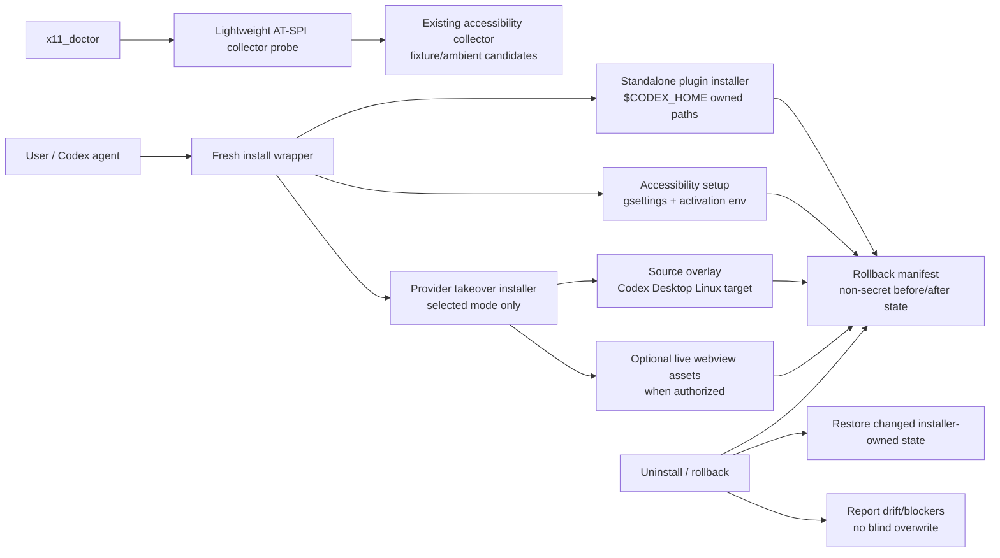

## Context

This change hardens a working standalone/source-overlay X11 Computer Use stack where the runtime can already provide `x11_get_app_state` and `x11_accessibility_tree`, but doctor still reports a false AT-SPI degradation because `src/doctor.rs:gather_system_facts()` sets `atspi_tree_available=false` unconditionally. The project constitution requires Rust 2021/Cargo implementation, root `make fmt`, `make check`, and `make test`, OpenSpec validation for artifacts, and no secret handling or installed OpenSpec package patching. No external secrets or `.secrets.local.env` access are needed.

Architecture constraints in force:

- ADR 0008: preserve X11 root-coordinate and safe targeted-input boundaries; this change must not weaken app-state or input safety.
- ADR 0009: scope remains Cinnamon/X11 v1 baseline with explicit pass/degraded evidence.
- ADR 0010: provider takeover is a localized settings/provider shim; do not globally rename the standalone plugin, do not rewrite bundled plugin ownership, and preserve rollback to bundled mode.
- `ARCHITECTURE.md`: source overlay is optional integration staging, while the standalone plugin remains the primary runtime delivery path.

The design is rollback-first: each mutating installer path records a non-secret backup manifest entry before it writes, classifies whether the installer changed the state or found it already acceptable, and restores only installer-owned state when current state still matches the recorded installer after-state.



## Goals / Non-Goals

**Goals:**

- Make `doctor --json` derive AT-SPI tree availability from collector evidence and expose `tree_available`, `candidate_count`, `match_outcome`, and `controlled_fixture_pass` accurately.
- Add a reusable AT-SPI probe seam so doctor tests can prove both positive and degraded paths without depending on the live desktop.
- Extend fresh install to activate the full selected Cinnamon/X11 delivery path: standalone plugin, safe accessibility setup, optional provider takeover/source overlay, and optional live asset patch.
- Extend manifests to cover `$CODEX_HOME` plugin state, source overlay target files, live assets, gsettings values, user systemd/dbus activation environment, ownership, mode, sha256, and partial install progress.
- Make uninstall idempotent, partial-install safe, dry-run/report-json capable, and drift-aware across standalone and takeover surfaces.
- Provide fake e2e verification for fresh install → doctor ok → uninstall restored and live-safe checklist guidance.

**Non-Goals:**

- Do not enable Orca or any screen-reader/autostart state.
- Do not make Wayland, unstable Cinnamon/Muffin extension behavior, or unsafe unverified input part of the baseline.
- Do not globally masquerade `codex-computer-use-x11` as bundled `computer-use`, rename `x11_*` tools, or rewrite bundled marketplace/cache ownership.
- Do not blindly patch or delete live/root-owned assets when current state has drifted from recorded installer after-state.
- Do not access, print, or depend on secrets.

## Decisions

### 1. Doctor consumes an AT-SPI probe rather than hardcoding tree state

Add a small probe abstraction in or near `src/accessibility.rs` that reuses the same collector boundary used by `accessibility-tree`/app-state. The public report shape in `src/doctor.rs` can stay stable because it already has `atspi_tree_available`, `atspi_match_outcome`, `atspi_candidate_count`, and `atspi_controlled_fixture_pass` fields.

Implementation direction:

- Introduce an internal `AtspiProbeReport` with:
  - `bus_available: bool`
  - `tree_available: bool`
  - `candidate_count: Option<usize>`
  - `match_outcome: Option<String>` using existing canonical outcome strings where possible
  - `controlled_fixture_pass: bool`
  - `reason: Option<String>` for unavailable/bridge-disabled/degraded states
- In `gather_system_facts()`, keep the lightweight bus probe but then run the bounded collector probe when the bus is reachable and bridge env is not disabled.
- Treat `NO_AT_BRIDGE=1` as a canonical bridge-disabled diagnostic even if the bus is reachable.
- Bound the probe so doctor remains a quick, non-invasive command. Use the existing timeout pattern around desktop commands and collector subprocess calls.
- For tests, add a fixture/seam that can inject collector JSON or command output through fake `PATH`/environment, matching existing `tests/doctor_cli.rs` and `tests/accessibility_tree_cli.rs` style.

Alternatives considered:

- Keep doctor as bus-only readiness: rejected because it preserves the current false-negative and does not explain working tree extraction.
- Duplicate the entire accessibility-tree correlation path in doctor: rejected because it risks divergent outcomes from `x11_accessibility_tree` and `x11_get_app_state`.

### 2. Manifests become the single rollback authority

Use manifest-backed rollback for every install surface. Source/provider takeover already has a manifest in `scripts/codex-source-overlay.py`; extend that model and add equivalent standalone plugin/accessibility manifest entries instead of inventing ad hoc rollback rules in each shell script.

Manifest entry shape should be common enough for tests and reports:

```json
{
  "schema_version": 1,
  "operation": "install|uninstall|rollback",
  "started_at": "timestamp",
  "surfaces": {
    "plugin": [],
    "accessibility": [],
    "source_overlay": [],
    "live_assets": []
  },
  "entries": [
    {
      "surface": "live_asset|source_file|plugin_path|gsettings|activation_env",
      "path_or_key": "non-secret identifier",
      "before": {"exists": true, "sha256": "...", "mode": "...", "uid": 0, "gid": 0, "value": "..."},
      "after": {"exists": true, "sha256": "...", "mode": "...", "uid": 0, "gid": 0, "value": "..."},
      "installer_changed": true,
      "completed": true,
      "backup": "relative backup path when applicable"
    }
  ]
}
```

Design rules:

- Record before-state before mutation.
- Record completed status immediately after each successful mutation so partial installs can roll back only completed writes.
- Store no secrets. Environment entries are limited to the explicitly relevant non-secret variables (`NO_AT_BRIDGE`, `GTK_MODULES`, `QT_ACCESSIBILITY`) and should redact unexpected values if they could contain sensitive material; these names normally carry non-secret bridge/config flags.
- For files, record existence, sha256, size, ownership, and mode. For root-owned live assets, preserve ownership and mode during backup/restore.
- For gsettings and activation env, record value vs absence and installer-changed vs already-present.
- For rollback, restore only entries marked `installer_changed=true` and `completed=true`, and only when current state matches recorded `after` unless the entry type is explicitly safe to remove because it is absent/already restored.

Alternatives considered:

- A single monolithic shell rollback script with hardcoded paths: rejected because it cannot safely distinguish changed vs already-present state or partial installs.
- Always restore manifest before-state even after drift: rejected because it could overwrite user/admin changes made after install.

### 3. Fresh install orchestrates surfaces, but each surface remains independently testable

Do not collapse all installers into one opaque script. Keep existing wrappers and add orchestration/reporting so each surface can be tested independently and the one-command rollout can compose them.

Proposed command behavior:

- `scripts/install-codex-plugin.sh`
  - Existing owned plugin installation remains.
  - Add `--activate-accessibility` or equivalent fresh-install mode for toolkit accessibility and activation environment setup.
  - Add `--report-json <path|->` and manifest output under an owned `$CODEX_HOME` state directory.
- `scripts/uninstall-codex-plugin.sh`
  - Restore plugin/accessibility manifest entries.
  - Support `--dry-run --report-json`.
- `scripts/install-x11-provider-takeover.sh`
  - Continue composing standalone plugin install and source-overlay takeover.
  - Pass through manifest/report-json and live asset options.
  - Live assets patch only when selected and writable/authorized; `--require-live-assets` keeps current hard-fail semantics.
- `scripts/uninstall-x11-provider-takeover.sh`
  - Compose provider/source/live rollback and standalone uninstall only when requested/manifest-owned.
  - Report state and blockers instead of blind deletion.

The orchestrator should be transaction-like but not all-or-nothing across all surfaces: on failure it rolls back completed writes for the current transaction using manifest entries, and leaves prior successful installs untouched unless the user invoked full uninstall/rollback.

### 4. Accessibility setup is minimal and reversible

Installer accessibility setup is limited to the baseline needed for GTK/ATK bridge and AT-SPI tree extraction:

- Ensure `org.gnome.desktop.interface toolkit-accessibility=true` when gsettings is available and the value is not already true.
- Inspect user activation environment through `systemctl --user show-environment` and/or `dbus-update-activation-environment --systemd` compatible commands using fakeable command seams in tests.
- Remove or neutralize `NO_AT_BRIDGE=1` in user activation environments when safely updatable.
- Preserve or set `GTK_MODULES=gail:atk-bridge` and `QT_ACCESSIBILITY=1` only when needed and safe; record whether they were already present.
- Do not enable Orca.

Rollback restores prior values only for entries the installer changed. If the user changed the same values after install, uninstall reports drift/blocker and does not overwrite blindly.

### 5. Provider takeover keeps ADR 0010 boundaries

The takeover design remains localized:

- Source overlay patches provider/settings resolver payloads and webview patch descriptors.
- Live asset patches are optional, backed up, marker-verified, and secondary to source overlay/rebuild behavior.
- Bundled `computer-use` marketplace/cache paths are diagnostics/fallback state only; they are not rewritten to point at X11.
- Rollback restores bundled mode from manifest and leaves standalone plugin uninstall to standalone plugin rollback policy.

### 6. Verification is vertical and fixture-first

The implementation phase should use TDD slices:

1. Doctor AT-SPI probe fixture proves true tree availability before production code changes the hardcoded false path.
2. Doctor bridge-disabled fixture proves degraded outcome remains distinct.
3. Plugin installer manifest test proves env/gsettings before-state capture and dry-run no mutation.
4. Plugin uninstall manifest test proves restoration and drift/blocker behavior.
5. Source/live asset manifest tests extend existing provider takeover rollback tests for ownership/mode/sha256 and changed-vs-already-present classification.
6. Fake e2e smoke proves fresh install → doctor fixture ok → uninstall restored.

Final apply verification will run the user-requested checks: `make fmt`, `make check`, `make test`, `scripts/e2e/codex-plugin-smoke.sh --fake`, relevant dry-run install/uninstall checks, and live-safe checklist commands where available.

## Risks / Trade-offs

- **Installer breadth**: touching plugin state, gsettings, activation env, source overlay, and live assets increases failure modes. Mitigation: per-surface manifests, partial completion flags, dry-run/report-json, and fixture tests.
- **Live asset ownership**: `/opt/codex-desktop/...` assets may be root-owned and can drift after Codex Desktop updates. Mitigation: optional live patch, sha256/ownership/mode checks, and blocker reporting on drift.
- **AT-SPI probe cost/flakiness**: live AT-SPI enumeration can be slow or sensitive to session state. Mitigation: bounded lightweight probe, fake fixtures for CI, and controlled fixture pass as stronger live evidence.
- **Environment mutation sensitivity**: user activation env changes can affect other apps. Mitigation: only remove known disabling bridge state or set known accessibility variables when needed, record before-state, and restore only installer-owned changes.
- **Manifest schema compatibility**: extending current provider manifest must not break existing rollback tests. Mitigation: keep legacy fields where tests/docs already expect them, add `schema_version` and richer metadata compatibly.

## Migration Plan

1. Planning artifacts complete and checkpointed.
2. During apply, update tests first for each vertical slice.
3. Introduce the AT-SPI probe and wire doctor fields.
4. Extend standalone installer/uninstaller argument parsing, manifest write/read, dry-run/report-json, and accessibility setup helpers behind fake command seams.
5. Extend source-overlay/provider takeover manifest metadata, drift checks, ownership/mode preservation, and report-json output while keeping legacy manifest keys until tests/docs are updated.
6. Extend fake e2e smoke to create fake home/target/gsettings/env/AT-SPI probe state, run fresh install, verify doctor report, run uninstall, and assert restoration.
7. Run required local verification and record live-safe checklist limitations or evidence.

Rollback during development:

- Use `scripts/uninstall-codex-plugin.sh --dry-run --report-json` and `scripts/uninstall-x11-provider-takeover.sh --dry-run --report-json` before write-mode rollback.
- If drift is reported, inspect and decide manually; do not force overwrite without a new explicit task/override.
- For source overlay/live asset tests, rollback through fake targets first before trying the active local target.

## Open Questions

None. Design preserves in-force ADRs. The later `adr.md` artifact should decide whether to create a new durable ADR for the rollback-first manifest contract and update `ARCHITECTURE.md` if accepted.
