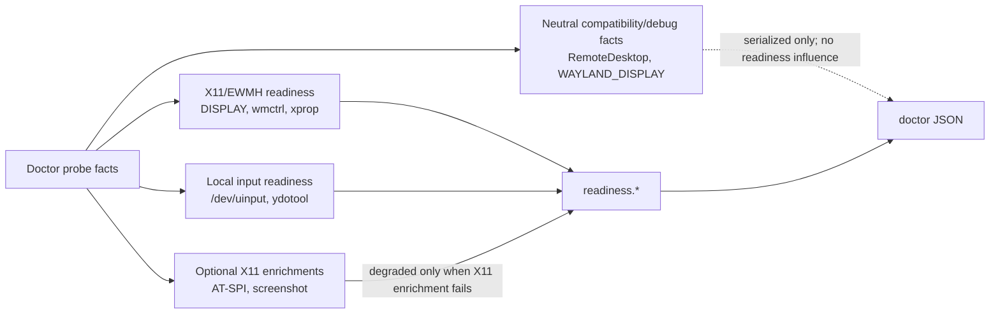

## Context

The current standalone doctor report already uses `backend="x11-ewmh"`, but its readiness aggregation still carries older upstream/portal-oriented diagnostics:

- `readiness_report()` adds `"RemoteDesktop portal unavailable or incomplete"` to `readiness.degraded_reasons` and `remote_desktop_portal_unavailable` to `readiness.optional_enrichments` when strict portal input is absent.
- The same function adds `wayland_runtime_out_of_scope` to `readiness.unsupported_out_of_scope` when `WAYLAND_DISPLAY` is present or the session type is Wayland.
- `can_send_development_input` and the no-input blocker still include `input.remote_desktop.available`, and the no-input recommendation says to enable RemoteDesktop portal input.
- Unit tests in `src/doctor.rs` intentionally assert those old RemoteDesktop/Wayland readiness entries, making them good RED targets.
- Docs such as `README.md`, `docs/troubleshooting.md`, `docs/integration-contract.md`, `docs/e2e-harness.md`, `docs/upstreaming.md`, and `docs/release-checklist.md` still describe portal readiness/RemoteDesktop facts as part of current diagnostics.

Project constraints from `CONSTITUTION.md`: Rust 2021/Cargo, root `Makefile` verification (`make fmt`, `make check`, `make test`), machine-readable doctor JSON validation, OpenSpec validation, and no secrets. ADR 0009 already decides the durable scope: yes for the documented Cinnamon/X11 `x11-ewmh` baseline; Cinnamon Wayland and portal-required runtime paths are outside v1. This design aligns doctor behavior with that existing ADR rather than superseding it.

## Goals / Non-Goals

**Goals:**

- Make doctor readiness for `codex-computer-use-x11` depend only on the X11/EWMH baseline and supported local input paths.
- Keep RemoteDesktop/Wayland JSON facts only as neutral compatibility/debug facts if retained.
- Ensure RemoteDesktop absence and `WAYLAND_DISPLAY` presence do not appear in `readiness.degraded_reasons`, `optional_enrichments`, `unsupported_out_of_scope`, blockers, or `recommended_next_step`.
- Add TDD regression coverage for the user-specified ready X11 scenario with absent RemoteDesktop portal and mixed `WAYLAND_DISPLAY`.
- Remove or rewrite docs that tell users to fix RemoteDesktop portal or Wayland for current standalone doctor readiness.

**Non-Goals:**

- Do not add Wayland or RemoteDesktop portal support to this plugin.
- Do not remove public JSON compatibility fields unless implementation shows they are dead and tests/docs can be safely cleaned in the refactor slice.
- Do not change source-overlay target behavior that is explicitly about a future/upstream target diagnostics vocabulary unless it is described as current standalone doctor readiness.
- Do not archive the OpenSpec change without separate explicit user confirmation.
- Do not mutate external systems, read `.secrets.local.env`, inject input, or require screenshots.

## Decisions

### Decision 1: Keep compatibility fields but remove them from readiness aggregation

`environment.wayland_display_present`, `portals.remote_desktop`, and `input.remote_desktop` will remain serialized for now. Their semantics become debug/compatibility-only for standalone doctor readiness.

Rejected alternative: remove all RemoteDesktop/Wayland fields immediately. That would satisfy the no-noise goal but is a broader JSON compatibility break and would require more fixture/doc churn than needed.

### Decision 2: Derive development input readiness from local X11-supported input only

Change `can_send_development_input` and the no-input blocker to consider:

- `/dev/uinput` read/write (`input.abs_pointer.available`), and
- connectable ydotool socket (`input.ydotool.available`).

Do not use `input.remote_desktop.available` to satisfy or block X11-only plugin input readiness. Remove RemoteDesktop from the no-input recommendation.

### Decision 3: Delete RemoteDesktop portal readiness issue creation

Remove the readiness branch that currently pushes:

- `RemoteDesktop portal unavailable or incomplete` into `degraded_reasons`; and
- `remote_desktop_portal_unavailable` into `optional_enrichments`.

Any retained portal fact remains under `portals.remote_desktop` and `input.remote_desktop` only.

### Decision 4: Delete Wayland unsupported-out-of-scope readiness emission

Remove the branch that creates `wayland_runtime_out_of_scope`. Product scope remains documented in README/troubleshooting, but inherited Wayland environment facts do not become per-run readiness warnings when X11 passes.

### Decision 5: Update docs to be X11-scoped

Rewrite current standalone docs so X11 readiness troubleshooting names X11 session variables, EWMH tools, ydotool/uinput, AT-SPI, and screenshot providers. RemoteDesktop portal and Wayland should appear only as out-of-current-scope notes, not as things doctor asks users to repair.

### Boundary diagram

## Risks / Trade-offs

- **Compatibility-field ambiguity**: keeping `portals.remote_desktop` can still look important to readers. Mitigation: docs/specs explicitly state it is neutral/debug-only and tests assert readiness fields do not reference it.
- **Target-overlay distinction**: source-overlay specs/docs may still mention strict portal checks for upstream target diagnostics. Mitigation: rewrite standalone docs and avoid changing target-overlay scope unless wording claims it is current standalone plugin readiness.
- **Input semantics**: removing portal from `can_send_development_input` means a portal-only environment no longer satisfies standalone X11 plugin input readiness. This is intended because the plugin is X11/EWMH-only and supports local input paths.
- **String-search tests**: forbidden strings could still appear in compatibility details or docs. Mitigation: regression tests should target readiness fields, while docs grep/refactor removes stale user-facing remediation wording.

## Migration Plan

- No data migration or installer migration is required.
- Implementation is a local Rust/test/docs change.
- Existing installed binaries remain unchanged until rebuilt/reinstalled by a later install/release flow.
- Rollback is a standard Git revert of implementation and docs changes.
- Verification uses fake doctor fixtures plus live/local `doctor --json` smoke when applicable; no input injection or external credentials.

## Open Questions

None.
