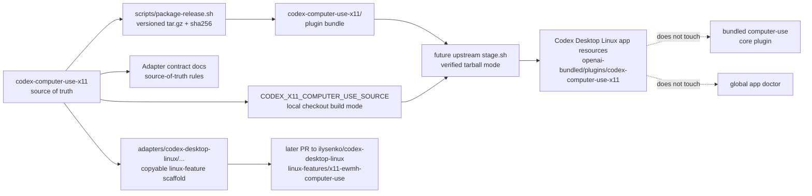

## Overview

Prepare this repository for a later upstream `codex-desktop-linux` optional Linux Feature adapter by adding source-of-truth release packaging, adapter contract docs, and an inert copyable scaffold. The runtime plugin behavior stays unchanged: the standalone binary continues to expose namespaced `x11_*` tools and X11/EWMH doctor readiness; the upstream checkout is read-only in this change.

## Goals / Non-Goals

### Goals

- Produce a versioned `tar.gz` release artifact plus `.sha256` sidecar for the current `VERSION`.
- Package a ready Codex plugin bundle layout with `.mcp.json`, `.codex-plugin/plugin.json`, `assets/app-icon.png`, `bin/codex-computer-use-x11`, and `RELEASE-METADATA.json`.
- Keep package metadata aligned with the existing standalone installer contract.
- Document the adapter contract for upstream `linux-features/x11-ewmh-computer-use/`.
- Provide a copyable adapter scaffold in this repository, including feature metadata, README, stage hook, conservative plugin gate patch, and Node tests.
- Add Rust tests and scaffold tests that prove artifact/scaffold/docs consistency.

### Non-Goals

- Do not publish a GitHub release or bump to `v0.1.3` without separate explicit approval.
- Do not modify `/home/as/Документы/AI_PROJECTS/codex-desktop-linux` or open an upstream PR in this change.
- Do not replace bundled `computer-use`, rename this plugin, modify core Computer Use behavior, or change upstream global doctor behavior.
- Do not introduce submodules or require secrets.

## Boundary Diagram



## Release Packaging Design

### Script shape

Add `scripts/package-release.sh` with:

- `set -Eeuo pipefail`.
- Options:
  - `--output-dir <dir>`: output directory; default `dist/release`.
  - `--target-triple <triple>`: default `x86_64-unknown-linux-gnu` for this project stage.
  - `--skip-build`: test helper for using an already built binary when appropriate.
  - `--check`: build/package, verify checksum, extract artifact, inspect forbidden paths/manifests, and run extracted `doctor --json` if possible.
  - `-h|--help`.
- Read `VERSION` and assert it matches `Cargo.toml` package version.
- Build with `cargo build --release` unless `--skip-build` is passed.
- Stage files under a temporary directory, never by tarring the repository root.
- Write output tarball named `codex-computer-use-x11-v${VERSION}-${TARGET_TRIPLE}.tar.gz`.
- Write sidecar `${tarball}.sha256` with `sha256sum`-compatible content.

### Bundle writer

The existing installer writes plugin manifest and `.mcp.json` inline. To avoid drift with minimal risk:

1. Add `scripts/lib/plugin-bundle.py` as a small shared helper that can write a plugin bundle from:
   - version,
   - binary path,
   - destination directory,
   - repository root,
   - optional release metadata JSON fields.
2. Update `scripts/install-codex-plugin.sh` to call the helper for `.mcp.json`, `.codex-plugin/plugin.json`, binary copy, and icon copy.
3. Use the same helper from `scripts/package-release.sh`.
4. Keep marketplace/config writing in the installer because release packaging does not install into `CODEX_HOME`.

This keeps the public bundle metadata contract in one place while avoiding a risky rewrite of installer rollback/config behavior.

### Release metadata

`RELEASE-METADATA.json` should include at least:

```json
{
  "plugin_name": "codex-computer-use-x11",
  "version": "0.1.2",
  "command": "./bin/codex-computer-use-x11",
  "args": ["mcp"],
  "cwd": ".",
  "display_name": "X11 Computer Use",
  "short_description": "Standalone x11_* tools for Linux X11/EWMH",
  "baseline": "x11-ewmh / Cinnamon X11",
  "source_repo_url": "https://github.com/AlekseiSeleznev/codex-computer-use-x11",
  "release_url_pattern": "https://github.com/AlekseiSeleznev/codex-computer-use-x11/releases/download/v{version}/{artifact}",
  "artifact": "codex-computer-use-x11-v0.1.2-x86_64-unknown-linux-gnu.tar.gz",
  "sha256": "...",
  "sha256_scope": "bin/codex-computer-use-x11",
  "artifact_sha256_sidecar": "codex-computer-use-x11-v0.1.2-x86_64-unknown-linux-gnu.tar.gz.sha256"
}
```

The helper records the packaged binary SHA256 inside `RELEASE-METADATA.json`; `package-release.sh` records the tarball SHA256 in the adjacent `.sha256` sidecar because a tarball cannot contain its own final hash without changing that hash.

## Adapter Contract Documentation Design

Add `docs/codex-desktop-linux-x11-ewmh-adapter.md` with sections:

- Status: prepared contract only; upstream not merged.
- Source-of-truth rule: this repo owns release binary/plugin behavior; upstream adapter is thin.
- Upstream location: `linux-features/x11-ewmh-computer-use/`.
- Required disabled-by-default feature contract and `features.json` opt-in.
- Staging modes:
  1. pinned release artifact + SHA256 verification;
  2. local source checkout build via `CODEX_X11_COMPUTER_USE_SOURCE`;
  3. direct binary override for test/local development.
- Non-goals: no core Computer Use rewrite, no default bundled plugin, no submodule, no global doctor changes, no Wayland/RemoteDesktop baseline.
- Failure behavior and future PR checklist.

## Adapter Scaffold Design

Create:

```text
adapters/codex-desktop-linux/linux-features/x11-ewmh-computer-use/
├── feature.json
├── README.md
├── stage.sh
├── patches.js
└── test.js
```

Do not copy this directory into upstream during this change.

### feature.json

Use:

```json
{
  "id": "x11-ewmh-computer-use",
  "title": "X11/EWMH Computer Use",
  "description": "Disabled-by-default adapter for the standalone codex-computer-use-x11 MCP plugin.",
  "defaultEnabled": false,
  "entrypoints": {
    "patchDescriptors": "./patches.js",
    "stageHook": "./stage.sh"
  }
}
```

### stage.sh modes

The stage hook is a thin adapter. It writes only under `$INSTALL_DIR/resources/plugins/openai-bundled/` and its temporary `$WORK_DIR`. It must not write user home.

Mode precedence:

1. `CODEX_X11_COMPUTER_USE_RELEASE_TARBALL=/path/to/tar.gz` plus `CODEX_X11_COMPUTER_USE_RELEASE_SHA256=<expected>`: verify SHA256, extract plugin tree, stage it.
2. `CODEX_X11_COMPUTER_USE_BINARY=/path/to/codex-computer-use-x11`: verify executable, create plugin tree from local manifest templates generated inside the script.
3. `CODEX_X11_COMPUTER_USE_SOURCE=/path/to/codex-computer-use-x11`: verify `Cargo.toml`, run `cargo build --release`, then stage the built binary using the generated plugin tree path.
4. Optional `CODEX_X11_COMPUTER_USE_DOWNLOAD_URL` + `CODEX_X11_COMPUTER_USE_RELEASE_SHA256`: download into `$WORK_DIR`, verify, extract. This is present for future pinned-release PR use; tests can avoid network by using local tarballs.

For this scaffold, direct binary mode is the simplest deterministic test path. Pinned tarball and local source modes are documented and implemented with clear failures.

Marketplace update:

- Load existing marketplace JSON or initialize `{ "plugins": [] }`.
- Remove any prior `codex-computer-use-x11` entry.
- Append local entry:

```json
{
  "name": "codex-computer-use-x11",
  "source": { "source": "local", "path": "./plugins/codex-computer-use-x11" },
  "policy": { "installation": "AVAILABLE", "authentication": "ON_INSTALL" },
  "category": "Productivity"
}
```

Do not mutate `plugins/openai-bundled/plugins/computer-use`.

### patches.js

Mirror the conservative shape of upstream `read-aloud-mcp`:

- Export `X11_COMPUTER_USE_PLUGIN_NAME`.
- Export `applyX11ComputerUsePluginGatePatch(source)`.
- Export `descriptors` with one `main-bundle` descriptor.
- Locate the existing bundled plugin gate array around `.computerUse`.
- Insert `{installWhenMissing:!0,name:\`codex-computer-use-x11\`,isAvailable:({platform:e})=>e===\`linux\`}` or `isEnabled` based on the discovered insertion point.
- Return unchanged if already patched.
- Throw only when `.computerUse` exists but expected plugin gate anchors are missing, matching read-aloud's required-upstream posture.
- Never alter existing `computer-use` descriptor behavior.

### test.js

Self-contained Node tests should copy the scaffold into a temporary `featuresRoot` and import upstream `scripts/lib/linux-features.js` when run from upstream. Tests cover:

- disabled-by-default stage hooks and patch descriptors are absent without `features.json` enablement;
- enabled feature exposes one stage hook and one patch descriptor;
- patch idempotence and no `computer-use` descriptor rewrite;
- stage hook with a fake executable writes plugin files and marketplace entry;
- existing `computer-use` plugin fixture remains byte-for-byte untouched;
- optional SHA256 helper/tarball mode if implementation supports a local test tarball.

For local verification before the scaffold is copied upstream, `test.js` should locate the upstream repository through `CODEX_DESKTOP_LINUX_REPO`, `CODEX_DESKTOP_LINUX_FULL_PATH`, or the documented local default `/home/as/Документы/AI_PROJECTS/codex-desktop-linux`. When the scaffold is copied into upstream, the same file should fall back to the relative upstream path used by `read-aloud-mcp`. This keeps the scaffold test executable here without writing to the upstream checkout.

## Tests

Add/extend Rust tests:

- `tests/release_package.rs` for script behavior:
  - run `scripts/package-release.sh --output-dir <temp> --check` using the Cargo-built test binary where practical;
  - assert tarball and `.sha256` exist;
  - verify checksum;
  - extract tarball;
  - assert executable bit, `.mcp.json`, plugin manifest version, metadata fields, and forbidden-file exclusion.
- Extend `tests/packaging_docs.rs` for README/INSTALL/CHANGELOG adapter contract links and scaffold file existence.
- Add scaffold consistency tests if they are easier in Rust; keep upstream-style behavior tests in scaffold `test.js`.

TDD order in apply:

1. RED package artifact test for missing `scripts/package-release.sh`.
2. GREEN shared bundle helper + package script.
3. RED docs/scaffold tests for missing contract/scaffold.
4. GREEN docs/scaffold.
5. RED scaffold Node tests for stage/patch behavior.
6. GREEN stage/patch/test implementation.
7. REFACTOR shared metadata and docs wording while tests remain green.

## Verification Plan

Run after tasks:

```bash
make fmt
make check
make test
openspec validate --all --strict
git diff --check
scripts/package-release.sh --check
```

Then extract the release tarball and run the extracted binary:

```bash
./codex-computer-use-x11/bin/codex-computer-use-x11 doctor --json
```

Verify JSON validity, `version` equals `VERSION`, `backend` equals `x11-ewmh`, and readiness is either `ok=true` on available X11 or a structured blockers/degraded report when the environment cannot provide X11.

## Risks and Mitigations

- **Installer/package metadata drift**: mitigate with shared helper and tests comparing `.mcp.json` and plugin manifest fields.
- **Upstream patch fragility**: keep patch narrow, modeled on `read-aloud-mcp`, with idempotence tests and clear failure when anchors drift.
- **Accidental upstream mutation**: keep scaffold under `adapters/` only and do not run stage hook against the real upstream checkout.
- **Forbidden file leakage**: stage from explicit files only and test tar listing against forbidden patterns.
- **Release overclaiming**: docs say adapter contract is prepared; they do not claim upstream merge, default enablement, or published release.
