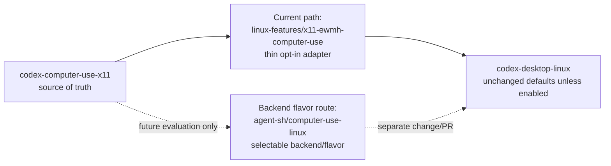

## Context

Issue #389 confirms the low-friction upstream path for this project as a disabled-by-default `codex-desktop-linux` Linux Feature adapter under `linux-features/x11-ewmh-computer-use/`. The latest comments also say that, if it fits better, X11/EWMH behavior could be explored as a selectable backend/flavor in `agent-sh/computer-use-linux`, with only a small opt-in adapter or generic hook needed downstream.

Current repository state already provides release packaging, a contract document, and a copyable Linux Feature scaffold. ADR 0009 keeps standalone MCP tools namespaced as `x11_*` and separates backend/windowing work from wrapper packaging work. ADR 0010 forbids global masquerading as bundled `computer-use`. Therefore this change is a documentation/spec/test alignment change, not a runtime integration pivot.

## Goals / Non-Goals

**Goals:**

- Make the adapter contract and scaffold README explicitly mention the `agent-sh/computer-use-linux` backend flavor route.
- Preserve the current thin Linux Feature adapter as the upstream-ready path until a separate fit evaluation changes that decision.
- Add public-interface tests that enforce the new wording and default-behavior boundary.
- Keep OpenSpec specs aligned so archive will update canonical requirements.

**Non-Goals:**

- No runtime code change to the MCP server.
- No change to release tarball structure, plugin manifests, or `x11_*` tools.
- No implementation inside `agent-sh/computer-use-linux`.
- No upstream `codex-desktop-linux` mutation beyond existing copyable scaffold docs.
- No default enablement, core Computer Use rewrite, global doctor change, or submodule.

## Decisions

1. **Document backend/flavor as future evaluation, not active behavior.**
   - Rationale: Issue #389 uses conditional language: if it fits better, it can be considered. Treating it as required now would contradict the accepted thin adapter path.
   - Alternative rejected: pivot the scaffold to a backend/flavor implementation now. This would require a separate upstream/backend design and risks violating the no-default-behavior-change boundary.

2. **Use docs plus packaging-doc tests as the implementation surface.**
   - Rationale: The observable behavior is maintainer-facing contract clarity. Tests should read tracked docs/spec-facing files and fail when the guidance disappears.
   - Alternative rejected: introduce a placeholder runtime hook. The grill resolved that an unused runtime hook widens scope without evidence that upstream lacks a hook.

3. **Keep source-of-truth and namespaced-tool language unchanged.**
   - Rationale: ADR 0009 and issue #389 both support standalone `x11_*` tools. Backend/flavor work may reuse behavior later, but this change must not blur plugin identity.

## Risks / Trade-offs

- The wording may become stale if upstream maintainers later choose a specific backend/flavor API. Mitigation: phrase it as a separate future evaluation path and keep current hard adapter constraints intact.
- Tests that assert documentation wording can become brittle. Mitigation: assert stable concepts (`agent-sh/computer-use-linux`, selectable backend/flavor, separate future evaluation, no default behavior change) rather than exact paragraphs.
- Adding a glossary term slightly broadens project vocabulary. Mitigation: define it as a route, not an accepted architecture.

## Migration Plan

No migration is required. Implementation updates tracked documentation and tests only. Rollback is a normal git revert of the docs/test/spec changes. The feature remains disabled by default and no installed Codex Desktop Linux state is modified.

## Open Questions

None.
