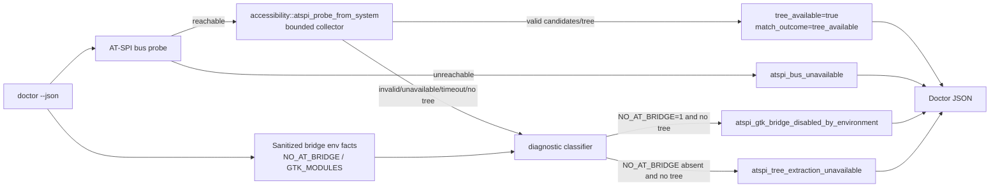

## Context

The v0.1.1 installed binary proves a runtime mismatch: `accessibility-tree --window-id 113246212 --json` can return a high-confidence tree while `doctor --json` reports AT-SPI degraded with `collector_unavailable` or `atspi_tree_extraction_unavailable`. The current code path explains the mismatch:

- `src/accessibility.rs::atspi_probe_from_system()` already treats a successful collector output with candidates as `tree_available=true` and `match_outcome=tree_available`.
- `src/doctor.rs::gather_probe_facts_from_system()` currently runs that probe only when the AT-SPI bus is reachable **and** `NO_AT_BRIDGE=1` is not present.
- `tests/doctor_cli.rs::doctor_atspi_probe_preserves_bridge_disabled_state` currently asserts the old behavior: with `NO_AT_BRIDGE=1`, doctor must not run the collector and must report bridge-disabled degradation.

Constitution constraints: keep Rust 2021/Cargo, run `make fmt`, `make check`, `make test`, verify machine-readable doctor JSON, and do not use or print secrets. Architecture constraints: preserve ADR 0009's safe AT-SPI degraded semantics and ADR 0011's sanitized bridge-environment handling, but correct the implementation so environment hints do not override proven collector facts.

## Goals / Non-Goals

**Goals:**

- Make `doctor --json` run the bounded AT-SPI collector whenever the AT-SPI bus is reachable, even if `NO_AT_BRIDGE=1` is present.
- Make successful collector output win over the bridge-disabled environment hint: `tree_available=true`, `match_outcome=tree_available`, `diagnostic_state=tree_extraction_available`.
- Keep `NO_AT_BRIDGE` in `bridge_env` as sanitized setup-risk metadata.
- Keep degraded behavior when the collector is actually unavailable, invalid, empty/no-tree, or timed out.
- Add public CLI regression tests for both `NO_AT_BRIDGE=1` and `env -u NO_AT_BRIDGE` valid collector paths, plus true collector degradation.

**Non-Goals:**

- Do not add a target selector to `doctor`.
- Do not relax `accessibility-tree` correlation thresholds or return arbitrary subtrees.
- Do not change public JSON field names or remove fields.
- Do not change installer rollback/environment activation behavior.
- Do not access external credentials, screenshots, or input injection paths.

## Decisions

### Decision 1: Run the doctor AT-SPI collector based on bus reachability, not bridge env

`gather_probe_facts_from_system()` will change from:

```text
if atspi_bus_available && !atspi_bridge_disabled_by_environment(env) { run probe } else { None }
```

to:

```text
if atspi_bus_available { run bounded probe } else { None }
```

The bounded probe remains the existing `accessibility::atspi_probe_from_system()` path, which already uses the concurrent stdout/stderr draining behavior introduced before v0.1.1.

### Decision 2: Preserve bridge-disabled classification only after collector failure/no-tree

`accessibility_report()` already computes bridge-disabled only when `!tree && atspi_bridge_disabled_by_environment(env)`. That classification rule is correct after Decision 1: if the collector proves `tree=true`, the bridge-disabled branch is skipped and the state becomes `tree_extraction_available` for `match_outcome=tree_available`.

If the collector is unavailable, invalid, empty, or timed out while `NO_AT_BRIDGE=1` is present, the report may still classify as `atspi_gtk_bridge_disabled_by_environment` because the environment remains the most actionable setup hint.

### Decision 3: Keep the probe seam in `src/accessibility.rs`

No new command runner abstraction is needed. Tests already exercise the public CLI through fake `PATH` commands and a fake `python3` collector. The design keeps that seam and updates fake-command tests rather than mocking internal Rust functions.

### Decision 4: Update old bridge-disabled regression instead of adding contradictory tests

The existing `doctor_atspi_probe_preserves_bridge_disabled_state` test should become the RED test for the changed behavior:

- fake collector logs that it ran;
- env contains `NO_AT_BRIDGE=1`;
- collector returns valid candidate/tree output;
- expected report is `tree_available=true`, `match_outcome=tree_available`, `diagnostic_state=tree_extraction_available`, and bridge env still records `NO_AT_BRIDGE=1`.

Add a separate degraded test where `NO_AT_BRIDGE=1` and collector output is invalid/unavailable/empty/timed out to preserve true degraded behavior.

### Boundary diagram



## Risks / Trade-offs

- **Risk: running the collector under `NO_AT_BRIDGE=1` costs time.** Mitigation: reuse the existing bounded collector timeout and concurrent output draining.
- **Risk: `NO_AT_BRIDGE=1` still indicates new GTK child processes may suppress bridge loading.** Mitigation: keep sanitized `bridge_env` and remediation text for true degraded cases.
- **Risk: ambient collector candidates are not a target-specific accessibility pass.** Mitigation: doctor only claims tree extraction availability; `accessibility-tree` remains responsible for target correlation and confidence.
- **Trade-off: environment prediction vs observed runtime fact.** The design chooses observed collector success as authoritative for doctor readiness because it matches the user's v0.1.1 evidence and avoids false degraded states.

## Migration Plan

- No data migration, installer migration, or rollback migration is required.
- Implementation is a local code/test change in the standalone Rust crate.
- Existing installed v0.1.1 binaries remain unchanged until a future release/install updates them.
- Rollback is standard Git revert of the implementation commit(s); no external state is mutated.

## Open Questions

None.
